```mermaid
graph LR
    API_Server["API Server"]
    LLM_Inference_Orchestrator["LLM Inference Orchestrator"]
    Input_Output_Preprocessing["Input/Output Preprocessing"]
    Request_Scheduler["Request Scheduler"]
    KV_Cache_Manager["KV Cache Manager"]
    Model_Executor["Model Executor"]
    Token_Sampling_Output_Generation["Token Sampling & Output Generation"]
    API_Server -- "submits requests to" --> LLM_Inference_Orchestrator
    LLM_Inference_Orchestrator -- "manages input/output processing via" --> Input_Output_Preprocessing
    Input_Output_Preprocessing -- "provides processed data to" --> LLM_Inference_Orchestrator
    LLM_Inference_Orchestrator -- "queues requests for" --> Request_Scheduler
    Request_Scheduler -- "provides batched sequences to" --> LLM_Inference_Orchestrator
    Request_Scheduler -- "manages KV cache with" --> KV_Cache_Manager
    Request_Scheduler -- "provides batch metadata to" --> Model_Executor
    LLM_Inference_Orchestrator -- "triggers forward pass on" --> Model_Executor
    Model_Executor -- "accesses KV cache in" --> KV_Cache_Manager
    Model_Executor -- "outputs logits to" --> Token_Sampling_Output_Generation
    Token_Sampling_Output_Generation -- "returns sampled tokens to" --> LLM_Inference_Orchestrator
    LLM_Inference_Orchestrator -- "returns responses to" --> API_Server
    click API_Server href "https://github.com/CodeBoarding/GeneratedOnBoardings/blob/main/vllm/API_Server.md" "Details"
    click LLM_Inference_Orchestrator href "https://github.com/CodeBoarding/GeneratedOnBoardings/blob/main/vllm/LLM_Inference_Orchestrator.md" "Details"
    click Input_Output_Preprocessing href "https://github.com/CodeBoarding/GeneratedOnBoardings/blob/main/vllm/Input_Output_Preprocessing.md" "Details"
    click Request_Scheduler href "https://github.com/CodeBoarding/GeneratedOnBoardings/blob/main/vllm/Request_Scheduler.md" "Details"
    click KV_Cache_Manager href "https://github.com/CodeBoarding/GeneratedOnBoardings/blob/main/vllm/KV_Cache_Manager.md" "Details"
    click Model_Executor href "https://github.com/CodeBoarding/GeneratedOnBoardings/blob/main/vllm/Model_Executor.md" "Details"
    click Token_Sampling_Output_Generation href "https://github.com/CodeBoarding/GeneratedOnBoardings/blob/main/vllm/Token_Sampling_Output_Generation.md" "Details"
```

## Details

VLLM's architecture is designed for high-throughput and low-latency LLM inference. The `API Server` acts as the external entry point, receiving user requests. The `LLM Inference Orchestrator` is the core component, managing the entire inference pipeline from request reception to response generation. It interacts with `Input/Output Preprocessing` for tokenization and detokenization, and with the `Request Scheduler` to efficiently manage and batch incoming requests. The `Request Scheduler` works closely with the `KV Cache Manager` to optimize GPU memory usage. The `Model Executor` performs the actual forward pass of the LLM, utilizing the KV cache and specialized layers for attention and quantization. Finally, `Token Sampling & Output Generation` processes the model's logits to produce the final tokens, which are then detokenized and returned through the `LLM Inference Orchestrator` back to the `API Server`. This modular design ensures efficient resource utilization and clear separation of concerns.

### API Server [[Expand]](./API_Server.md)
The external interface for VLLM, handling incoming inference requests (e.g., via HTTP/OpenAI API) and formatting responses.

**Related Classes/Methods**:

- <a href="https://github.com/vllm-project/vllm/blob/main/vllm/entrypoints/openai/api_server.py" target="_blank" rel="noopener noreferrer">`vllm.entrypoints.openai.api_server`</a>

### LLM Inference Orchestrator [[Expand]](./LLM_Inference_Orchestrator.md)
The central control plane that manages the entire lifecycle of an inference request, coordinating interactions between all other components.

**Related Classes/Methods**:

- <a href="https://github.com/vllm-project/vllm/blob/main/vllm/engine/async_llm_engine.py" target="_blank" rel="noopener noreferrer">`vllm.engine.async_llm_engine`</a>
- <a href="https://github.com/vllm-project/vllm/blob/main/vllm/engine/llm_engine.py" target="_blank" rel="noopener noreferrer">`vllm.engine.llm_engine`</a>

### Input/Output Preprocessing [[Expand]](./Input_Output_Preprocessing.md)
Responsible for converting raw text/multimodal inputs into token IDs and embeddings, applying chat templates, and detokenizing generated tokens back into human-readable text.

**Related Classes/Methods**:

- <a href="https://github.com/vllm-project/vllm/blob/main/vllm/multimodal/processing.py" target="_blank" rel="noopener noreferrer">`vllm.multimodal.processing`</a>
- <a href="https://github.com/vllm-project/vllm/blob/main/vllm/transformers_utils/tokenizer.py" target="_blank" rel="noopener noreferrer">`vllm.transformers_utils.tokenizer`</a>

### Request Scheduler [[Expand]](./Request_Scheduler.md)
Optimizes GPU utilization by dynamically batching and prioritizing incoming requests, making decisions on sequence processing, memory swapping, and preemption.

**Related Classes/Methods**:

- <a href="https://github.com/vllm-project/vllm/blob/main/vllm/core/scheduler.py" target="_blank" rel="noopener noreferrer">`vllm.core.scheduler`</a>

### KV Cache Manager [[Expand]](./KV_Cache_Manager.md)
Manages the allocation, deallocation, and efficient access of Key-Value (KV) cache memory on the GPU, supporting features like prefix caching and memory swapping.

**Related Classes/Methods**:

- <a href="https://github.com/vllm-project/vllm/blob/main/vllm/core/block_manager.py" target="_blank" rel="noopener noreferrer">`vllm.core.block_manager`</a>

### Model Executor [[Expand]](./Model_Executor.md)
Executes the neural network model's forward pass on the underlying hardware, integrating specialized layers for attention, quantization, and LoRA adaptation.

**Related Classes/Methods**:

- <a href="https://github.com/vllm-project/vllm/blob/main/vllm/model_executor/models/transformers.py" target="_blank" rel="noopener noreferrer">`vllm.model_executor.models.transformers`</a>
- <a href="https://github.com/vllm-project/vllm/blob/main/vllm/attention/layers/chunked_local_attention.py" target="_blank" rel="noopener noreferrer">`vllm.attention.layers.chunked_local_attention`</a>
- <a href="https://github.com/vllm-project/vllm/blob/main/vllm/model_executor/layers/quantization/__init__.py" target="_blank" rel="noopener noreferrer">`vllm.model_executor.layers.quantization.__init__`</a>
- <a href="https://github.com/vllm-project/vllm/blob/main/vllm/lora/models.py" target="_blank" rel="noopener noreferrer">`vllm.lora.models`</a>

### Token Sampling & Output Generation [[Expand]](./Token_Sampling_Output_Generation.md)
Applies various token sampling strategies (greedy, top-k, top-p) and modifies raw logits based on penalties, biases, or structured output constraints (e.g., JSON schema, regex) to determine the next token.

**Related Classes/Methods**:

- <a href="https://github.com/vllm-project/vllm/blob/main/vllm/model_executor/layers/sampler.py" target="_blank" rel="noopener noreferrer">`vllm.model_executor.layers.sampler`</a>
- <a href="https://github.com/vllm-project/vllm/blob/main/vllm/logits_process.py" target="_blank" rel="noopener noreferrer">`vllm.logits_process`</a>
- <a href="https://github.com/vllm-project/vllm/blob/main/vllm/v1/structured_output/backend_guidance.py" target="_blank" rel="noopener noreferrer">`vllm.v1.structured_output.backend_guidance`</a>

### [FAQ](https://github.com/CodeBoarding/GeneratedOnBoardings/tree/main?tab=readme-ov-file#faq)