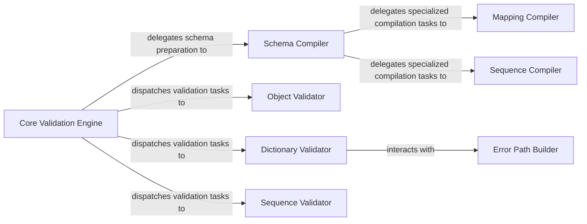

## Details

The `Core Validation Engine` subsystem is the heart of the Voluptuous library, responsible for executing defined schemas against input data. It embodies the "Schema-based Validation" and "Rule Engine/Specification" architectural patterns by orchestrating the compilation and application of validation rules.

### Core Validation Engine [[Expand]](./Core_Validation_Engine.md)
The primary orchestrator of the validation process. It receives input data, ensures the schema is compiled, and dispatches validation tasks to specialized handlers based on the data type and schema structure. It also handles nested schemas through recursive calls.

**Related Classes/Methods**:

- <a href="https://github.com/alecthomas/voluptuous/blob/master/voluptuous/schema_builder.py" target="_blank" rel="noopener noreferrer">`voluptuous.schema_builder.Schema.__call__`</a>

### Schema Compiler
Transforms the declarative schema definition into an executable form, preparing it for the validation process. This component is crucial for the "Schema as the Central Artifact" pattern.

**Related Classes/Methods**:

- <a href="https://github.com/alecthomas/voluptuous/blob/master/voluptuous/schema_builder.py#L212-L234" target="_blank" rel="noopener noreferrer">`voluptuous.schema_builder._compile`:212-234</a>

### Mapping Compiler
Specializes in compiling schema definitions that represent mappings (e.g., dictionaries), ensuring that key-value pair validation rules are correctly prepared.

**Related Classes/Methods**:

- <a href="https://github.com/alecthomas/voluptuous/blob/master/voluptuous/schema_builder.py#L236-L388" target="_blank" rel="noopener noreferrer">`voluptuous.schema_builder._compile_mapping`:236-388</a>

### Sequence Compiler
Specializes in compiling schema definitions for sequences (e.g., lists, tuples), preparing rules for ordered or unordered collections of data.

**Related Classes/Methods**:

- <a href="https://github.com/alecthomas/voluptuous/blob/master/voluptuous/schema_builder.py#L555-L610" target="_blank" rel="noopener noreferrer">`voluptuous.schema_builder._compile_sequence`:555-610</a>

### Object Validator
Implements the core type-specific validation logic for generic Python objects, ensuring they conform to the schema's constraints.

**Related Classes/Methods**:

- <a href="https://github.com/alecthomas/voluptuous/blob/master/voluptuous/schema_builder.py#L410-L416" target="_blank" rel="noopener noreferrer">`voluptuous.schema_builder.validate_object`:410-416</a>

### Dictionary Validator
Provides type-specific validation logic tailored for dictionary structures, handling key presence, value types, and nested dictionary validation.

**Related Classes/Methods**:

- <a href="https://github.com/alecthomas/voluptuous/blob/master/voluptuous/schema_builder.py#L508-L551" target="_blank" rel="noopener noreferrer">`voluptuous.schema_builder.validate_dict`:508-551</a>

### Sequence Validator
Implements type-specific validation logic for sequence types, such as lists and tuples, ensuring elements meet defined criteria.

**Related Classes/Methods**:

- <a href="https://github.com/alecthomas/voluptuous/blob/master/voluptuous/schema_builder.py#L571-L608" target="_blank" rel="noopener noreferrer">`voluptuous.schema_builder.validate_sequence`:571-608</a>

### Error Path Builder
A crucial component for constructing detailed error paths, which is essential for providing robust and user-friendly error reporting, aligning with the "Explicit Error Handling" pattern.

**Related Classes/Methods**:

- <a href="https://github.com/alecthomas/voluptuous/blob/master/voluptuous/schema_builder.py#L940-L945" target="_blank" rel="noopener noreferrer">`voluptuous.schema_builder.VirtualPathComponent`:940-945</a>

### [FAQ](https://github.com/CodeBoarding/GeneratedOnBoardings/tree/main?tab=readme-ov-file#faq)