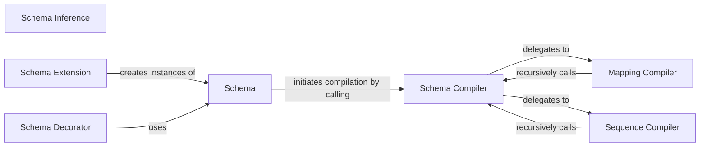

## Details

The `Schema Definition API` subsystem is primarily encapsulated within the `voluptuous.schema_builder` module, with `voluptuous.schema_builder.Schema` serving as its central component and public interface.

### Schema
The primary public interface for users to declaratively define validation schemas. It acts as the central artifact, encapsulating the schema definition and orchestrating its compilation and validation.

**Related Classes/Methods**:

- <a href="https://github.com/alecthomas/voluptuous/blob/master/voluptuous/schema_builder.py" target="_blank" rel="noopener noreferrer">`voluptuous.schema_builder.Schema`</a>

### Schema Compiler
An internal, recursive function responsible for transforming the declarative schema definition into an executable validation structure. It dispatches compilation tasks based on the schema type.

**Related Classes/Methods**:

- <a href="https://github.com/alecthomas/voluptuous/blob/master/voluptuous/schema_builder.py#L212-L234" target="_blank" rel="noopener noreferrer">`voluptuous.schema_builder._compile`:212-234</a>

### Mapping Compiler
Handles the compilation logic specifically for dictionary-like schemas, managing key-value pair validation.

**Related Classes/Methods**:

- <a href="https://github.com/alecthomas/voluptuous/blob/master/voluptuous/schema_builder.py#L236-L388" target="_blank" rel="noopener noreferrer">`voluptuous.schema_builder._compile_mapping`:236-388</a>

### Sequence Compiler
Manages the compilation of sequence-like schemas (e.g., lists, tuples), ensuring elements conform to defined rules.

**Related Classes/Methods**:

- <a href="https://github.com/alecthomas/voluptuous/blob/master/voluptuous/schema_builder.py#L555-L610" target="_blank" rel="noopener noreferrer">`voluptuous.schema_builder._compile_sequence`:555-610</a>

### Schema Inference
A utility that infers a schema type from a given Python value, aiding in automatic schema generation or simplification.

**Related Classes/Methods**:

- <a href="https://github.com/alecthomas/voluptuous/blob/master/voluptuous/schema_builder.py#L140-L181" target="_blank" rel="noopener noreferrer">`voluptuous.schema_builder.infer`:140-181</a>

### Schema Extension
Provides a mechanism to extend an existing schema with new rules or modify existing ones, promoting reusability and modularity in schema definitions.

**Related Classes/Methods**:

- <a href="https://github.com/alecthomas/voluptuous/blob/master/voluptuous/schema_builder.py#L682-L744" target="_blank" rel="noopener noreferrer">`voluptuous.schema_builder.extend`:682-744</a>

### Schema Decorator
A decorator that allows for the validation of function arguments against a schema, integrating schema definition with function execution.

**Related Classes/Methods**:

- <a href="https://github.com/alecthomas/voluptuous/blob/master/voluptuous/schema_builder.py#L1288-L1315" target="_blank" rel="noopener noreferrer">`voluptuous.schema_builder.validate_schema_decorator`:1288-1315</a>

### [FAQ](https://github.com/CodeBoarding/GeneratedOnBoardings/tree/main?tab=readme-ov-file#faq)