```mermaid
graph LR
    Schema_Definition_API["Schema Definition API"]
    Schema_Compilation_Engine["Schema Compilation Engine"]
    Core_Validation_Engine["Core Validation Engine"]
    Atomic_Validators_Library["Atomic Validators Library"]
    Error_Management_System["Error Management System"]
    Humanized_Error_Reporting["Humanized Error Reporting"]
    Schema_Definition_API -- "compiles" --> Schema_Compilation_Engine
    Schema_Compilation_Engine -- "provides compiled schema to" --> Core_Validation_Engine
    Core_Validation_Engine -- "uses" --> Atomic_Validators_Library
    Core_Validation_Engine -- "reports errors to" --> Error_Management_System
    Error_Management_System -- "provides errors to" --> Humanized_Error_Reporting
    click Schema_Definition_API href "https://github.com/CodeBoarding/GeneratedOnBoardings/blob/main/voluptuous/Schema_Definition_API.md" "Details"
    click Core_Validation_Engine href "https://github.com/CodeBoarding/GeneratedOnBoardings/blob/main/voluptuous/Core_Validation_Engine.md" "Details"
```

## Details

The `voluptuous` library's architecture is designed around a clear separation of concerns for schema definition, compilation, and validation. Users interact with the `Schema Definition API` to declaratively define their validation rules. This high-level definition is then processed by the `Schema Compilation Engine`, which transforms it into an optimized, executable internal representation. This compiled schema is then provided to the `Core Validation Engine`, the central orchestrator that applies the compiled rules against input data. During validation, the `Core Validation Engine` leverages the `Atomic Validators Library` for fundamental checks. Any discrepancies or failures are reported to the `Error Management System`, which structures and propagates detailed error information. Finally, for user comprehension, the `Humanized Error Reporting` component translates these structured errors into easily understandable messages. This modular design ensures efficient validation and clear error feedback.

### Schema Definition API [[Expand]](./Schema_Definition_API.md)
Provides the public interface for users to declaratively define validation schemas.

**Related Classes/Methods**:

- <a href="https://github.com/alecthomas/voluptuous/blob/master/voluptuous/schema_builder.py" target="_blank" rel="noopener noreferrer">`voluptuous.schema_builder.Schema`</a>

### Schema Compilation Engine
Transforms the user-defined schema into an optimized, executable internal representation.

**Related Classes/Methods**:

- <a href="https://github.com/alecthomas/voluptuous/blob/master/voluptuous/schema_builder.py#L212-L234" target="_blank" rel="noopener noreferrer">`voluptuous.schema_builder._compile`:212-234</a>

### Core Validation Engine [[Expand]](./Core_Validation_Engine.md)
The central component that executes the compiled schema against input data, orchestrating the validation process.

**Related Classes/Methods**:

- <a href="https://github.com/alecthomas/voluptuous/blob/master/voluptuous/schema_builder.py" target="_blank" rel="noopener noreferrer">`voluptuous.schema_builder.Schema.__call__`</a>

### Atomic Validators Library
A collection of fundamental, reusable validation functions and classes that perform specific, atomic checks.

**Related Classes/Methods**:

- <a href="https://github.com/alecthomas/voluptuous/blob/master/voluptuous/validators.py" target="_blank" rel="noopener noreferrer">`voluptuous.validators`</a>

### Error Management System
Responsible for capturing, structuring, and propagating validation errors with contextual information.

**Related Classes/Methods**:

- <a href="https://github.com/alecthomas/voluptuous/blob/master/voluptuous/error.py" target="_blank" rel="noopener noreferrer">`voluptuous.error.Error`</a>
- <a href="https://github.com/alecthomas/voluptuous/blob/master/voluptuous/error.py#L60-L87" target="_blank" rel="noopener noreferrer">`voluptuous.error.MultipleInvalid`:60-87</a>

### Humanized Error Reporting
Transforms structured validation errors into user-friendly, human-readable messages.

**Related Classes/Methods**:

- <a href="https://github.com/alecthomas/voluptuous/blob/master/voluptuous/humanize.py#L26-L48" target="_blank" rel="noopener noreferrer">`voluptuous.humanize.humanize_error`:26-48</a>

### [FAQ](https://github.com/CodeBoarding/GeneratedOnBoardings/tree/main?tab=readme-ov-file#faq)