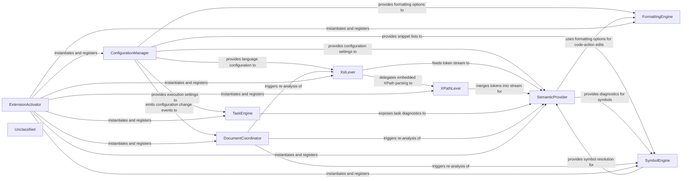

## Details

XSLT Extension Core – The heart of the VS Code XSLT extension is a tightly‑coupled set of eight components that together deliver a full language‑service experience. The ConfigurationManager supplies immutable language‑configuration objects for XSLT, XPath, XML, DCP and Schematron. The XslLexer (backed by the XPathLexer) tokenises source files and produces a unified token stream. This stream powers the SemanticProvider, which implements diagnostics, completions, hover, definition, reference and code‑action services, all of which respect the current configuration. Document formatting is handled by the FormattingEngine, while the TaskEngine creates Saxon‑based build tasks using the same configuration data. Navigation and outline features are provided by the SymbolEngine, which builds a hierarchical symbol tree from the lexer output. The DocumentCoordinator watches editor and configuration events and triggers re‑analysis of the lexer, semantic and symbol engines when needed. Finally, the ExtensionActivator bootstraps the subsystem, registers every provider with VS Code, and disposes resources on shutdown. This architecture isolates configuration, lexical analysis, language‑feature provision, formatting, task execution and change‑notification into clear, single‑responsibility components, enabling a concise flow diagram with at most two relationships per component pair.

### ConfigurationManager
Holds immutable LanguageConfiguration objects for XSLT, XPath, XML, DCP, and Schematron, exposes them via static properties, and emits configuration‑changed events.

**Related Classes/Methods**:

- <a href="https://github.com/DeltaXML/vscode-xslt-tokenizer/blob/master/src/languageConfigurations.ts" target="_blank" rel="noopener noreferrer">`languageConfigurations.ConfigurationManager`</a>

### XslLexer
Scans XSLT source, produces a stream of XslToken objects, detects embedded XPath expressions and delegates to XPathLexer, and supplies token‑level state for semantic colouring.

**Related Classes/Methods**:

- <a href="https://github.com/DeltaXML/vscode-xslt-tokenizer/blob/master/src/xslLexer.ts" target="_blank" rel="noopener noreferrer">`xslLexer.XslLexer`</a>

### XPathLexer
Parses XPath fragments inside XSLT attribute values, emits Token objects compatible with the XSLT token stream, and is invoked by XslLexer for embedded expressions.

**Related Classes/Methods**:

- <a href="https://github.com/DeltaXML/vscode-xslt-tokenizer/blob/master/src/xpLexer.ts" target="_blank" rel="noopener noreferrer">`xpLexer.XPathLexer`</a>

### SemanticProvider
Implements diagnostics, completions, hover, definition, reference and code‑action services using the token stream and configuration settings.

**Related Classes/Methods**:

- <a href="https://github.com/DeltaXML/vscode-xslt-tokenizer/blob/master/src/xsltTokenDiagnostics.ts" target="_blank" rel="noopener noreferrer">`xsltTokenDiagnostics.XsltTokenDiagnostics`</a>
- <a href="https://github.com/DeltaXML/vscode-xslt-tokenizer/blob/master/src/xsltTokenCompletions.ts" target="_blank" rel="noopener noreferrer">`xsltTokenCompletions.XsltTokenCompletions`</a>
- <a href="https://github.com/DeltaXML/vscode-xslt-tokenizer/blob/master/src/xsltHoverProvider.ts" target="_blank" rel="noopener noreferrer">`xsltHoverProvider.XsltHoverProvider`</a>
- <a href="https://github.com/DeltaXML/vscode-xslt-tokenizer/blob/master/src/xsltDefinitionProvider.ts" target="_blank" rel="noopener noreferrer">`xsltDefinitionProvider.XsltDefinitionProvider`</a>
- <a href="https://github.com/DeltaXML/vscode-xslt-tokenizer/blob/master/src/xsltReferenceProvider.ts" target="_blank" rel="noopener noreferrer">`xsltReferenceProvider.XsltReferenceProvider`</a>
- <a href="https://github.com/DeltaXML/vscode-xslt-tokenizer/blob/master/src/xsltCodeActions.ts" target="_blank" rel="noopener noreferrer">`xsltCodeActions.XsltCodeActions`</a>

### FormattingEngine
Formats XSLT, XPath, XML, DCP and Schematron documents according to active LanguageConfiguration (indentation, line‑break rules, attribute ordering).

**Related Classes/Methods**:

- <a href="https://github.com/DeltaXML/vscode-xslt-tokenizer/blob/master/src/xmlDocumentFormattingProvider.ts" target="_blank" rel="noopener noreferrer">`xmlDocumentFormattingProvider.XmlDocumentFormattingProvider`</a>

### TaskEngine
Generates VS Code Task objects that invoke Saxon (Java) or Saxon‑JS based on configuration, registers the task provider, and surfaces execution‑related diagnostics.

**Related Classes/Methods**:

- <a href="https://github.com/DeltaXML/vscode-xslt-tokenizer/blob/master/src/saxonTaskProvider.ts" target="_blank" rel="noopener noreferrer">`saxonTaskProvider.SaxonTaskProvider`</a>
- <a href="https://github.com/DeltaXML/vscode-xslt-tokenizer/blob/master/src/saxonJsTaskProvider.ts" target="_blank" rel="noopener noreferrer">`saxonJsTaskProvider.SaxonJsTaskProvider`</a>

### SymbolEngine
Walks the token stream to build a hierarchical DocumentSymbol tree for outline, go‑to‑symbol and UI commands, using snippet lists for root‑element suggestions.

**Related Classes/Methods**:

- <a href="https://github.com/DeltaXML/vscode-xslt-tokenizer/blob/master/src/xsltSymbolProvider.ts" target="_blank" rel="noopener noreferrer">`xsltSymbolProvider.XsltSymbolProvider`</a>
- <a href="https://github.com/DeltaXML/vscode-xslt-tokenizer/blob/master/src/dcpSymbolProvider.ts" target="_blank" rel="noopener noreferrer">`dcpSymbolProvider.DcpSymbolProvider`</a>

### DocumentCoordinator
Listens to VS Code editor and configuration events, triggers refresh of lexer, semantic and symbol engines, and provides UI helpers for file‑selection dialogs.

**Related Classes/Methods**:

- <a href="https://github.com/DeltaXML/vscode-xslt-tokenizer/blob/master/src/documentChangeHandler.ts" target="_blank" rel="noopener noreferrer">`documentChangeHandler.DocumentChangeHandler`</a>
- <a href="https://github.com/DeltaXML/vscode-xslt-tokenizer/blob/master/src/fileSelection.ts" target="_blank" rel="noopener noreferrer">`fileSelection.FileSelection`</a>

### ExtensionActivator
Bootstraps the subsystem: instantiates all core components, registers them with VS Code, holds the extension context and disposes resources on shutdown.

**Related Classes/Methods**:

- <a href="https://github.com/DeltaXML/vscode-xslt-tokenizer/blob/master/src/extension.ts" target="_blank" rel="noopener noreferrer">`extension.activate`</a>

### Unclassified
Component for all unclassified files and utility functions (Utility functions/External Libraries/Dependencies)

**Related Classes/Methods**: _None_

### [FAQ](https://github.com/CodeBoarding/GeneratedOnBoardings/tree/main?tab=readme-ov-file#faq)