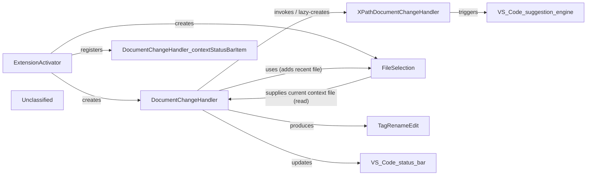

## Details

The XSLT/XPath editor subsystem is initialized by the extension's `activate` entry point, which creates a singleton `FileSelection` cache and a `DocumentChangeHandler` that registers a VS Code text‑document‑change listener for XML/XSLT files. The handler debounces rapid keystrokes, runs a lightweight lexer to detect tag‑rename situations, creates a `TagRenameEdit` DTO and applies the edit via a WorkspaceEdit, updates a static status‑bar item with the current XSLT context file, and records opened files in the `FileSelection` cache. For pure‑XPath documents, the handler lazily creates an `XPathDocumentChangeHandler` that decides when to trigger VS Code's suggestion popup, sharing the same inline debounce logic. All UI disposables are registered by the `activate` function, forming a tightly scoped component set that manages editor change events, rename operations, and context tracking.

### ExtensionActivator
Logical entry‑point function `activate` that boot‑straps the subsystem: creates the `FileSelection` singleton, instantiates `DocumentChangeHandler`, registers the static status‑bar item and VS Code disposables.

**Related Classes/Methods**:

- <a href="https://github.com/DeltaXML/vscode-xslt-tokenizer/blob/master/src/extension.ts" target="_blank" rel="noopener noreferrer">`activate`</a>

### DocumentChangeHandler
Core class that registers an XML/XSLT `onDidChangeTextDocument` listener, debounces edits, runs the `XslLexerRenameTag` lexer, creates a `TagRenameEdit` DTO, applies the rename via `performRename`, updates the static status‑bar item, and writes opened files to the `FileSelection` cache. It also lazily creates an `XPathDocumentChangeHandler` for XPath files.

**Related Classes/Methods**:

- <a href="https://github.com/DeltaXML/vscode-xslt-tokenizer/blob/master/src/documentChangeHandler.ts" target="_blank" rel="noopener noreferrer">`DocumentChangeHandler`</a>

### XPathDocumentChangeHandler
Small class that registers a text‑document‑change listener for pure‑XPath files and decides, based on surrounding whitespace, when to fire VS Code's `editor.action.triggerSuggest` command. Uses the same inline debounce as the XML handler.

**Related Classes/Methods**:

- <a href="https://github.com/DeltaXML/vscode-xslt-tokenizer/blob/master/src/xpathDocumentChangeHandler.ts" target="_blank" rel="noopener noreferrer">`XPathDocumentChangeHandler`</a>

### FileSelection
Singleton that maintains a bounded list of recently used XSLT files (the XPath context). Provides methods to add a newly opened XML file and to retrieve the recent‑file list, which is used by the status‑bar update routine.

**Related Classes/Methods**:

- <a href="https://github.com/DeltaXML/vscode-xslt-tokenizer/blob/master/src/fileSelection.ts" target="_blank" rel="noopener noreferrer">`FileSelection`</a>

### TagRenameEdit
Simple exported interface (`range`, `text`, `fullTagName`) that serves as the data‑transfer object between the lexer analysis and the workspace‑edit routine.

**Related Classes/Methods**:

- <a href="https://github.com/DeltaXML/vscode-xslt-tokenizer/blob/master/src/documentChangeHandler.ts" target="_blank" rel="noopener noreferrer">`TagRenameEdit`</a>

### Unclassified
Component for all unclassified files and utility functions (Utility functions/External Libraries/Dependencies)

**Related Classes/Methods**: _None_

### [FAQ](https://github.com/CodeBoarding/GeneratedOnBoardings/tree/main?tab=readme-ov-file#faq)