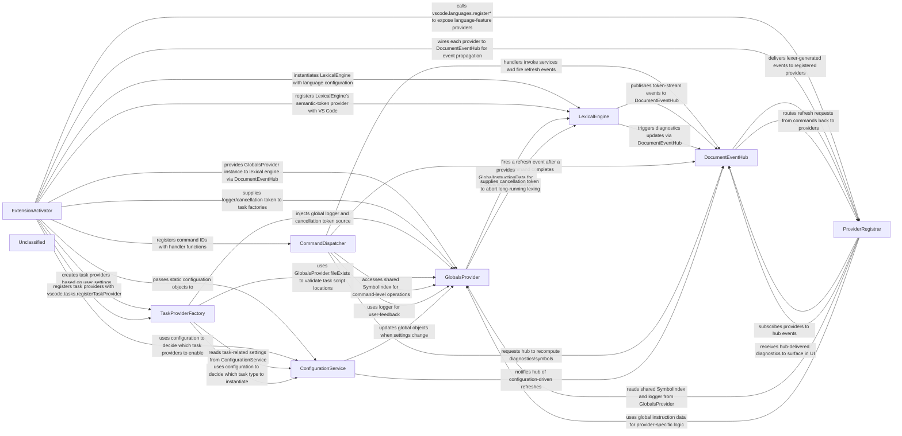

## Details

The XSLT/XPath VS Code extension is orchestrated by an activation entry point that boot‑straps static language configurations, a global state provider, a lexical engine for XSLT and XPath, and a central document event hub. The activation routine registers all VS Code language‑feature providers, task providers and UI commands, wiring them to the event hub and global services. As the user edits a document, the lexical engine tokenises the content, publishes semantic‑token and symbol events to the hub, which in turn updates diagnostics, status‑bar information and triggers completions. Commands and tasks invoke the core services (configuration, globals, lexical engine) and push refresh events back through the hub, completing a clear activation → configuration → globals → lexical → hub ↔ providers ↔ commands ↔ tasks flow that powers the extension’s functionality.

### ExtensionActivator
Entry‑point called by VS Code; creates core services, registers providers, commands and disposables.

**Related Classes/Methods**:

- <a href="https://github.com/DeltaXML/vscode-xslt-tokenizer/blob/master/src/extension.ts" target="_blank" rel="noopener noreferrer">`src/extension.ts:activate`</a>

### ConfigurationService
Holds static, typed language‑configuration objects (attribute lists, schema data, document‑type flags) consumed by lexers, token providers and task factories.

**Related Classes/Methods**:

- <a href="https://github.com/DeltaXML/vscode-xslt-tokenizer/blob/master/src/languageConfigurations.ts" target="_blank" rel="noopener noreferrer">`src/languageConfigurations.ts:XSLTConfiguration`</a>
- <a href="https://github.com/DeltaXML/vscode-xslt-tokenizer/blob/master/src/languageConfigurations.ts" target="_blank" rel="noopener noreferrer">`src/languageConfigurations.ts:XPathConfiguration`</a>
- <a href="https://github.com/DeltaXML/vscode-xslt-tokenizer/blob/master/src/languageConfigurations.ts" target="_blank" rel="noopener noreferrer">`src/languageConfigurations.ts:DCPConfiguration`</a>
- <a href="https://github.com/DeltaXML/vscode-xslt-tokenizer/blob/master/src/languageConfigurations.ts" target="_blank" rel="noopener noreferrer">`src/languageConfigurations.ts:SchConfiguration`</a>
- <a href="https://github.com/DeltaXML/vscode-xslt-tokenizer/blob/master/src/languageConfigurations.ts" target="_blank" rel="noopener noreferrer">`src/languageConfigurations.ts:XMLConfiguration`</a>
- <a href="https://github.com/DeltaXML/vscode-xslt-tokenizer/blob/master/src/languageConfigurations.ts" target="_blank" rel="noopener noreferrer">`src/languageConfigurations.ts:XSLTLightConfiguration`</a>

### GlobalsProvider
Supplies global‑instruction data (XSLT include/import analysis) and a file‑existence helper used by the lexical engine and task providers.

**Related Classes/Methods**:

- <a href="https://github.com/DeltaXML/vscode-xslt-tokenizer/blob/master/src/globalsProvider.ts" target="_blank" rel="noopener noreferrer">`src/globalsProvider.ts:GlobalsProvider`</a>

### LexicalEngine
Drives the XSLT and XPath tokenisers, merges their token streams, and produces semantic‑token / symbol events.

**Related Classes/Methods**:

- <a href="https://github.com/DeltaXML/vscode-xslt-tokenizer/blob/master/src/xslLexer.ts" target="_blank" rel="noopener noreferrer">`src/xslLexer.ts:XslLexer`</a>
- <a href="https://github.com/DeltaXML/vscode-xslt-tokenizer/blob/master/src/xpLexer.ts" target="_blank" rel="noopener noreferrer">`src/xpLexer.ts:XPathLexer`</a>

### DocumentEventHub
Central hub for document‑level change events; receives lexer output, publishes diagnostics, updates status‑bar and drives auto‑completion triggers.

**Related Classes/Methods**:

- <a href="https://github.com/DeltaXML/vscode-xslt-tokenizer/blob/master/src/documentChangeHandler.ts" target="_blank" rel="noopener noreferrer">`src/documentChangeHandler.ts:DocumentChangeHandler`</a>

### ProviderRegistrar
Registers all VS Code contributions (symbol providers, definition/hover/completion providers, document‑link providers, semantic‑token providers, code‑action providers, and commands).

**Related Classes/Methods**:

- <a href="https://github.com/DeltaXML/vscode-xslt-tokenizer/blob/master/src/extension.ts#L187-L229" target="_blank" rel="noopener noreferrer">`src/extension.ts:registerProviders`:187-229</a>

### TaskProviderFactory
Creates concrete task‑provider objects for XSLT‑Java and XSLT‑JS build scripts, wiring them into VS Code’s task system.

**Related Classes/Methods**:

- <a href="https://github.com/DeltaXML/vscode-xslt-tokenizer/blob/master/src/saxonTaskProvider.ts" target="_blank" rel="noopener noreferrer">`src/saxonTaskProvider.ts:SaxonTaskProvider`</a>
- <a href="https://github.com/DeltaXML/vscode-xslt-tokenizer/blob/master/src/saxonJsTaskProvider.ts" target="_blank" rel="noopener noreferrer">`src/saxonJsTaskProvider.ts:SaxonJsTaskProvider`</a>

### CommandDispatcher
Maps command IDs (xslt‑xpath.*) to handler functions that invoke core services (e.g., formatting, task‑input injection, symbol lookup) and fire refresh events via the DocumentEventHub.

**Related Classes/Methods**:

- <a href="https://github.com/DeltaXML/vscode-xslt-tokenizer/blob/master/src/extension.ts#L206-L224" target="_blank" rel="noopener noreferrer">`src/extension.ts:registerCommands`:206-224</a>

### Unclassified
Component for all unclassified files and utility functions (Utility functions/External Libraries/Dependencies)

**Related Classes/Methods**: _None_

### [FAQ](https://github.com/CodeBoarding/GeneratedOnBoardings/tree/main?tab=readme-ov-file#faq)