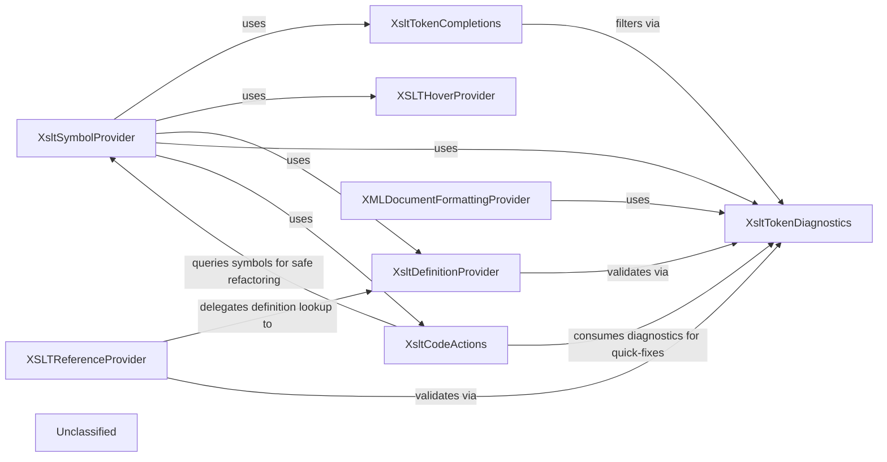

## Details

The XSLT language service centers on a single source‑of‑truth symbol index provided by XsltSymbolProvider, which parses XSLT/XPath documents via XslLexer and builds a hierarchical set of DocumentSymbols for all language constructs. All higher‑level features—completion, hover, definition, reference, code actions, and formatting—query this index for contextual information, while XsltTokenDiagnostics supplies validation and token‑position data to filter results and generate diagnostics. This layered architecture ensures consistent symbol data across features and isolates validation logic, enabling efficient, maintainable language‑service capabilities for XSLT editing.

### XsltSymbolProvider
Parses XSLT/XPath files using XslLexer and builds a hierarchical symbol index (DocumentSymbols) that serves as the single source of truth for all language‑service features.

**Related Classes/Methods**:

- <a href="https://github.com/DeltaXML/vscode-xslt-tokenizer/blob/master/src/xsltSymbolProvider.ts" target="_blank" rel="noopener noreferrer">`XsltSymbolProvider`</a>

### XsltTokenCompletions
Generates context‑aware completion items by querying the symbol index and filtering suggestions through XsltTokenDiagnostics.

**Related Classes/Methods**:

- <a href="https://github.com/DeltaXML/vscode-xslt-tokenizer/blob/master/src/xsltTokenCompletions.ts" target="_blank" rel="noopener noreferrer">`XsltTokenCompletions`</a>

### XSLTHoverProvider
Provides hover documentation and type information by looking up the hovered token in the symbol index and re‑using data prepared by the completion engine.

**Related Classes/Methods**:

- <a href="https://github.com/DeltaXML/vscode-xslt-tokenizer/blob/master/src/xsltHoverProvider.ts" target="_blank" rel="noopener noreferrer">`XSLTHoverProvider`</a>

### XsltDefinitionProvider
Implements go‑to‑definition by locating the declaration of a token in the symbol index and validating the request via XsltTokenDiagnostics.

**Related Classes/Methods**:

- <a href="https://github.com/DeltaXML/vscode-xslt-tokenizer/blob/master/src/xsltDefinitionProvider.ts" target="_blank" rel="noopener noreferrer">`XsltDefinitionProvider`</a>

### XSLTReferenceProvider
Implements find‑all‑references and rename by delegating definition lookup to XsltDefinitionProvider and validating via XsltTokenDiagnostics.

**Related Classes/Methods**:

- <a href="https://github.com/DeltaXML/vscode-xslt-tokenizer/blob/master/src/xsltReferenceProvider.ts" target="_blank" rel="noopener noreferrer">`XSLTReferenceProvider`</a>

### XsltTokenDiagnostics
Provides validation, token‑position information, and diagnostics used by other components to filter results and generate quick‑fixes.

**Related Classes/Methods**:

- <a href="https://github.com/DeltaXML/vscode-xslt-tokenizer/blob/master/src/xsltTokenDiagnostics.ts" target="_blank" rel="noopener noreferrer">`XsltTokenDiagnostics`</a>

### XMLDocumentFormattingProvider
Formats XSLT‑aware XML by walking the token stream from XslLexer and consulting XsltTokenDiagnostics for token positions; uses the symbol index for hierarchical layout when needed.

**Related Classes/Methods**:

- <a href="https://github.com/DeltaXML/vscode-xslt-tokenizer/blob/master/src/xmlDocumentFormattingProvider.ts" target="_blank" rel="noopener noreferrer">`XMLDocumentFormattingProvider`</a>

### XsltCodeActions
Offers quick‑fixes and refactorings by consuming diagnostics from XsltTokenDiagnostics and querying the symbol index for safe symbol rewrites.

**Related Classes/Methods**:

- <a href="https://github.com/DeltaXML/vscode-xslt-tokenizer/blob/master/src/xsltCodeActions.ts" target="_blank" rel="noopener noreferrer">`XsltCodeActions`</a>

### Unclassified
Component for all unclassified files and utility functions (Utility functions/External Libraries/Dependencies)

**Related Classes/Methods**: _None_

### [FAQ](https://github.com/CodeBoarding/GeneratedOnBoardings/tree/main?tab=readme-ov-file#faq)