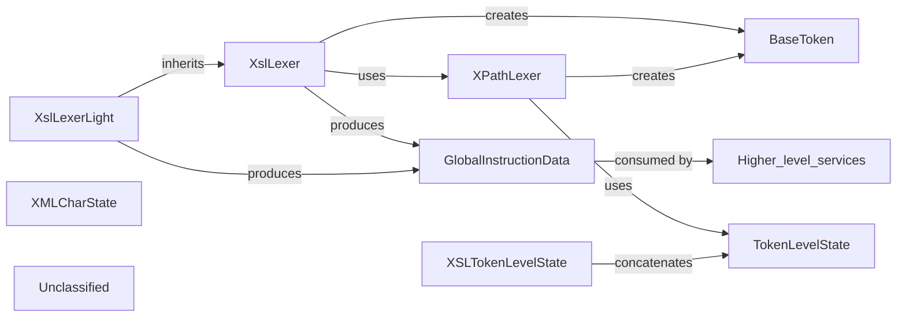

## Details

The lexical‑analysis subsystem of the DeltaXignia XSLT extension consists of three tightly‑coupled lexer classes—XslLexer, XslLexerLight, and XPathLexer—that scan XSLT stylesheets and XPath fragments, emit immutable BaseToken objects, and produce a unified token‑type legend composed of the XPath TokenLevelState enum and the XSL‑specific XSLTokenLevelState enum. While parsing, XslLexer also builds a collection of GlobalInstructionData DTOs describing top‑level XSLT constructs (templates, functions, modes, imports, etc.). These DTOs are the sole output consumed by higher‑level language‑service components (symbol providers, diagnostics, code‑actions). The subsystem is deliberately isolated from UI, logging, or error‑handling concerns, providing a clean, well‑defined flow for token generation and global‑instruction extraction.

### XslLexer
Full XSLT lexer – drives the state‑machine (XMLCharState), creates BaseToken instances, builds GlobalInstructionData arrays, and publishes the XSL‑specific token‑type legend (XSLTokenLevelState).

**Related Classes/Methods**:

- <a href="https://github.com/DeltaXML/vscode-xslt-tokenizer/blob/master/src/xslLexer.ts" target="_blank" rel="noopener noreferrer">`src/xslLexer.ts:XslLexer`</a>

### XslLexerLight
Light‑weight subclass of XslLexer that re‑uses low‑level helpers but stops after the global‑instruction pass, returning only the GlobalInstructionData collection.

**Related Classes/Methods**:

- <a href="https://github.com/DeltaXML/vscode-xslt-tokenizer/blob/master/src/xslLexerLight.ts" target="_blank" rel="noopener noreferrer">`src/xslLexerLight.ts:XslLexerLight`</a>

### XPathLexer
Pure‑XPath lexer – drives its own state‑machine (CharLevelState), creates BaseToken instances, and supplies the XPath token‑type legend (TokenLevelState).

**Related Classes/Methods**:

- <a href="https://github.com/DeltaXML/vscode-xslt-tokenizer/blob/master/src/xpLexer.ts" target="_blank" rel="noopener noreferrer">`src/xpLexer.ts:XPathLexer`</a>

### BaseToken
Immutable token object containing line, startCharacter, length, value, and tokenType. All lexers emit instances of this type.

**Related Classes/Methods**:

- <a href="https://github.com/DeltaXML/vscode-xslt-tokenizer/blob/master/src/xpLexer.ts" target="_blank" rel="noopener noreferrer">`src/xpLexer.ts:BaseToken`</a>

### XSLTokenLevelState
Enum defining XSL‑specific token categories (element‑name, attribute‑value, AVT, etc.) that are concatenated with the XPath legend to form the final semantic‑token set.

**Related Classes/Methods**:

- <a href="https://github.com/DeltaXML/vscode-xslt-tokenizer/blob/master/src/xslLexer.ts" target="_blank" rel="noopener noreferrer">`src/xslLexer.ts:XSLTokenLevelState`</a>

### XMLCharState
Enum representing the state‑machine symbols for the XSL lexer (start‑tag, comment, CDATA, attribute, etc.).

**Related Classes/Methods**:

- <a href="https://github.com/DeltaXML/vscode-xslt-tokenizer/blob/master/src/xslLexer.ts" target="_blank" rel="noopener noreferrer">`src/xslLexer.ts:XMLCharState`</a>

### TokenLevelState
Enum defining token categories used by the XPath lexer (string, number, operator, function, etc.).

**Related Classes/Methods**:

- <a href="https://github.com/DeltaXML/vscode-xslt-tokenizer/blob/master/src/xpLexer.ts" target="_blank" rel="noopener noreferrer">`src/xpLexer.ts:TokenLevelState`</a>

### GlobalInstructionData
DTO describing a top‑level XSLT instruction (name, type, source token, optional members, href, version). Consumed by higher‑level services for symbols, diagnostics, and code‑actions.

**Related Classes/Methods**:

- <a href="https://github.com/DeltaXML/vscode-xslt-tokenizer/blob/master/src/xslLexer.ts" target="_blank" rel="noopener noreferrer">`src/xslLexer.ts:GlobalInstructionData`</a>

### Unclassified
Component for all unclassified files and utility functions (Utility functions/External Libraries/Dependencies)

**Related Classes/Methods**: _None_

### [FAQ](https://github.com/CodeBoarding/GeneratedOnBoardings/tree/main?tab=readme-ov-file#faq)