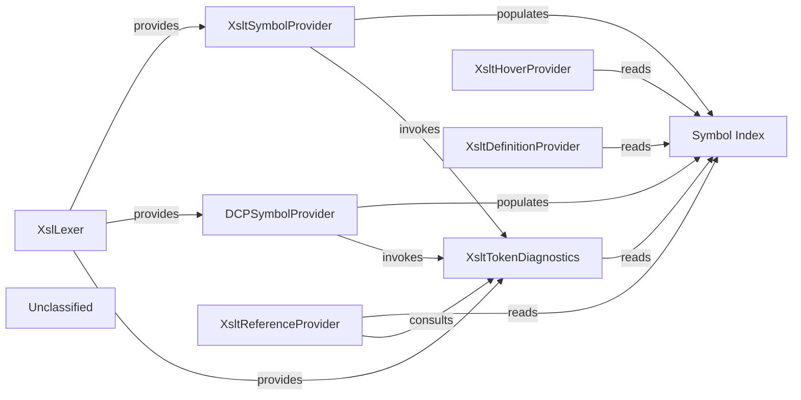

## Details

The XSLT/DCP language‑service core is built around a single lexical engine (XslLexer) that tokenises any XSLT‑ or DCP‑compatible document and extracts global‑instruction metadata. Two VS‑Code providers – XsltSymbolProvider (for XSLT) and DCPSymbolProvider (for DCP) – each instantiate the lexer, consume its token stream and populate a shared, read‑only Symbol Index (XsltSymbolProvider.documentSymbols). All higher‑level language‑service features (hover, go‑to‑definition, find‑references) read from this index, guaranteeing a single source of truth for symbol locations. The XsltTokenDiagnostics component also reads the lexer output and the Symbol Index to compute semantic diagnostics (duplicate names, unresolved imports, illegal attributes, etc.). The reference provider optionally consults the diagnostics component to filter out references that are flagged as errors, while the symbol providers invoke diagnostics to publish document‑wide issues after each analysis pass. This architecture enforces a clean producer → consumer data flow, isolates the index as the sole repository for symbol information, and makes the subsystem easy to understand, document and visualise.

### XslLexer
Low‑level lexical analyser. Parses a document’s text, produces a stream of XslTokens (analyse()) and fills globalInstructionData with the XSLT/DCP global‑instruction meta‑data (templates, functions, imports, etc.).

**Related Classes/Methods**:

- <a href="https://github.com/DeltaXML/vscode-xslt-tokenizer/blob/master/src/XslLexer.ts" target="_blank" rel="noopener noreferrer">`XslLexer`</a>

### XsltSymbolProvider
VS‑Code DocumentSymbolProvider for XSLT files. Instantiates XslLexer, consumes its token stream, builds the symbol index (static documentSymbols map) and emits diagnostics via XsltTokenDiagnostics.

**Related Classes/Methods**:

- <a href="https://github.com/DeltaXML/vscode-xslt-tokenizer/blob/master/src/XsltSymbolProvider.ts" target="_blank" rel="noopener noreferrer">`XsltSymbolProvider`</a>

### DCPSymbolProvider
VS‑Code DocumentSymbolProvider for DCP files (XSLT‑compatible). Mirrors XsltSymbolProvider – creates its own XslLexer, consumes tokens, populates the same symbol index and forwards diagnostics.

**Related Classes/Methods**:

- <a href="https://github.com/DeltaXML/vscode-xslt-tokenizer/blob/master/src/DCPSymbolProvider.ts" target="_blank" rel="noopener noreferrer">`DCPSymbolProvider`</a>

### Symbol Index [[Expand]](./Symbol_Index.md)
Central, read‑only store of all document symbols discovered by the two symbol providers. Implemented as the static XsltSymbolProvider.documentSymbols map (key = vscode.Uri, value = DocumentSymbol[]).

**Related Classes/Methods**:

- <a href="https://github.com/DeltaXML/vscode-xslt-tokenizer/blob/master/src/XsltSymbolProvider.ts" target="_blank" rel="noopener noreferrer">`XsltSymbolProvider.documentSymbols`</a>

### XsltTokenDiagnostics
Consumes the lexer output (allTokens, globalInstructionData) and the Symbol Index to compute semantic diagnostics (duplicate names, unresolved imports, illegal attributes, etc.). Provides a static calculateDiagnostics() API used by the symbol providers and optionally by the reference provider.

**Related Classes/Methods**:

- <a href="https://github.com/DeltaXML/vscode-xslt-tokenizer/blob/master/src/XsltTokenDiagnostics.ts" target="_blank" rel="noopener noreferrer">`XsltTokenDiagnostics`</a>

### XsltHoverProvider
VS‑Code HoverProvider. Reads the Symbol Index to locate a symbol’s definition, signature and documentation and builds a hover tooltip.

**Related Classes/Methods**:

- <a href="https://github.com/DeltaXML/vscode-xslt-tokenizer/blob/master/src/XsltHoverProvider.ts" target="_blank" rel="noopener noreferrer">`XsltHoverProvider`</a>

### XsltDefinitionProvider
VS‑Code DefinitionProvider. Reads the Symbol Index (and, for XSLT imports, may invoke the lexer to resolve imported globals) to resolve “Go‑to‑Definition”.

**Related Classes/Methods**:

- <a href="https://github.com/DeltaXML/vscode-xslt-tokenizer/blob/master/src/XsltDefinitionProvider.ts" target="_blank" rel="noopener noreferrer">`XsltDefinitionProvider`</a>

### XsltReferenceProvider
VS‑Code ReferenceProvider. Reads the Symbol Index to locate all references to a symbol; optionally consults XsltTokenDiagnostics to filter out references that are flagged as unresolved.

**Related Classes/Methods**:

- <a href="https://github.com/DeltaXML/vscode-xslt-tokenizer/blob/master/src/XsltReferenceProvider.ts" target="_blank" rel="noopener noreferrer">`XsltReferenceProvider`</a>

### Unclassified
Component for all unclassified files and utility functions (Utility functions/External Libraries/Dependencies)

**Related Classes/Methods**: _None_

### [FAQ](https://github.com/CodeBoarding/GeneratedOnBoardings/tree/main?tab=readme-ov-file#faq)