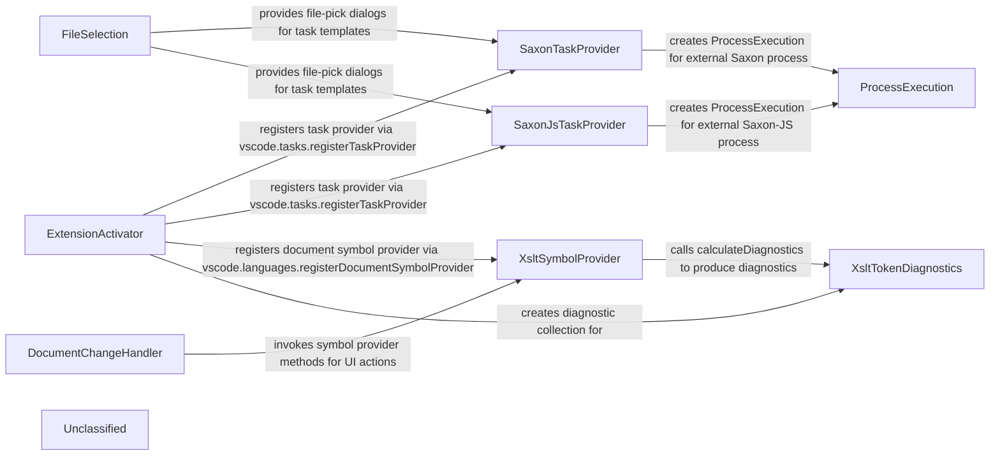

## Details

The XSLT VS Code extension is boot‑strapped by the `activate` function (ExtensionActivator) which registers two TaskProvider implementations – SaxonTaskProvider (Java‑based Saxon) and SaxonJsTaskProvider (Node‑based Saxon‑JS) – under the task types `xslt` and `xslt‑js`. Each provider reads the user’s configuration, assembles command‑line arguments and returns a vscode.Task whose ProcessExecution spawns the external Saxon process. Simultaneously, `activate` registers XsltSymbolProvider as the document‑symbol provider for the XSLT language and creates a diagnostic collection that is populated by XsltTokenDiagnostics. The symbol provider drives the lexer, resolves imports/includes, and after symbol construction calls the diagnostics component to surface syntax and name‑validation errors. UI‑level interactions (status‑bar updates, auto‑completion triggers, and commands such as “Go to XPath” or “Select current element”) are handled by DocumentChangeHandler, which keeps a reference to the active editor, rewrites matching end‑tags on the fly and forwards user actions to the symbol provider. File‑selection dialogs used in task templates are supplied by FileSelection, which records recent picks and resolves the `${command:…}` placeholders embedded in the task definitions. In summary, the extension’s architecture consists of a single activation hub, two task‑providers that directly construct the process execution, a symbol‑/diagnostic engine (symbol provider + token diagnostics), and a document‑change helper that ties the editor UI to the core services. All communication flows outward from the activation function, making the component graph simple, explicit, and fully traceable to the source files.

### ExtensionActivator
Entry point; registers task‑providers, symbol provider, diagnostics collection and VS Code commands.

**Related Classes/Methods**:

- <a href="https://github.com/DeltaXML/vscode-xslt-tokenizer/blob/master/src/extension.ts" target="_blank" rel="noopener noreferrer">`src/extension.ts:activate`</a>

### SaxonTaskProvider
Provides Java‑based Saxon XSLT tasks; builds vscode.Task with ProcessExecution.

**Related Classes/Methods**:

- <a href="https://github.com/DeltaXML/vscode-xslt-tokenizer/blob/master/src/saxonTaskProvider.ts" target="_blank" rel="noopener noreferrer">`src/saxonTaskProvider.ts:SaxonTaskProvider`</a>

### SaxonJsTaskProvider
Provides Saxon‑JS (Node) XSLT tasks; builds vscode.Task with npx xslt3.

**Related Classes/Methods**:

- <a href="https://github.com/DeltaXML/vscode-xslt-tokenizer/blob/master/src/saxonJsTaskProvider.ts" target="_blank" rel="noopener noreferrer">`src/saxonJsTaskProvider.ts:SaxonJsTaskProvider`</a>

### XsltSymbolProvider
Parses XSLT files, resolves imports/packages, produces document symbols and drives diagnostics.

**Related Classes/Methods**:

- <a href="https://github.com/DeltaXML/vscode-xslt-tokenizer/blob/master/src/xsltSymbolProvider.ts" target="_blank" rel="noopener noreferrer">`src/xsltSymbolProvider.ts:XsltSymbolProvider`</a>

### XsltTokenDiagnostics
Analyses token stream, validates names, creates vscode.Diagnostic objects for the active document.

**Related Classes/Methods**:

- <a href="https://github.com/DeltaXML/vscode-xslt-tokenizer/blob/master/src/xsltTokenDiagnostics.ts" target="_blank" rel="noopener noreferrer">`src/xsltTokenDiagnostics.ts:XsltTokenDiagnostics`</a>

### DocumentChangeHandler
Tracks the active XML/XSLT editor, updates a status‑bar item, rewrites matching end‑tags and triggers suggestion/completion.

**Related Classes/Methods**:

- <a href="https://github.com/DeltaXML/vscode-xslt-tokenizer/blob/master/src/documentChangeHandler.ts" target="_blank" rel="noopener noreferrer">`src/documentChangeHandler.ts:DocumentChangeHandler`</a>

### FileSelection
Utility that presents file‑pick dialogs, stores recent picks, and supplies ${command:…} placeholders used in task templates.

**Related Classes/Methods**:

- <a href="https://github.com/DeltaXML/vscode-xslt-tokenizer/blob/master/src/fileSelection.ts" target="_blank" rel="noopener noreferrer">`src/fileSelection.ts:FileSelection`</a>

### ProcessExecution
Executes the external Saxon/Javascript process; the only runtime component that actually runs the transformation.

**Related Classes/Methods**:

- <a href="https://github.com/DeltaXML/vscode-xslt-tokenizer/blob/master/src/saxonTaskProvider.ts" target="_blank" rel="noopener noreferrer">`vscode.ProcessExecution`</a>

### Unclassified
Component for all unclassified files and utility functions (Utility functions/External Libraries/Dependencies)

**Related Classes/Methods**: _None_

### [FAQ](https://github.com/CodeBoarding/GeneratedOnBoardings/tree/main?tab=readme-ov-file#faq)