```mermaid
graph LR
    Extension_Core["Extension Core"]
    Configuration_Service["Configuration Service"]
    Globals_Provider["Globals Provider"]
    Lexical_Engine["Lexical Engine"]
    Symbol_Index["Symbol Index"]
    Language_Service_Layer["Language Service Layer"]
    Task_Integration["Task Integration"]
    Document_Event_Hub["Document Event Hub"]
    Unclassified["Unclassified"]
    Extension_Core -- "activates and reads language‑specific settings" --> Configuration_Service
    Extension_Core -- "provides Globals Provider instance to Lexical Engine" --> Globals_Provider
    Extension_Core -- "instantiates lexers with configuration" --> Lexical_Engine
    Extension_Core -- "registers symbol‑provider instances" --> Symbol_Index
    Extension_Core -- "registers language‑service providers" --> Language_Service_Layer
    Extension_Core -- "registers Saxon task providers" --> Task_Integration
    Extension_Core -- "creates and wires document change handler" --> Document_Event_Hub
    Lexical_Engine -- "resolves imports via Globals Provider" --> Globals_Provider
    Lexical_Engine -- "emits parsed symbols to Symbol Index" --> Symbol_Index
    Document_Event_Hub -- "triggers fresh lexing on document change" --> Lexical_Engine
    Document_Event_Hub -- "notifies Symbol Index to refresh cache after re‑lexing" --> Symbol_Index
    Language_Service_Layer -- "queries Symbol Index for completions, hover, definitions, references, diagnostics" --> Symbol_Index
    Language_Service_Layer -- "reads language‑specific settings for completions and validation" --> Configuration_Service
    Task_Integration -- "reports task progress/completion via VS Code UI" --> Extension_Core
    Globals_Provider -- "surfaces import errors through diagnostics flow" --> Language_Service_Layer
    click Extension_Core href "https://github.com/CodeBoarding/GeneratedOnBoardings/blob/main/vscode-xslt-tokenizer/Extension_Core.md" "Details"
    click Configuration_Service href "https://github.com/CodeBoarding/GeneratedOnBoardings/blob/main/vscode-xslt-tokenizer/Configuration_Service.md" "Details"
    click Lexical_Engine href "https://github.com/CodeBoarding/GeneratedOnBoardings/blob/main/vscode-xslt-tokenizer/Lexical_Engine.md" "Details"
    click Symbol_Index href "https://github.com/CodeBoarding/GeneratedOnBoardings/blob/main/vscode-xslt-tokenizer/Symbol_Index.md" "Details"
    click Language_Service_Layer href "https://github.com/CodeBoarding/GeneratedOnBoardings/blob/main/vscode-xslt-tokenizer/Language_Service_Layer.md" "Details"
    click Task_Integration href "https://github.com/CodeBoarding/GeneratedOnBoardings/blob/main/vscode-xslt-tokenizer/Task_Integration.md" "Details"
    click Document_Event_Hub href "https://github.com/CodeBoarding/GeneratedOnBoardings/blob/main/vscode-xslt-tokenizer/Document_Event_Hub.md" "Details"
```

## Details

The XSLT‑XPath VS Code extension is built around a lightweight Extension Core that initializes the plug‑in and connects six functional subsystems. A Configuration Service supplies typed language settings to all parts. The Lexical Engine (full XSLT lexer, light XSLT lexer, XPath lexer) parses source files into token streams and, via the Globals Provider, resolves imported XSLT modules to produce global‑instruction data. Parsed symbols are stored in the Symbol Index, a workspace‑wide map refreshed on every document change by the Document Event Hub. Editor‑side features—completion, hover, definition, reference, diagnostics, formatting, and code‑actions—are implemented in the Language Service Layer, each provider querying the Symbol Index and Configuration Service to deliver precise, schema‑aware results. Task Integration exposes Saxon‑Java and Saxon‑JS executions as VS Code tasks, using the same configuration data and reporting status through the native VS Code task UI. This separation yields a clear flow: activation → configuration → lexing → symbol indexing → language services, with document events and task execution feeding back into the core loop.

### Extension Core [[Expand]](./Extension_Core.md)
Boots the extension, creates the Configuration Service, Globals Provider, Lexical Engine and Document Event Hub; registers all VS Code contributions (symbol providers, completion providers, task providers, link providers, formatting, diagnostics, UI commands).

**Related Classes/Methods**:

- <a href="https://github.com/DeltaXML/vscode-xslt-tokenizer/blob/master/src/extension.ts" target="_blank" rel="noopener noreferrer">`extension.activate`</a>

### Configuration Service [[Expand]](./Configuration_Service.md)
Centralised, typed access to all language‑specific settings (XSLT, XPath, DCP, Schematron, XML, XSLT‑Light, XProc). Provides LanguageConfiguration objects consumed by the lexer, token‑providers and formatters.

**Related Classes/Methods**:

- <a href="https://github.com/DeltaXML/vscode-xslt-tokenizer/blob/master/src/languageConfigurations.ts" target="_blank" rel="noopener noreferrer">`languageConfigurations.XSLTConfiguration`</a>
- <a href="https://github.com/DeltaXML/vscode-xslt-tokenizer/blob/master/src/languageConfigurations.ts" target="_blank" rel="noopener noreferrer">`languageConfigurations.XPathConfiguration`</a>
- <a href="https://github.com/DeltaXML/vscode-xslt-tokenizer/blob/master/src/languageConfigurations.ts" target="_blank" rel="noopener noreferrer">`languageConfigurations.DCPConfiguration`</a>
- <a href="https://github.com/DeltaXML/vscode-xslt-tokenizer/blob/master/src/languageConfigurations.ts" target="_blank" rel="noopener noreferrer">`languageConfigurations.SchConfiguration`</a>
- <a href="https://github.com/DeltaXML/vscode-xslt-tokenizer/blob/master/src/languageConfigurations.ts" target="_blank" rel="noopener noreferrer">`languageConfigurations.XMLConfiguration`</a>
- <a href="https://github.com/DeltaXML/vscode-xslt-tokenizer/blob/master/src/languageConfigurations.ts" target="_blank" rel="noopener noreferrer">`languageConfigurations.XSLTLightConfiguration`</a>

### Globals Provider
Reads external XSLT files referenced by <xsl:import> / <xsl:include> and returns the global instruction data needed by the lexer for cross‑file symbol resolution.

**Related Classes/Methods**:

- <a href="https://github.com/DeltaXML/vscode-xslt-tokenizer/blob/master/src/globalsProvider.ts#L15-L32" target="_blank" rel="noopener noreferrer">`globalsProvider.provideGlobals`:15-32</a>

### Lexical Engine [[Expand]](./Lexical_Engine.md)
Turns raw XSLT / XPath source text into token streams and global instruction data. Includes full XSLT lexer (XslLexer), light XSLT lexer (XslLexerLight) for fast global‑instruction extraction, and XPath lexer (XPathLexer).

**Related Classes/Methods**:

- <a href="https://github.com/DeltaXML/vscode-xslt-tokenizer/blob/master/src/xslLexer.ts" target="_blank" rel="noopener noreferrer">`xslLexer.XslLexer`</a>
- <a href="https://github.com/DeltaXML/vscode-xslt-tokenizer/blob/master/src/xslLexerLight.ts" target="_blank" rel="noopener noreferrer">`xslLexerLight.XslLexerLight`</a>
- <a href="https://github.com/DeltaXML/vscode-xslt-tokenizer/blob/master/src/xpLexer.ts" target="_blank" rel="noopener noreferrer">`xpLexer.XPathLexer`</a>

### Symbol Index [[Expand]](./Symbol_Index.md)
Maintains a workspace‑wide map of XSLT/DCP symbols (templates, functions, variables, keys, etc.). Updated on document changes, queried by all language‑service providers.

**Related Classes/Methods**:

- <a href="https://github.com/DeltaXML/vscode-xslt-tokenizer/blob/master/src/xsltSymbolProvider.ts" target="_blank" rel="noopener noreferrer">`xsltSymbolProvider.XsltSymbolProvider`</a>
- <a href="https://github.com/DeltaXML/vscode-xslt-tokenizer/blob/master/src/dcpSymbolProvider.ts" target="_blank" rel="noopener noreferrer">`dcpSymbolProvider.DCPSymbolProvider`</a>

### Language Service Layer [[Expand]](./Language_Service_Layer.md)
Implements VS Code language‑service APIs (completion, hover, definition, reference, diagnostics, formatting, code‑actions). Each provider consumes the Symbol Index and the Configuration Service to produce editor‑side results.

**Related Classes/Methods**:

- <a href="https://github.com/DeltaXML/vscode-xslt-tokenizer/blob/master/src/xsltTokenCompletions.ts" target="_blank" rel="noopener noreferrer">`xsltTokenCompletions.XsltTokenCompletions`</a>
- <a href="https://github.com/DeltaXML/vscode-xslt-tokenizer/blob/master/src/xsltHoverProvider.ts" target="_blank" rel="noopener noreferrer">`xsltHoverProvider.XSLTHoverProvider`</a>
- <a href="https://github.com/DeltaXML/vscode-xslt-tokenizer/blob/master/src/xsltDefinitionProvider.ts" target="_blank" rel="noopener noreferrer">`xsltDefinitionProvider.XsltDefinitionProvider`</a>
- <a href="https://github.com/DeltaXML/vscode-xslt-tokenizer/blob/master/src/xsltReferenceProvider.ts" target="_blank" rel="noopener noreferrer">`xsltReferenceProvider.XSLTReferenceProvider`</a>
- <a href="https://github.com/DeltaXML/vscode-xslt-tokenizer/blob/master/src/xsltTokenDiagnostics.ts" target="_blank" rel="noopener noreferrer">`xsltTokenDiagnostics.XsltTokenDiagnostics`</a>
- <a href="https://github.com/DeltaXML/vscode-xslt-tokenizer/blob/master/src/xmlDocumentFormattingProvider.ts" target="_blank" rel="noopener noreferrer">`xmlDocumentFormattingProvider.XMLDocumentFormattingProvider`</a>
- <a href="https://github.com/DeltaXML/vscode-xslt-tokenizer/blob/master/src/xsltCodeActions.ts" target="_blank" rel="noopener noreferrer">`xsltCodeActions.XSLTCodeActions`</a>

### Task Integration [[Expand]](./Task_Integration.md)
Wraps Saxon‑Java and Saxon‑JS command‑line executions as VS Code Task objects. Reads configuration (paths, options) and reports task completion via VS Code UI.

**Related Classes/Methods**:

- <a href="https://github.com/DeltaXML/vscode-xslt-tokenizer/blob/master/src/saxonTaskProvider.ts" target="_blank" rel="noopener noreferrer">`saxonTaskProvider.SaxonTaskProvider`</a>
- <a href="https://github.com/DeltaXML/vscode-xslt-tokenizer/blob/master/src/saxonJsTaskProvider.ts" target="_blank" rel="noopener noreferrer">`saxonJsTaskProvider.SaxonJsTaskProvider`</a>

### Document Event Hub [[Expand]](./Document_Event_Hub.md)
Listens to VS Code document‑change events, debounces them and triggers re‑lexing + symbol‑index refreshes. Also drives on‑type suggestion triggers for XPath.

**Related Classes/Methods**:

- <a href="https://github.com/DeltaXML/vscode-xslt-tokenizer/blob/master/src/documentChangeHandler.ts" target="_blank" rel="noopener noreferrer">`documentChangeHandler.DocumentChangeHandler`</a>
- <a href="https://github.com/DeltaXML/vscode-xslt-tokenizer/blob/master/src/xpathDocumentChangeHandler.ts" target="_blank" rel="noopener noreferrer">`xpathDocumentChangeHandler.XPathDocumentChangeHandler`</a>

### Unclassified
Component for all unclassified files and utility functions (Utility functions/External Libraries/Dependencies)

**Related Classes/Methods**: _None_

### [FAQ](https://github.com/CodeBoarding/GeneratedOnBoardings/tree/main?tab=readme-ov-file#faq)