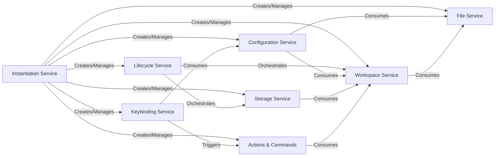

## Details

One paragraph explaining the functionality which is represented by this graph. What the main flow is and what is its purpose.

### Instantiation Service
The Instantiation Service is the heart of the application's architecture, providing a powerful dependency injection (DI) container. It is responsible for creating, managing, and injecting service instances, ensuring that components are loosely coupled and dependencies are handled explicitly. This service is the primary mechanism for architectural cohesion.

**Related Classes/Methods**:

- `src/vs/platform/instantiation/common/instantiationService.ts` (1:1)
- `src/vs/platform/instantiation/common/instantiation.ts` (1:1)

### Lifecycle Service
Manages the application's lifecycle phases. It provides critical events and hooks for startup (onWillStart) and shutdown (onWillShutdown), allowing other services to initialize and terminate gracefully.

**Related Classes/Methods**:

- `src/vs/platform/lifecycle/common/lifecycle.ts` (1:1)

### Workspace Service
Manages the user's project context, abstracting the concept of a workspace. It handles single-folder, multi-root, and untitled workspace scenarios, providing a consistent context for other services.

**Related Classes/Methods**:

- `src/vs/platform/workspace/common/workspace.ts` (1:1)

### File Service
Provides a platform-agnostic API for all file system operations. It abstracts the underlying file system (e.g., local disk via Node.js or virtual file systems), handling file reading, writing, and watching.

**Related Classes/Methods**:

- `src/vs/platform/files/common/files.ts` (1:1)

### Configuration Service
Manages all application and workspace settings. It provides a unified API to access configuration values, handling the complex hierarchy of user, workspace, and folder-level settings.

**Related Classes/Methods**:

- `src/vs/platform/configuration/common/configuration.ts` (1:1)

### Storage Service
Provides a key-value API for persisting state across sessions. It abstracts different storage scopes (Global vs. Workspace) and underlying database mechanisms (e.g., SQLite, browser localStorage).

**Related Classes/Methods**:

- `src/vs/platform/storage/common/storage.ts` (1:1)

### Actions & Commands
Implements a registry and dispatcher for reusable operations. Actions and Commands are the foundation for user-invokable functionality, from the command palette to menu items, decoupling the invoker from the implementation.

**Related Classes/Methods**:

- `src/vs/platform/actions/common/actions.ts` (1:1)
- `src/vs/platform/commands/common/commands.ts` (1:1)

### Keybinding Service
Manages all keyboard shortcuts. It is responsible for resolving key combinations based on active contexts (e.g., "editor has focus") and dispatching the corresponding command to be executed.

**Related Classes/Methods**:

- `src/vs/platform/keybinding/common/keybindingService.ts` (1:1)

### [FAQ](https://github.com/CodeBoarding/GeneratedOnBoardings/tree/main?tab=readme-ov-file#faq)