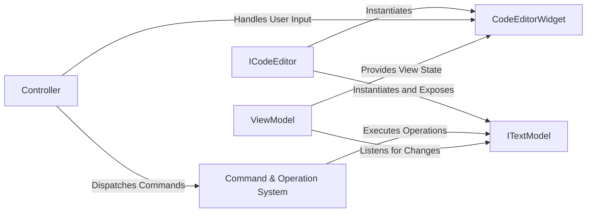

## Details

The Editor subsystem is a cornerstone of the application, embodying the Model-View-ViewModel (MVVM) pattern to manage the complexity of text editing. This design ensures a clean separation of concerns between the data (Model), the UI (View), and the logic that connects them (ViewModel/Controller).

### ICodeEditor
The public API and Facade for the entire editor component. It's the primary entry point for other parts of the application (like the Workbench) to create, configure, and interact with an editor instance.

**Related Classes/Methods**:

- ``

### ITextModel
The Model in MVVM. It represents the document's content, including the text, language mode, versioning for undo/redo, and attached metadata (decorations). It is completely UI-agnostic.

**Related Classes/Methods**:

- ``

### CodeEditorWidget
The View in MVVM. This is the concrete UI component that renders the editor's visual elements in the DOM, including text lines, gutters, cursors, and selections. It is responsible for all rendering.

**Related Classes/Methods**:

- ``

### ViewModel
The ViewModel in MVVM. It acts as an intermediary between the ITextModel and the CodeEditorWidget. It manages view-specific state, such as folded regions, and handles coordinate transformations (e.g., model lines to view lines).

**Related Classes/Methods**:

- ``

### Controller
The Controller part of the architecture. It listens for raw user input events (keyboard, mouse) from the CodeEditorWidget and translates them into logical editor actions or commands.

**Related Classes/Methods**:

- ``

### Command & Operation System
A core Service that executes, undoes, and redoes editor operations. It receives commands from the Controller and applies them as atomic changes to the ITextModel.

**Related Classes/Methods**:

- ``
- ``

### [FAQ](https://github.com/CodeBoarding/GeneratedOnBoardings/tree/main?tab=readme-ov-file#faq)