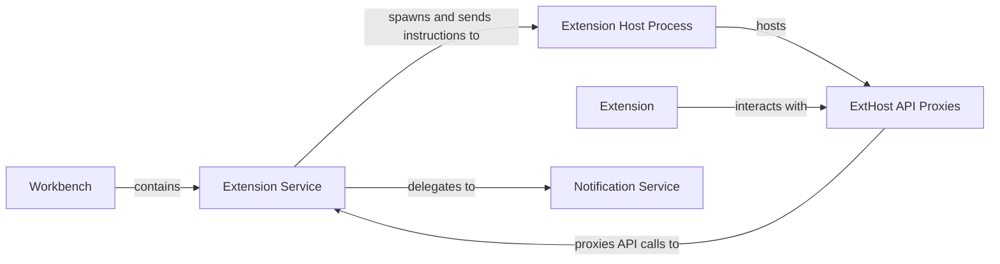

## Details

High-level architectural overview of the system, detailing the main components and their interactions.

### Workbench [[Expand]](./Workbench.md)
The main application window and UI thread. It contains the core editor services and is the entry point for all user interactions. It cannot directly access extension code.

**Related Classes/Methods**:

- `src/vs/workbench/browser/workbench.ts`

### Extension Service
Residing within the Workbench, this service is the primary orchestrator. It is responsible for identifying, loading, and activating extensions. It spawns the Extension Host process and establishes the IPC channel for communication.

**Related Classes/Methods**:

- `src/vs/workbench/services/extensions/common/extensionService.ts`
- `src/vs/platform/extensions/common/extensions.ts`

### Extension Host Process
A dedicated Node.js process that runs all extension code. This isolation is key to the architecture's stability. A crash in this process will not bring down the Workbench. It receives instructions from the Extension Service and executes the extension logic.

**Related Classes/Methods**:

- `src/vs/workbench/services/extensions/electron-sandbox/extensionHostProcessSetup.ts`

### ExtHost API Proxies
A collection of proxy objects that exist within the Extension Host process. These proxies mirror the VS Code API. When an extension calls a VS Code API function, it's actually invoking a method on a proxy object. This proxy then serializes the request and sends it over the IPC channel to the Extension Service in the Workbench.

**Related Classes/Methods**:

- `src/vs/workbench/api/common/extHost.api.impl.ts`
- `src/vs/workbench/api/common/extHost.protocol.ts`

### Extension
The third-party code, plugin, or feature set that runs within the Extension Host. It interacts with the editor and core services exclusively through the exposed ExtHost API Proxies.

**Related Classes/Methods**:

- `src/vs/platform/extensions/common/extensions.ts`

### Notification Service
A core service residing in the Workbench. When the Extension Service receives an API request for a notification from the Extension Host, it delegates the task of rendering the UI element to this service.

**Related Classes/Methods**:

- `src/vs/workbench/services/notification/common/notification.ts`
- `src/vs/workbench/services/notification/browser/notificationService.ts`

### [FAQ](https://github.com/CodeBoarding/GeneratedOnBoardings/tree/main?tab=readme-ov-file#faq)