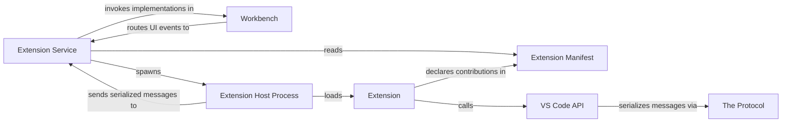

## Details

This analysis synthesizes the provided context into a focused overview of the VS Code `Extensions` subsystem, highlighting the components and interactions that are fundamental to its microkernel architecture.

### Extension Manifest
A declarative JSON file (`package.json`) that defines an extension's identity and contributions. It lists activation events, commands, UI elements, and language features, allowing VS Code to load the extension efficiently without running its code.

**Related Classes/Methods**:

- `package.json`

### Extension
A package of JavaScript/TypeScript code that runs in the Extension Host. It implements the logic for the features declared in its manifest by interacting with the `VS Code API`.

**Related Classes/Methods**:

- `out/extension.js`

### Extension Service
A core service running in the `Workbench` process. It discovers installed extensions by reading their manifests, manages the lifecycle of the `Extension Host Process`, and acts as the RPC proxy for all communication between the Workbench and extensions.

**Related Classes/Methods**:

- `src/vs/workbench/services/extensions/common/extensionService.ts`

### Workbench [[Expand]](./Workbench.md)
The main renderer process that hosts the editor's user interface. It initiates the extension loading process via the `Extension Service` and renders the UI contributions (e.g., buttons, panels) requested by extensions.

**Related Classes/Methods**:

- `src/vs/workbench/browser/workbench.ts`

### Extension Host Process
A dedicated Node.js process that provides a sandboxed runtime environment for extensions. Its primary role is to isolate extension code from the core editor process, ensuring stability and performance.

**Related Classes/Methods**:

- `src/vs/workbench/api/node/extHostProcess.js`

### VS Code API
A set of TypeScript interfaces that are exposed to extensions running within the `Extension Host`. It provides a stable, high-level abstraction for interacting with the editor, workspace, and UI without accessing internal components.

**Related Classes/Methods**:

- `src/vs/vscode.d.ts`

### The Protocol
A critical architectural artifact that defines the strict RPC (Remote Procedure Call) contract between the `Workbench` and the `Extension Host`. It contains the TypeScript type definitions for all messages, ensuring type-safe communication across the process boundary.

**Related Classes/Methods**:

- `src/vs/workbench/api/common/extHost.protocol.ts`

### [FAQ](https://github.com/CodeBoarding/GeneratedOnBoardings/tree/main?tab=readme-ov-file#faq)