```mermaid
graph LR
    Workbench["Workbench"]
    IWorkbenchLayoutService["IWorkbenchLayoutService"]
    IEditorService["IEditorService"]
    ViewServices["ViewServices"]
    IStatusbarService["IStatusbarService"]
    IExtensionService["IExtensionService"]
    IPCService["IPCService"]
    QuickInput_CommandPalette["QuickInput/CommandPalette"]
    Workbench -- "Initializes and uses" --> IWorkbenchLayoutService
    Workbench -- "Listens for messages from" --> IPCService
    Workbench -- "Initializes and uses" --> ViewServices
    Workbench -- "invokes" --> QuickInput_CommandPalette
    IWorkbenchLayoutService -- "Is directed by" --> Workbench
    IWorkbenchLayoutService -- "Provides layout context to" --> ViewServices
    IEditorService -- "Receives commands from" --> QuickInput_CommandPalette
    IEditorService -- "Contributes contextual information to" --> IStatusbarService
    ViewServices -- "Receives view contribution and registration data from" --> IExtensionService
    ViewServices -- "Is controlled by" --> Workbench
    IStatusbarService -- "Displays real-time editor context received from" --> IEditorService
    IStatusbarService -- "Renders status items contributed by" --> IExtensionService
    IExtensionService -- "Communicates with via" --> IPCService
    IExtensionService -- "Forwards UI contribution requests to" --> ViewServices
    IExtensionService -- "Forwards UI contribution requests to" --> IStatusbarService
    IPCService -- "Is used by" --> IExtensionService
    IPCService -- "Transmits events back to" --> Workbench
    QuickInput_CommandPalette -- "Executes commands by invoking methods on" --> IEditorService
    QuickInput_CommandPalette -- "Executes commands by invoking methods on" --> ViewServices
    QuickInput_CommandPalette -- "Is invoked by" --> Workbench
    click Workbench href "https://github.com/CodeBoarding/GeneratedOnBoardings/blob/main/vscode/Workbench.md" "Details"
```

## Details

One paragraph explaining the functionality which is represented by this graph. What the main flow is and what is its purpose.

### Workbench [[Expand]](./Workbench.md)
The root container for all visible UI elements and the central orchestrator of the application. It is responsible for initializing core services, managing the application lifecycle, and assembling the main UI structure, including the editor grid, sidebars, and panels.

**Related Classes/Methods**:

- `src/vs/workbench/browser/workbench.ts`

### IWorkbenchLayoutService
A foundational service that governs the geometry, visibility, and arrangement of the primary UI containers (e.g., Sidebar, Panel, Editor Group). It provides a centralized API for other components to query and manipulate the layout, ensuring a consistent and responsive UI.

**Related Classes/Methods**:

- `src/vs/workbench/services/layout/browser/layoutService.ts`

### IEditorService
Manages the lifecycle and state of the editor area, which is the primary user workspace. Its responsibilities include opening, closing, and switching between files, tracking the active editor, and managing editor-specific state like view history.

**Related Classes/Methods**:

- `src/vs/workbench/services/editor/browser/editorService.ts`

### ViewServices
A logical grouping of services (`IViewService`, `IPanelService`, `IActivityService`) that manage the content and visibility of the workbench's main peripheral view containers. This includes the Side Bar (hosting the Explorer, Search), the Panel (hosting the Terminal, Problems), and the Activity Bar.

**Related Classes/Methods**:

- `src/vs/workbench/services/views/browser/viewservice.ts`
- `src/vs/workbench/services/panel/browser/panelService.ts`
- `src/vs/workbench/services/activity/browser/activityService.ts`

### IStatusbarService
Manages the collection of all items displayed in the status bar. It provides a prioritized API that allows other components and extensions to contribute status indicators, ensuring that the most relevant information is always visible.

**Related Classes/Methods**:

- `src/vs/workbench/services/statusbar/browser/statusbarService.ts`

### IExtensionService
The cornerstone of the microkernel architecture. This service manages the entire lifecycle of extensions, which are executed in a separate, isolated Extension Host process. It serves as the broker for all extension contributions to the workbench UI and functionality.

**Related Classes/Methods**:

- `src/vs/workbench/services/extensions/common/extensionService.ts`
- `src/vs/workbench/api/browser/mainThreadExtensionService.ts`

### IPCService
A critical low-level service that enables stable, asynchronous Inter-Process Communication between the main renderer process (where the Workbench runs) and the Extension Host process. This isolation is key to the application's stability, preventing faulty extensions from crashing the core editor.

**Related Classes/Methods**:

- `src/vs/base/parts/ipc/common/ipc.ts`

### QuickInput/CommandPalette
A primary user interaction component that provides a fast, searchable interface for discovering and executing available commands. It acts as a central dispatcher, translating user intent into direct, de-coupled calls to the appropriate services.

**Related Classes/Methods**:

- `src/vs/platform/quickinput/browser/quickInput.ts`
- `src/vs/workbench/contrib/quickaccess/browser/quickAccess.contribution.ts`

### [FAQ](https://github.com/CodeBoarding/GeneratedOnBoardings/tree/main?tab=readme-ov-file#faq)