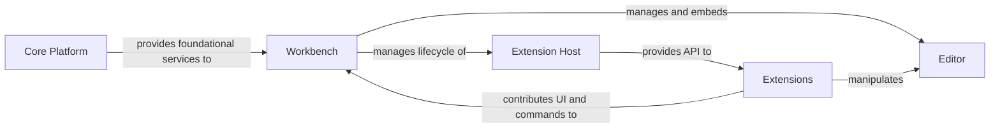

## Details

One paragraph explaining the functionality which is represented by this graph. What the main flow is and what is its purpose.

### Core Platform [[Expand]](./Core_Platform.md)
This is the foundational 'kernel' of the application. It is headless and provides essential low-level services, including file system access and watching, workspace management, and dependency injection. It is designed to be stable and provides the bedrock upon which all other components are built.

**Related Classes/Methods**:

- `src/vs/platform`

### Workbench [[Expand]](./Workbench.md)
The Workbench is the main application shell and the primary UI container. It is responsible for the overall layout, including the sidebars, status bar, and panels. It orchestrates the various UI components, manages the lifecycle of the Editor and the Extension Host, and exposes the main user-facing features like the Command Palette.

**Related Classes/Methods**:

- `src/vs/workbench`

### Editor [[Expand]](./Editor.md)
This is the specialized component for viewing and editing text. It handles text rendering, user input, syntax highlighting, and provides rich text manipulation capabilities. It operates within the Workbench and is the primary target for modifications by many extensions.

**Related Classes/Methods**:

- `src/vs/editor`

### Extension Host [[Expand]](./Extension_Host.md)
A critical component for stability and performance, the Extension Host runs all installed extensions in a separate process. This isolation prevents a faulty extension from crashing the main application. It acts as a proxy, exposing the VS Code API to extensions and mediating their communication with the Workbench.

**Related Classes/Methods**:

- `src/vs/workbench/services/extensions/common/extHostService.ts`

### Extensions [[Expand]](./Extensions.md)
These are third-party or first-party packages of functionality that add features to VS Code. They run within the Extension Host and use the exposed APIs to interact with the editor, contribute commands, and create custom UI elements. This is the foundation of VS Code's extensible microkernel architecture.

**Related Classes/Methods**:

- `src/vs/workbench/api/common/extHost.protocol.ts`

### [FAQ](https://github.com/CodeBoarding/GeneratedOnBoardings/tree/main?tab=readme-ov-file#faq)