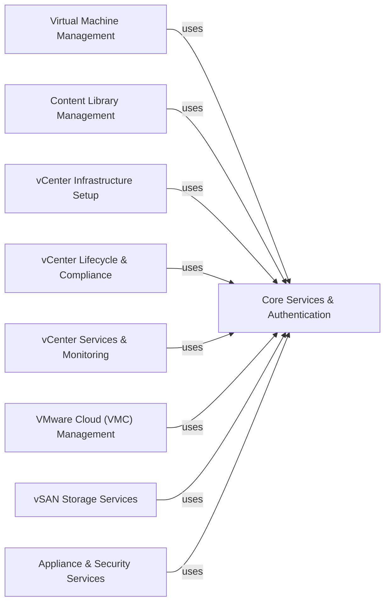

## Component Details

This graph illustrates the architecture of the provided sample modules, categorized into distinct functional components. The central component, 'Core Services & Authentication', acts as a foundational dependency, providing essential utilities for CLI argument parsing, SSL handling, API connections, and various authentication mechanisms (SSO, OAuth). All other functional components, such as 'Virtual Machine Management', 'Content Library Management', and 'VMware Cloud (VMC) Management', rely on 'Core Services & Authentication' to establish secure and authenticated communication with vCenter and VMC services, enabling their specific operations.

### Core Services & Authentication
Provides foundational utilities for CLI argument parsing, SSL certificate handling, establishing API connections (VAPI and VIM), and various Single Sign-On (SSO) and OAuth authentication mechanisms. This component is a core dependency for almost all other sample modules, enabling secure and authenticated communication with vCenter and VMC services.

**Related Classes/Methods**:

- `samples.vsphere.common.sample_cli` (full file reference)
- `samples.vsphere.common.sample_util` (full file reference)
- `samples.vsphere.common.ssl_helper` (full file reference)
- `samples.vsphere.common.id_generator` (full file reference)
- `samples.vsphere.common.sample_base` (full file reference)
- `samples.vsphere.common.vim.helpers.vim_utils` (full file reference)
- `samples.vsphere.common.vapiconnect` (full file reference)
- `samples.vsphere.common.service_manager` (full file reference)
- `samples.vsphere.common.service_manager_factory` (full file reference)
- `samples.vsphere.common.sso` (full file reference)
- `samples.vsphere.common.lookup_service_helper` (full file reference)
- `samples.vsphere.common.platform_service_controller` (full file reference)
- `samples.vsphere.oauth` (full file reference)
- `samples.vsphere.oauth.grant_types.webserver` (full file reference)
- `samples.vsphere.oauth.grant_types.list_vms_authorization_code` (full file reference)
- `samples.vsphere.oauth.grant_types.oauth_utility` (full file reference)
- `samples.vsphere.common.connect_with_cert` (full file reference)

### Virtual Machine Management
Encompasses all operations related to virtual machines, including their lifecycle (creation, deletion, power operations), hardware configuration (CPU, memory, disk, network adapters, boot devices), and guest operating system interactions.

**Related Classes/Methods**:

- `samples.vsphere.vcenter.vm.delete_vm` (full file reference)
- `samples.vsphere.vcenter.vm.list_vms` (full file reference)
- `samples.vsphere.vcenter.vm.power` (full file reference)
- `samples.vsphere.vcenter.vm.create` (full file reference)
- `samples.vsphere.vcenter.vm.guest` (full file reference)
- `samples.vsphere.vcenter.vm.hardware` (full file reference)
- `samples.vsphere.vcenter.helper.vm_helper` (full file reference)

### Content Library Management
Focuses on managing content libraries, which store and manage various types of content like OVF/OVA templates, VM templates, and ISO images. It supports deployment, capture, CRUD operations, and publish/subscribe functionalities.

**Related Classes/Methods**:

- `samples.vsphere.contentlibrary.ovfdeploy` (full file reference)
- `samples.vsphere.contentlibrary.vmcapture` (full file reference)
- `samples.vsphere.contentlibrary.crud` (full file reference)
- `samples.vsphere.contentlibrary.publishsubscribe` (full file reference)
- `samples.vsphere.contentlibrary.vmtemplate` (full file reference)
- `samples.vsphere.contentlibrary.ovaimport` (full file reference)
- `samples.vsphere.contentlibrary.contentupdate` (full file reference)
- `samples.vsphere.contentlibrary.isomount` (full file reference)
- `samples.vsphere.contentlibrary.vmtx_sync` (full file reference)
- `samples.vsphere.contentlibrary.ovfimport` (full file reference)
- `samples.vsphere.contentlibrary.lib.cls_api_client` (full file reference)
- `samples.vsphere.contentlibrary.lib.cls_api_helper` (full file reference)

### vCenter Infrastructure Setup
Provides utilities for setting up and managing core vCenter infrastructure elements such as datastores, directories, and virtual machine images (ISO, floppy, VMDK). It also includes helpers for retrieving cluster and datastore information.

**Related Classes/Methods**:

- `samples.vsphere.vcenter.setup` (full file reference)
- `samples.vsphere.common.vim.file` (full file reference)
- `samples.vsphere.common.vim.datastore_file` (full file reference)
- `samples.vsphere.common.vim.inventory` (full file reference)
- `samples.vsphere.common.vim.vmdk` (full file reference)
- `samples.vsphere.common.vim.helpers.get_cluster_by_name` (full file reference)
- `samples.vsphere.common.vim.helpers.get_datastore_by_name` (full file reference)
- `samples.vsphere.vcenter.helper.folder_helper` (full file reference)

### vCenter Lifecycle & Compliance
Manages hardware compatibility checks, lifecycle updates, and related reporting functionalities within vCenter. It also includes samples for discovery and planning.

**Related Classes/Methods**:

- `samples.vsphere.vcenter.hcl` (full file reference)
- `samples.vsphere.vcenter.vlcm` (full file reference)
- `samples.vsphere.vcenter.discovery_and_plan` (full file reference)
- `samples.vsphere.deferhistoryimport` (full file reference)

### vCenter Services & Monitoring
Covers various vCenter services, including log forwarding, general service listing, vStats for performance monitoring, and management of vCenter Namespace and Workload Control Plane (WCP) related operations.

**Related Classes/Methods**:

- `samples.vsphere.logforwarding` (full file reference)
- `samples.vsphere.services` (full file reference)
- `samples.vsphere.vcenter.vstats` (full file reference)
- `samples.vsphere.vcenter.namespace_management` (full file reference)
- `samples.vsphere.vcenter.wcp` (full file reference)

### VMware Cloud (VMC) Management
Provides specific functionalities for managing Software-Defined Data Centers (SDDCs) and network configurations (NSX-V) within VMware Cloud environments, including public IP, VPN, NAT, firewall, DNS, and logical network management.

**Related Classes/Methods**:

- `samples.vmc.networks_nsxv` (full file reference)
- `samples.vmc.sddc` (full file reference)
- `samples.vmc.helpers.vmc_task_helper` (full file reference)

### vSAN Storage Services
Manages vSAN snapshot and protection group operations, enabling data protection and recovery for virtual machines running on vSAN datastores.

**Related Classes/Methods**:

- `samples.vsan.snapservice` (full file reference)

### Appliance & Security Services
Handles vCenter appliance health monitoring, backup and restore operations, management of hardware TPM (Trusted Platform Module), and tagging for resource organization. Also includes compute policy management.

**Related Classes/Methods**:

- `samples.vsphere.appliances` (full file reference)
- `samples.vsphere.backuprestore` (full file reference)
- `samples.vsphere.hardwaretpm` (full file reference)
- `samples.vsphere.tagging` (full file reference)
- `samples.vsphere.crypto_manager.kms.native_key_provider` (full file reference)
- `samples.vsphere.compute_policy` (full file reference)

### [FAQ](https://github.com/CodeBoarding/GeneratedOnBoardings/tree/main?tab=readme-ov-file#faq)