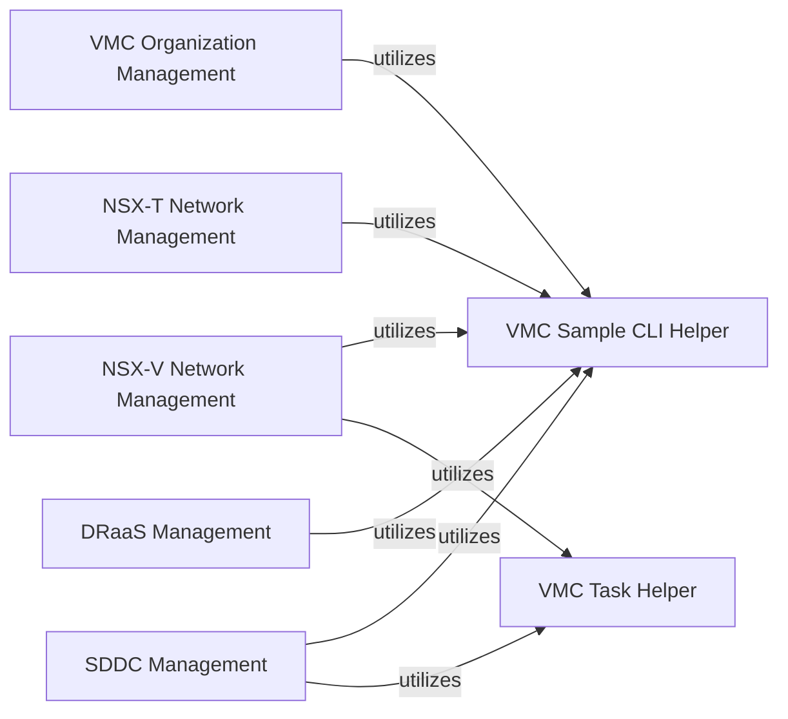

## Component Details

The VMware Cloud (VMC) Management subsystem provides comprehensive functionalities for managing VMware Cloud environments, including Software-Defined Data Centers (SDDCs) and organizations. It covers NSX-T and NSX-V network configurations (segments, firewall rules, NAT, VPNs, public IPs, DNS, logical networks) and Disaster Recovery as a Service (DRaaS) operations (SRM deployment, activation, and site recovery information). The main flow involves various management operations on VMC resources, often utilizing common helper utilities for task management and command-line interface parsing.

### VMC Organization Management
Provides functionalities for managing VMware Cloud organizations, including listing and retrieving their details. It interacts with the VMware Cloud API.

**Related Classes/Methods**:

- <a href="https://github.com/vmware/vsphere-automation-sdk-python/blob/master/samples/vmc/orgs/organization_operations.py#L15-L80" target="_blank" rel="noopener noreferrer">`samples.vmc.orgs.organization_operations` (15:80)</a>
- <a href="https://github.com/vmware/vsphere-automation-sdk-python/blob/master/samples/vmc/orgs/organization_operations.py#L79-L84" target="_blank" rel="noopener noreferrer">`samples.vmc.orgs.organization_operations:main` (79:84)</a>
- <a href="https://github.com/vmware/vsphere-automation-sdk-python/blob/master/samples/vmc/orgs/organization_operations.py#L24-L76" target="_blank" rel="noopener noreferrer">`samples.vmc.orgs.organization_operations.OperationsOnOrganizations` (24:76)</a>
- <a href="https://github.com/vmware/vsphere-automation-sdk-python/blob/master/samples/vmc/orgs/organization_operations.py#L38-L48" target="_blank" rel="noopener noreferrer">`samples.vmc.orgs.organization_operations.OperationsOnOrganizations.options` (38:48)</a>
- <a href="https://github.com/vmware/vsphere-automation-sdk-python/blob/master/samples/vmc/orgs/organization_operations.py#L50-L54" target="_blank" rel="noopener noreferrer">`samples.vmc.orgs.organization_operations.OperationsOnOrganizations.setup` (50:54)</a>
- <a href="https://github.com/vmware/vsphere-automation-sdk-python/blob/master/samples/vmc/orgs/organization_operations.py#L56-L65" target="_blank" rel="noopener noreferrer">`samples.vmc.orgs.organization_operations.OperationsOnOrganizations.list_orgs` (56:65)</a>
- <a href="https://github.com/vmware/vsphere-automation-sdk-python/blob/master/samples/vmc/orgs/organization_operations.py#L67-L76" target="_blank" rel="noopener noreferrer">`samples.vmc.orgs.organization_operations.OperationsOnOrganizations.get_org_detail` (67:76)</a>

### NSX-T Network Management
Manages NSX-T network configurations, including segment firewall rules, NAT rules, and L3 VPNs (policy-based and route-based). It interacts with NSX-T policy APIs.

**Related Classes/Methods**:

- <a href="https://github.com/vmware/vsphere-automation-sdk-python/blob/master/samples/vmc/networks_nsxt/segments_firewall_crud.py#L15-L180" target="_blank" rel="noopener noreferrer">`samples.vmc.networks_nsxt.segments_firewall_crud` (15:180)</a>
- <a href="https://github.com/vmware/vsphere-automation-sdk-python/blob/master/samples/vmc/networks_nsxt/segments_firewall_crud.py#L122-L125" target="_blank" rel="noopener noreferrer">`samples.vmc.networks_nsxt.segments_firewall_crud:main` (122:125)</a>
- <a href="https://github.com/vmware/vsphere-automation-sdk-python/blob/master/samples/vmc/networks_nsxt/segments_firewall_crud.py#L29-L119" target="_blank" rel="noopener noreferrer">`samples.vmc.networks_nsxt.segments_firewall_crud.NSXPolicySegmentFirewall` (29:119)</a>
- <a href="https://github.com/vmware/vsphere-automation-sdk-python/blob/master/samples/vmc/networks_nsxt/segments_firewall_crud.py#L74-L88" target="_blank" rel="noopener noreferrer">`samples.vmc.networks_nsxt.segments_firewall_crud.NSXPolicySegmentFirewall.patch_mgw_gateway_firewall_rule` (74:88)</a>
- <a href="https://github.com/vmware/vsphere-automation-sdk-python/blob/master/samples/vmc/networks_nsxt/segments_firewall_crud.py#L90-L96" target="_blank" rel="noopener noreferrer">`samples.vmc.networks_nsxt.segments_firewall_crud.NSXPolicySegmentFirewall.delete_mgw_gateway_firewall_rule` (90:96)</a>
- <a href="https://github.com/vmware/vsphere-automation-sdk-python/blob/master/samples/vmc/networks_nsxt/segments_firewall_crud.py#L108-L115" target="_blank" rel="noopener noreferrer">`samples.vmc.networks_nsxt.segments_firewall_crud.NSXPolicySegmentFirewall.run` (108:115)</a>
- <a href="https://github.com/vmware/vsphere-automation-sdk-python/blob/master/samples/vmc/networks_nsxt/segments_firewall_crud.py#L117-L119" target="_blank" rel="noopener noreferrer">`samples.vmc.networks_nsxt.segments_firewall_crud.NSXPolicySegmentFirewall.cleanup` (117:119)</a>
- <a href="https://github.com/vmware/vsphere-automation-sdk-python/blob/master/samples/vmc/networks_nsxt/segments_firewall_crud.py#L98-L106" target="_blank" rel="noopener noreferrer">`samples.vmc.networks_nsxt.segments_firewall_crud.NSXPolicySegmentFirewall.log_error` (98:106)</a>
- <a href="https://github.com/vmware/vsphere-automation-sdk-python/blob/master/samples/vmc/networks_nsxt/segments_firewall_crud.py#L43-L47" target="_blank" rel="noopener noreferrer">`samples.vmc.networks_nsxt.segments_firewall_crud.NSXPolicySegmentFirewall.get_infra` (43:47)</a>
- <a href="https://github.com/vmware/vsphere-automation-sdk-python/blob/master/samples/vmc/networks_nsxt/segments_firewall_crud.py#L49-L53" target="_blank" rel="noopener noreferrer">`samples.vmc.networks_nsxt.segments_firewall_crud.NSXPolicySegmentFirewall.get_tier1s` (49:53)</a>
- <a href="https://github.com/vmware/vsphere-automation-sdk-python/blob/master/samples/vmc/networks_nsxt/segments_firewall_crud.py#L55-L59" target="_blank" rel="noopener noreferrer">`samples.vmc.networks_nsxt.segments_firewall_crud.NSXPolicySegmentFirewall.get_segments` (55:59)</a>
- <a href="https://github.com/vmware/vsphere-automation-sdk-python/blob/master/samples/vmc/networks_nsxt/segments_firewall_crud.py#L61-L65" target="_blank" rel="noopener noreferrer">`samples.vmc.networks_nsxt.segments_firewall_crud.NSXPolicySegmentFirewall.get_domains` (61:65)</a>
- <a href="https://github.com/vmware/vsphere-automation-sdk-python/blob/master/samples/vmc/networks_nsxt/segments_firewall_crud.py#L67-L72" target="_blank" rel="noopener noreferrer">`samples.vmc.networks_nsxt.segments_firewall_crud.NSXPolicySegmentFirewall.get_mgw_gateway_firewall_rules` (67:72)</a>
- <a href="https://github.com/vmware/vsphere-automation-sdk-python/blob/master/samples/vmc/networks_nsxt/nat_crud.py#L15-L150" target="_blank" rel="noopener noreferrer">`samples.vmc.networks_nsxt.nat_crud` (15:150)</a>
- <a href="https://github.com/vmware/vsphere-automation-sdk-python/blob/master/samples/vmc/networks_nsxt/nat_crud.py#L126-L129" target="_blank" rel="noopener noreferrer">`samples.vmc.networks_nsxt.nat_crud:main` (126:129)</a>
- <a href="https://github.com/vmware/vsphere-automation-sdk-python/blob/master/samples/vmc/networks_nsxt/nat_crud.py#L33-L123" target="_blank" rel="noopener noreferrer">`samples.vmc.networks_nsxt.nat_crud.NSXPolicyNAT` (33:123)</a>
- <a href="https://github.com/vmware/vsphere-automation-sdk-python/blob/master/samples/vmc/networks_nsxt/nat_crud.py#L59-L66" target="_blank" rel="noopener noreferrer">`samples.vmc.networks_nsxt.nat_crud.NSXPolicyNAT.update_public_ip` (59:66)</a>
- <a href="https://github.com/vmware/vsphere-automation-sdk-python/blob/master/samples/vmc/networks_nsxt/nat_crud.py#L68-L74" target="_blank" rel="noopener noreferrer">`samples.vmc.networks_nsxt.nat_crud.NSXPolicyNAT.delete_public_ip` (68:74)</a>
- <a href="https://github.com/vmware/vsphere-automation-sdk-python/blob/master/samples/vmc/networks_nsxt/nat_crud.py#L83-L96" target="_blank" rel="noopener noreferrer">`samples.vmc.networks_nsxt.nat_crud.NSXPolicyNAT.patch_nat_rule` (83:96)</a>
- <a href="https://github.com/vmware/vsphere-automation-sdk-python/blob/master/samples/vmc/networks_nsxt/nat_crud.py#L98-L104" target="_blank" rel="noopener noreferrer">`samples.vmc.networks_nsxt.nat_crud.NSXPolicyNAT.delete_nat_rule` (98:104)</a>
- <a href="https://github.com/vmware/vsphere-automation-sdk-python/blob/master/samples/vmc/networks_nsxt/nat_crud.py#L116-L118" target="_blank" rel="noopener noreferrer">`samples.vmc.networks_nsxt.nat_crud.NSXPolicyNAT.run` (116:118)</a>
- <a href="https://github.com/vmware/vsphere-automation-sdk-python/blob/master/samples/vmc/networks_nsxt/nat_crud.py#L120-L123" target="_blank" rel="noopener noreferrer">`samples.vmc.networks_nsxt.nat_crud.NSXPolicyNAT.cleanup` (120:123)</a>
- <a href="https://github.com/vmware/vsphere-automation-sdk-python/blob/master/samples/vmc/networks_nsxt/nat_crud.py#L106-L114" target="_blank" rel="noopener noreferrer">`samples.vmc.networks_nsxt.nat_crud.NSXPolicyNAT.log_error` (106:114)</a>
- <a href="https://github.com/vmware/vsphere-automation-sdk-python/blob/master/samples/vmc/networks_nsxt/nat_crud.py#L52-L57" target="_blank" rel="noopener noreferrer">`samples.vmc.networks_nsxt.nat_crud.NSXPolicyNAT.get_public_ip` (52:57)</a>
- <a href="https://github.com/vmware/vsphere-automation-sdk-python/blob/master/samples/vmc/networks_nsxt/nat_crud.py#L76-L81" target="_blank" rel="noopener noreferrer">`samples.vmc.networks_nsxt.nat_crud.NSXPolicyNAT.get_nat_rules` (76:81)</a>
- <a href="https://github.com/vmware/vsphere-automation-sdk-python/blob/master/samples/vmc/networks_nsxt/l3_vpn_crud.py#L15-L200" target="_blank" rel="noopener noreferrer">`samples.vmc.networks_nsxt.l3_vpn_crud` (15:200)</a>
- <a href="https://github.com/vmware/vsphere-automation-sdk-python/blob/master/samples/vmc/networks_nsxt/l3_vpn_crud.py#L241-L246" target="_blank" rel="noopener noreferrer">`samples.vmc.networks_nsxt.l3_vpn_crud:main` (241:246)</a>
- <a href="https://github.com/vmware/vsphere-automation-sdk-python/blob/master/samples/vmc/networks_nsxt/l3_vpn_crud.py#L35-L238" target="_blank" rel="noopener noreferrer">`samples.vmc.networks_nsxt.l3_vpn_crud.NSXPolicyL3VPN` (35:238)</a>
- <a href="https://github.com/vmware/vsphere-automation-sdk-python/blob/master/samples/vmc/networks_nsxt/l3_vpn_crud.py#L57-L65" target="_blank" rel="noopener noreferrer">`samples.vmc.networks_nsxt.l3_vpn_crud.NSXPolicyL3VPN.get_l3_vpn_context` (57:65)</a>
- <a href="https://github.com/vmware/vsphere-automation-sdk-python/blob/master/samples/vmc/networks_nsxt/l3_vpn_crud.py#L67-L115" target="_blank" rel="noopener noreferrer">`samples.vmc.networks_nsxt.l3_vpn_crud.NSXPolicyL3VPN.create_policy_based_l3_vpn` (67:115)</a>
- <a href="https://github.com/vmware/vsphere-automation-sdk-python/blob/master/samples/vmc/networks_nsxt/l3_vpn_crud.py#L117-L174" target="_blank" rel="noopener noreferrer">`samples.vmc.networks_nsxt.l3_vpn_crud.NSXPolicyL3VPN.create_route_based_l3_vpn` (117:174)</a>
- <a href="https://github.com/vmware/vsphere-automation-sdk-python/blob/master/samples/vmc/networks_nsxt/l3_vpn_crud.py#L176-L184" target="_blank" rel="noopener noreferrer">`samples.vmc.networks_nsxt.l3_vpn_crud.NSXPolicyL3VPN.list_l3_vpns` (176:184)</a>
- <a href="https://github.com/vmware/vsphere-automation-sdk-python/blob/master/samples/vmc/networks_nsxt/l3_vpn_crud.py#L186-L193" target="_blank" rel="noopener noreferrer">`samples.vmc.networks_nsxt.l3_vpn_crud.NSXPolicyL3VPN.get_l3_vpn` (186:193)</a>
- <a href="https://github.com/vmware/vsphere-automation-sdk-python/blob/master/samples/vmc/networks_nsxt/l3_vpn_crud.py#L195-L201" target="_blank" rel="noopener noreferrer">`samples.vmc.networks_nsxt.l3_vpn_crud.NSXPolicyL3VPN.delete_l3vpn` (195:201)</a>
- <a href="https://github.com/vmware/vsphere-automation-sdk-python/blob/master/samples/vmc/networks_nsxt/l3_vpn_crud.py#L203-L211" target="_blank" rel="noopener noreferrer">`samples.vmc.networks_nsxt.l3_vpn_crud.NSXPolicyL3VPN.delete_bgp_neighbor` (203:211)</a>
- <a href="https://github.com/vmware/vsphere-automation-sdk-python/blob/master/samples/vmc/networks_nsxt/l3_vpn_crud.py#L223-L226" target="_blank" rel="noopener noreferrer">`samples.vmc.networks_nsxt.l3_vpn_crud.NSXPolicyL3VPN.run_policy_based_vpn` (223:226)</a>
- <a href="https://github.com/vmware/vsphere-automation-sdk-python/blob/master/samples/vmc/networks_nsxt/l3_vpn_crud.py#L228-L229" target="_blank" rel="noopener noreferrer">`samples.vmc.networks_nsxt.l3_vpn_crud.NSXPolicyL3VPN.cleanup_policy_based_vpn` (228:229)</a>
- <a href="https://github.com/vmware/vsphere-automation-sdk-python/blob/master/samples/vmc/networks_nsxt/l3_vpn_crud.py#L231-L234" target="_blank" rel="noopener noreferrer">`samples.vmc.networks_nsxt.l3_vpn_crud.NSXPolicyL3VPN.run_route_based_vpn` (231:234)</a>
- <a href="https://github.com/vmware/vsphere-automation-sdk-python/blob/master/samples/vmc/networks_nsxt/l3_vpn_crud.py#L236-L238" target="_blank" rel="noopener noreferrer">`samples.vmc.networks_nsxt.l3_vpn_crud.NSXPolicyL3VPN.cleanup_route_based_vpn` (236:238)</a>
- <a href="https://github.com/vmware/vsphere-automation-sdk-python/blob/master/samples/vmc/networks_nsxt/l3_vpn_crud.py#L213-L221" target="_blank" rel="noopener noreferrer">`samples.vmc.networks_nsxt.l3_vpn_crud.NSXPolicyL3VPN.log_error` (213:221)</a>

### NSX-V Network Management
Manages NSX-V network configurations, including exposing public IPs, IPsec VPNs, firewall rules, and logical networks.

**Related Classes/Methods**:

- <a href="https://github.com/vmware/vsphere-automation-sdk-python/blob/master/samples/vmc/networks_nsxv/expose_public_ip.py#L15-L100" target="_blank" rel="noopener noreferrer">`samples.vmc.networks_nsxv.expose_public_ip` (15:100)</a>
- <a href="https://github.com/vmware/vsphere-automation-sdk-python/blob/master/samples/vmc/networks_nsxv/expose_public_ip.py#L220-L226" target="_blank" rel="noopener noreferrer">`samples.vmc.networks_nsxv.expose_public_ip:main` (220:226)</a>
- <a href="https://github.com/vmware/vsphere-automation-sdk-python/blob/master/samples/vmc/networks_nsxv/expose_public_ip.py#L27-L217" target="_blank" rel="noopener noreferrer">`samples.vmc.networks_nsxv.expose_public_ip.ExposePublicIP` (27:217)</a>
- <a href="https://github.com/vmware/vsphere-automation-sdk-python/blob/master/samples/vmc/networks_nsxv/expose_public_ip.py#L93-L119" target="_blank" rel="noopener noreferrer">`samples.vmc.networks_nsxv.expose_public_ip.ExposePublicIP.request_public_ip` (93:119)</a>
- <a href="https://github.com/vmware/vsphere-automation-sdk-python/blob/master/samples/vmc/networks_nsxv/expose_public_ip.py#L74-L91" target="_blank" rel="noopener noreferrer">`samples.vmc.networks_nsxv.expose_public_ip.ExposePublicIP.setup` (74:91)</a>
- <a href="https://github.com/vmware/vsphere-automation-sdk-python/blob/master/samples/vmc/networks_nsxv/expose_public_ip.py#L121-L150" target="_blank" rel="noopener noreferrer">`samples.vmc.networks_nsxv.expose_public_ip.ExposePublicIP.create_firewall_rule_on_cgw` (121:150)</a>
- <a href="https://github.com/vmware/vsphere-automation-sdk-python/blob/master/samples/vmc/networks_nsxv/expose_public_ip.py#L152-L174" target="_blank" rel="noopener noreferrer">`samples.vmc.networks_nsxv.expose_public_ip.ExposePublicIP.create_net_rule` (152:174)</a>
- <a href="https://github.com/vmware/vsphere-automation-sdk-python/blob/master/samples/vmc/networks_nsxv/expose_public_ip.py#L176-L217" target="_blank" rel="noopener noreferrer">`samples.vmc.networks_nsxv.expose_public_ip.ExposePublicIP.cleanup` (176:217)</a>
- <a href="https://github.com/vmware/vsphere-automation-sdk-python/blob/master/samples/vmc/networks_nsxv/ipsec_vpns_crud.py#L15-L150" target="_blank" rel="noopener noreferrer">`samples.vmc.networks_nsxv.ipsec_vpns_crud` (15:150)</a>
- <a href="https://github.com/vmware/vsphere-automation-sdk-python/blob/master/samples/vmc/networks_nsxv/ipsec_vpns_crud.py#L192-L200" target="_blank" rel="noopener noreferrer">`samples.vmc.networks_nsxv.ipsec_vpns_crud:main` (192:200)</a>
- <a href="https://github.com/vmware/vsphere-automation-sdk-python/blob/master/samples/vmc/networks_nsxv/ipsec_vpns_crud.py#L22-L189" target="_blank" rel="noopener noreferrer">`samples.vmc.networks_nsxv.ipsec_vpns_crud.IpsecVPNsCrud` (22:189)</a>
- <a href="https://github.com/vmware/vsphere-automation-sdk-python/blob/master/samples/vmc/networks_nsxv/ipsec_vpns_crud.py#L140-L144" target="_blank" rel="noopener noreferrer">`samples.vmc.networks_nsxv.ipsec_vpns_crud.IpsecVPNsCrud.get_vpn` (140:144)</a>
- <a href="https://github.com/vmware/vsphere-automation-sdk-python/blob/master/samples/vmc/networks_nsxv/ipsec_vpns_crud.py#L146-L165" target="_blank" rel="noopener noreferrer">`samples.vmc.networks_nsxv.ipsec_vpns_crud.IpsecVPNsCrud.update_vpn` (146:165)</a>
- <a href="https://github.com/vmware/vsphere-automation-sdk-python/blob/master/samples/vmc/networks_nsxv/ipsec_vpns_crud.py#L89-L109" target="_blank" rel="noopener noreferrer">`samples.vmc.networks_nsxv.ipsec_vpns_crud.IpsecVPNsCrud.setup` (89:109)</a>
- <a href="https://github.com/vmware/vsphere-automation-sdk-python/blob/master/samples/vmc/networks_nsxv/ipsec_vpns_crud.py#L167-L171" target="_blank" rel="noopener noreferrer">`samples.vmc.networks_nsxv.ipsec_vpns_crud.IpsecVPNsCrud.delete_vpn` (167:171)</a>
- <a href="https://github.com/vmware/vsphere-automation-sdk-python/blob/master/samples/vmc/networks_nsxv/ipsec_vpns_crud.py#L173-L183" target="_blank" rel="noopener noreferrer">`samples.vmc.networks_nsxv.ipsec_vpns_crud.IpsecVPNsCrud.get_vpn_by_name` (173:183)</a>
- <a href="https://github.com/vmware/vsphere-automation-sdk-python/blob/master/samples/vmc/networks_nsxv/ipsec_vpns_crud.py#L185-L189" target="_blank" rel="noopener noreferrer">`samples.vmc.networks_nsxv.ipsec_vpns_crud.IpsecVPNsCrud.print_output` (185:189)</a>
- <a href="https://github.com/vmware/vsphere-automation-sdk-python/blob/master/samples/vmc/networks_nsxv/firewall_rules_crud.py#L15-L180" target="_blank" rel="noopener noreferrer">`samples.vmc.networks_nsxv.firewall_rules_crud` (15:180)</a>
- <a href="https://github.com/vmware/vsphere-automation-sdk-python/blob/master/samples/vmc/networks_nsxv/firewall_rules_crud.py#L212-L218" target="_blank" rel="noopener noreferrer">`samples.vmc.networks_nsxv.firewall_rules_crud:main` (212:218)</a>
- <a href="https://github.com/vmware/vsphere-automation-sdk-python/blob/master/samples/vmc/networks_nsxv/firewall_rules_crud.py#L24-L209" target="_blank" rel="noopener noreferrer">`samples.vmc.networks_nsxv.firewall_rules_crud.FirewallRulesCrud` (24:209)</a>
- <a href="https://github.com/vmware/vsphere-automation-sdk-python/blob/master/samples/vmc/networks_nsxv/firewall_rules_crud.py#L145-L167" target="_blank" rel="noopener noreferrer">`samples.vmc.networks_nsxv.firewall_rules_crud.FirewallRulesCrud.get_firewall_rule` (145:167)</a>
- <a href="https://github.com/vmware/vsphere-automation-sdk-python/blob/master/samples/vmc/networks_nsxv/firewall_rules_crud.py#L169-L191" target="_blank" rel="noopener noreferrer">`samples.vmc.networks_nsxv.firewall_rules_crud.FirewallRulesCrud.update_firewall_rule` (169:191)</a>
- <a href="https://github.com/vmware/vsphere-automation-sdk-python/blob/master/samples/vmc/networks_nsxv/firewall_rules_crud.py#L62-L73" target="_blank" rel="noopener noreferrer">`samples.vmc.networks_nsxv.firewall_rules_crud.FirewallRulesCrud.setup` (62:73)</a>
- <a href="https://github.com/vmware/vsphere-automation-sdk-python/blob/master/samples/vmc/networks_nsxv/firewall_rules_crud.py#L75-L143" target="_blank" rel="noopener noreferrer">`samples.vmc.networks_nsxv.firewall_rules_crud.FirewallRulesCrud.create_firewall_rule` (75:143)</a>
- <a href="https://github.com/vmware/vsphere-automation-sdk-python/blob/master/samples/vmc/networks_nsxv/firewall_rules_crud.py#L193-L201" target="_blank" rel="noopener noreferrer">`samples.vmc.networks_nsxv.firewall_rules_crud.FirewallRulesCrud.delete_firewall_rule` (193:201)</a>
- <a href="https://github.com/vmware/vsphere-automation-sdk-python/blob/master/samples/vmc/networks_nsxv/firewall_rules_crud.py#L203-L209" target="_blank" rel="noopener noreferrer">`samples.vmc.networks_nsxv.firewall_rules_crud.FirewallRulesCrud.print_output` (203:209)</a>
- `samples.vmc.networks_nsxv.logical_network_crud` (full file reference)
- <a href="https://github.com/vmware/vsphere-automation-sdk-python/blob/master/samples/vmc/networks_nsxv/logical_network_crud.py#L175-L182" target="_blank" rel="noopener noreferrer">`samples.vmc.networks_nsxv.logical_network_crud:main` (175:182)</a>
- <a href="https://github.com/vmware/vsphere-automation-sdk-python/blob/master/samples/vmc/networks_nsxv/logical_network_crud.py#L26-L172" target="_blank" rel="noopener noreferrer">`samples.vmc.networks_nsxv.logical_network_crud.LogicalNetworkCrud` (26:172)</a>
- <a href="https://github.com/vmware/vsphere-automation-sdk-python/blob/master/samples/vmc/networks_nsxv/logical_network_crud.py#L117-L136" target="_blank" rel="noopener noreferrer">`samples.vmc.networks_nsxv.logical_network_crud.LogicalNetworkCrud.get_logical_network` (117:136)</a>
- <a href="https://github.com/vmware/vsphere-automation-sdk-python/blob/master/samples/vmc/networks_nsxv/logical_network_crud.py#L138-L156" target="_blank" rel="noopener noreferrer">`samples.vmc.networks_nsxv.logical_network_crud.LogicalNetworkCrud.update_logical_network` (138:156)</a>
- <a href="https://github.com/vmware/vsphere-automation-sdk-python/blob/master/samples/vmc/networks_nsxv/logical_network_crud.py#L66-L87" target="_blank" rel="noopener noreferrer">`samples.vmc.networks_nsxv.logical_network_crud.LogicalNetworkCrud.setup` (66:87)</a>
- <a href="https://github.com/vmware/vsphere-automation-sdk-python/blob/master/samples/vmc/networks_nsxv/logical_network_crud.py#L89-L115" target="_blank" rel="noopener noreferrer">`samples.vmc.networks_nsxv.logical_network_crud.LogicalNetworkCrud.create_logical_network` (89:115)</a>
- <a href="https://github.com/vmware/vsphere-automation-sdk-python/blob/master/samples/vmc/networks_nsxv/logical_network_crud.py#L158-L163" target="_blank" rel="noopener noreferrer">`samples.vmc.networks_nsxv.logical_network_crud.LogicalNetworkCrud.delete_logical_network` (158:163)</a>
- <a href="https://github.com/vmware/vsphere-automation-sdk-python/blob/master/samples/vmc/networks_nsxv/logical_network_crud.py#L165-L172" target="_blank" rel="noopener noreferrer">`samples.vmc.networks_nsxv.logical_network_crud.LogicalNetworkCrud.print_output` (165:172)</a>

### SDDC Management
Provides comprehensive functionalities for managing Software-Defined Data Centers (SDDCs), including creation, listing, deletion, and host management (adding/removing hosts).

**Related Classes/Methods**:

- <a href="https://github.com/vmware/vsphere-automation-sdk-python/blob/master/samples/vmc/sddc/sddc_crud.py#L15-L200" target="_blank" rel="noopener noreferrer">`samples.vmc.sddc.sddc_crud` (15:200)</a>
- <a href="https://github.com/vmware/vsphere-automation-sdk-python/blob/master/samples/vmc/sddc/sddc_crud.py#L223-L233" target="_blank" rel="noopener noreferrer">`samples.vmc.sddc.sddc_crud:main` (223:233)</a>
- <a href="https://github.com/vmware/vsphere-automation-sdk-python/blob/master/samples/vmc/sddc/sddc_crud.py#L27-L220" target="_blank" rel="noopener noreferrer">`samples.vmc.sddc.sddc_crud.CreateDeleteSDDC` (27:220)</a>
- <a href="https://github.com/vmware/vsphere-automation-sdk-python/blob/master/samples/vmc/sddc/sddc_crud.py#L119-L169" target="_blank" rel="noopener noreferrer">`samples.vmc.sddc.sddc_crud.CreateDeleteSDDC.create_sddc` (119:169)</a>
- <a href="https://github.com/vmware/vsphere-automation-sdk-python/blob/master/samples/vmc/sddc/sddc_crud.py#L171-L200" target="_blank" rel="noopener noreferrer">`samples.vmc.sddc.sddc_crud.CreateDeleteSDDC.delete_sddc` (171:200)</a>
- <a href="https://github.com/vmware/vsphere-automation-sdk-python/blob/master/samples/vmc/sddc/sddc_crud.py#L202-L208" target="_blank" rel="noopener noreferrer">`samples.vmc.sddc.sddc_crud.CreateDeleteSDDC.list_sddc` (202:208)</a>
- <a href="https://github.com/vmware/vsphere-automation-sdk-python/blob/master/samples/vmc/sddc/sddc_crud.py#L111-L117" target="_blank" rel="noopener noreferrer">`samples.vmc.sddc.sddc_crud.CreateDeleteSDDC.setup` (111:117)</a>
- <a href="https://github.com/vmware/vsphere-automation-sdk-python/blob/master/samples/vmc/sddc/sddc_crud.py#L214-L220" target="_blank" rel="noopener noreferrer">`samples.vmc.sddc.sddc_crud.CreateDeleteSDDC.get_subnet_id` (214:220)</a>
- <a href="https://github.com/vmware/vsphere-automation-sdk-python/blob/master/samples/vmc/sddc/sddc_crud.py#L210-L212" target="_blank" rel="noopener noreferrer">`samples.vmc.sddc.sddc_crud.CreateDeleteSDDC.print_output` (210:212)</a>
- <a href="https://github.com/vmware/vsphere-automation-sdk-python/blob/master/samples/vmc/sddc/add_remove_hosts.py#L15-L150" target="_blank" rel="noopener noreferrer">`samples.vmc.sddc.add_remove_hosts` (15:150)</a>
- <a href="https://github.com/vmware/vsphere-automation-sdk-python/blob/master/samples/vmc/sddc/add_remove_hosts.py#L114-L119" target="_blank" rel="noopener noreferrer">`samples.vmc.sddc.add_remove_hosts:main` (114:119)</a>
- <a href="https://github.com/vmware/vsphere-automation-sdk-python/blob/master/samples/vmc/sddc/add_remove_hosts.py#L29-L111" target="_blank" rel="noopener noreferrer">`samples.vmc.sddc.add_remove_hosts.AddRemoveHosts` (29:111)</a>
- <a href="https://github.com/vmware/vsphere-automation-sdk-python/blob/master/samples/vmc/sddc/add_remove_hosts.py#L75-L91" target="_blank" rel="noopener noreferrer">`samples.vmc.sddc.add_remove_hosts.AddRemoveHosts.add_host` (75:91)</a>
- <a href="https://github.com/vmware/vsphere-automation-sdk-python/blob/master/samples/vmc/sddc/add_remove_hosts.py#L93-L111" target="_blank" rel="noopener noreferrer">`samples.vmc.sddc.add_remove_hosts.AddRemoveHosts.remove_host` (93:111)</a>
- <a href="https://github.com/vmware/vsphere-automation-sdk-python/blob/master/samples/vmc/sddc/add_remove_hosts.py#L45-L55" target="_blank" rel="noopener noreferrer">`samples.vmc.sddc.add_remove_hosts.AddRemoveHosts.options` (45:55)</a>
- <a href="https://github.com/vmware/vsphere-automation-sdk-python/blob/master/samples/vmc/sddc/add_remove_hosts.py#L57-L73" target="_blank" rel="noopener noreferrer">`samples.vmc.sddc.add_remove_hosts.AddRemoveHosts.setup` (57:73)</a>

### DRaaS Management
Manages Disaster Recovery as a Service (DRaaS) operations, including deployment and deletion of additional SRM nodes, activation/deactivation of SRM, and retrieval of site recovery information.

**Related Classes/Methods**:

- <a href="https://github.com/vmware/vsphere-automation-sdk-python/blob/master/samples/vmc/draas/deploy_additional_node.py#L15-L120" target="_blank" rel="noopener noreferrer">`samples.vmc.draas.deploy_additional_node` (15:120)</a>
- <a href="https://github.com/vmware/vsphere-automation-sdk-python/blob/master/samples/vmc/draas/deploy_additional_node.py#L112-L117" target="_blank" rel="noopener noreferrer">`samples.vmc.draas.deploy_additional_node:main` (112:117)</a>
- <a href="https://github.com/vmware/vsphere-automation-sdk-python/blob/master/samples/vmc/draas/deploy_additional_node.py#L24-L109" target="_blank" rel="noopener noreferrer">`samples.vmc.draas.deploy_additional_node.DeployAdditionalNode` (24:109)</a>
- <a href="https://github.com/vmware/vsphere-automation-sdk-python/blob/master/samples/vmc/draas/deploy_additional_node.py#L102-L109" target="_blank" rel="noopener noreferrer">`samples.vmc.draas.deploy_additional_node.DeployAdditionalNode.delete_node` (102:109)</a>
- <a href="https://github.com/vmware/vsphere-automation-sdk-python/blob/master/samples/vmc/draas/deploy_additional_node.py#L49-L64" target="_blank" rel="noopener noreferrer">`samples.vmc.draas.deploy_additional_node.DeployAdditionalNode.setup` (49:64)</a>
- <a href="https://github.com/vmware/vsphere-automation-sdk-python/blob/master/samples/vmc/draas/deploy_additional_node.py#L67-L73" target="_blank" rel="noopener noreferrer">`samples.vmc.draas.deploy_additional_node.DeployAdditionalNode.deploy_srm` (67:73)</a>
- <a href="https://github.com/vmware/vsphere-automation-sdk-python/blob/master/samples/vmc/draas/deploy_additional_node.py#L79-L99" target="_blank" rel="noopener noreferrer">`samples.vmc.draas.deploy_additional_node.DeployAdditionalNode.query_deployment` (79:99)</a>
- <a href="https://github.com/vmware/vsphere-automation-sdk-python/blob/master/samples/vmc/draas/activate_srm_ops.py#L15-L100" target="_blank" rel="noopener noreferrer">`samples.vmc.draas.activate_srm_ops` (15:100)</a>
- <a href="https://github.com/vmware/vsphere-automation-sdk-python/blob/master/samples/vmc/draas/activate_srm_ops.py#L102-L105" target="_blank" rel="noopener noreferrer">`samples.vmc.draas.activate_srm_ops:main` (102:105)</a>
- <a href="https://github.com/vmware/vsphere-automation-sdk-python/blob/master/samples/vmc/draas/activate_srm_ops.py#L23-L99" target="_blank" rel="noopener noreferrer">`samples.vmc.draas.activate_srm_ops.SrmActivationOperations` (23:99)</a>
- <a href="https://github.com/vmware/vsphere-automation-sdk-python/blob/master/samples/vmc/draas/activate_srm_ops.py#L61-L70" target="_blank" rel="noopener noreferrer">`samples.vmc.draas.activate_srm_ops.SrmActivationOperations.activate_srm` (61:70)</a>
- <a href="https://github.com/vmware/vsphere-automation-sdk-python/blob/master/samples/vmc/draas/activate_srm_ops.py#L93-L99" target="_blank" rel="noopener noreferrer">`samples.vmc.draas.activate_srm_ops.SrmActivationOperations.deactivate_srm` (93:99)</a>
- <a href="https://github.com/vmware/vsphere-automation-sdk-python/blob/master/samples/vmc/draas/activate_srm_ops.py#L76-L90" target="_blank" rel="noopener noreferrer">`samples.vmc.draas.activate_srm_ops.SrmActivationOperations.query_activation_status` (76:90)</a>
- <a href="https://github.com/vmware/vsphere-automation-sdk-python/blob/master/samples/vmc/draas/site_recovery_info.py#L15-L80" target="_blank" rel="noopener noreferrer">`samples.vmc.draas.site_recovery_info` (15:80)</a>
- <a href="https://github.com/vmware/vsphere-automation-sdk-python/blob/master/samples/vmc/draas/site_recovery_info.py#L57-L59" target="_blank" rel="noopener noreferrer">`samples.vmc.draas.site_recovery_info:main` (57:59)</a>
- <a href="https://github.com/vmware/vsphere-automation-sdk-python/blob/master/samples/vmc/draas/site_recovery_info.py#L21-L54" target="_blank" rel="noopener noreferrer">`samples.vmc.draas.site_recovery_info.VmcSiteRecoveryInfo` (21:54)</a>
- <a href="https://github.com/vmware/vsphere-automation-sdk-python/blob/master/samples/vmc/draas/site_recovery_info.py#L38-L54" target="_blank" rel="noopener noreferrer">`samples.vmc.draas.site_recovery_info.VmcSiteRecoveryInfo.get_draas_info` (38:54)</a>

### VMC Task Helper
A utility component responsible for polling and waiting for the completion of asynchronous VMC tasks.

**Related Classes/Methods**:

- `samples.vmc.helpers.vmc_task_helper` (full file reference)
- <a href="https://github.com/vmware/vsphere-automation-sdk-python/blob/master/samples/vmc/helpers/vmc_task_helper.py#L21-L48" target="_blank" rel="noopener noreferrer">`samples.vmc.helpers.vmc_task_helper.wait_for_task` (21:48)</a>
- <a href="https://github.com/vmware/vsphere-automation-sdk-python/blob/master/samples/vmc/helpers/vmc_task_helper.py#L51-L61" target="_blank" rel="noopener noreferrer">`samples.vmc.helpers.vmc_task_helper.list_all_tasks` (51:61)</a>

### VMC Sample CLI Helper
A common helper component providing command-line interface argument parsing functionalities for various VMC samples.

**Related Classes/Methods**:

- `samples.vmc.helpers.sample_cli` (full file reference)

### [FAQ](https://github.com/CodeBoarding/GeneratedOnBoardings/tree/main?tab=readme-ov-file#faq)