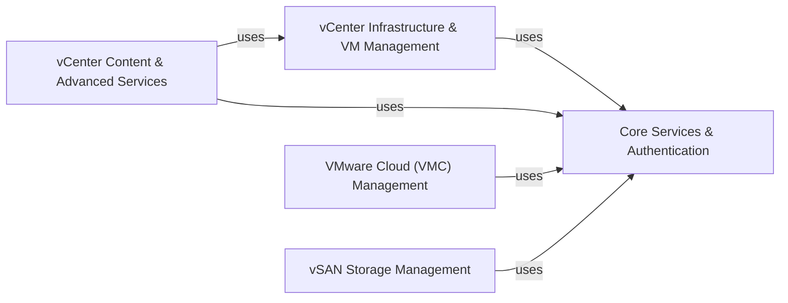

## Component Details

The `vsphere-automation-sdk-python` project provides a comprehensive set of Python samples and utilities for interacting with VMware vSphere and VMware Cloud (VMC) environments. The architecture is modular, centered around a core set of utilities and authentication mechanisms that enable secure communication with various VMware services. It encompasses functionalities for managing vCenter infrastructure, virtual machines, content libraries, advanced vCenter services, and a wide range of VMware Cloud operations including SDDC, networking (NSX-T, NSX-V), and disaster recovery, as well as vSAN storage management.

### Core Services & Authentication
Provides foundational utilities for CLI argument parsing, SSL certificate handling, establishing API connections (VAPI and VIM), and various Single Sign-On (SSO) and OAuth authentication mechanisms. This component is a core dependency for almost all other sample modules, enabling secure and authenticated communication with vCenter and VMC services.

**Related Classes/Methods**:

- <a href="https://github.com/vmware/vsphere-automation-sdk-python/blob/master/samples/vsphere/common/sample_cli.py#L15-L54" target="_blank" rel="noopener noreferrer">`samples.vsphere.common.sample_cli` (15:54)</a>
- <a href="https://github.com/vmware/vsphere-automation-sdk-python/blob/master/samples/vsphere/common/sample_util.py#L15-L109" target="_blank" rel="noopener noreferrer">`samples.vsphere.common.sample_util` (15:109)</a>
- <a href="https://github.com/vmware/vsphere-automation-sdk-python/blob/master/samples/vsphere/common/ssl_helper.py#L15-L64" target="_blank" rel="noopener noreferrer">`samples.vsphere.common.ssl_helper` (15:64)</a>
- <a href="https://github.com/vmware/vsphere-automation-sdk-python/blob/master/samples/vsphere/common/vapiconnect.py#L15-L115" target="_blank" rel="noopener noreferrer">`samples.vsphere.common.vapiconnect` (15:115)</a>
- <a href="https://github.com/vmware/vsphere-automation-sdk-python/blob/master/samples/vsphere/common/sso.py#L15-L105" target="_blank" rel="noopener noreferrer">`samples.vsphere.common.sso` (15:105)</a>
- <a href="https://github.com/vmware/vsphere-automation-sdk-python/blob/master/samples/vsphere/oauth/grant_types/webserver.py#L15-L120" target="_blank" rel="noopener noreferrer">`samples.vsphere.oauth.grant_types.webserver` (15:120)</a>
- <a href="https://github.com/vmware/vsphere-automation-sdk-python/blob/master/samples/vsphere/oauth/grant_types/list_vms_authorization_code.py#L15-L100" target="_blank" rel="noopener noreferrer">`samples.vsphere.oauth.grant_types.list_vms_authorization_code` (15:100)</a>

### vCenter Infrastructure & VM Management
Manages the setup, configuration, and cleanup of core vCenter infrastructure components such as datacenters, folders, clusters, hosts, datastores, networks, and the deployment of ISO/floppy images. It also provides comprehensive functionalities for managing virtual machines, including creation, deletion, power operations, guest customization, and detailed hardware configuration.

**Related Classes/Methods**:

- <a href="https://github.com/vmware/vsphere-automation-sdk-python/blob/master/samples/vsphere/vcenter/setup/datacenter.py#L15-L100" target="_blank" rel="noopener noreferrer">`samples.vsphere.vcenter.setup.datacenter` (15:100)</a>
- <a href="https://github.com/vmware/vsphere-automation-sdk-python/blob/master/samples/vsphere/vcenter/setup/cluster.py#L15-L100" target="_blank" rel="noopener noreferrer">`samples.vsphere.vcenter.setup.cluster` (15:100)</a>
- <a href="https://github.com/vmware/vsphere-automation-sdk-python/blob/master/samples/vsphere/vcenter/setup/host.py#L15-L100" target="_blank" rel="noopener noreferrer">`samples.vsphere.vcenter.setup.host` (15:100)</a>
- <a href="https://github.com/vmware/vsphere-automation-sdk-python/blob/master/samples/vsphere/vcenter/setup/datastore.py#L15-L100" target="_blank" rel="noopener noreferrer">`samples.vsphere.vcenter.setup.datastore` (15:100)</a>
- <a href="https://github.com/vmware/vsphere-automation-sdk-python/blob/master/samples/vsphere/vcenter/helper/datacenter_helper.py#L15-L60" target="_blank" rel="noopener noreferrer">`samples.vsphere.vcenter.helper.datacenter_helper` (15:60)</a>
- <a href="https://github.com/vmware/vsphere-automation-sdk-python/blob/master/samples/vsphere/vcenter/setup/testbed_setup.py#L15-L100" target="_blank" rel="noopener noreferrer">`samples.vsphere.vcenter.setup.testbed_setup` (15:100)</a>
- <a href="https://github.com/vmware/vsphere-automation-sdk-python/blob/master/samples/vsphere/vcenter/vm/create/create_default_vm.py#L15-L150" target="_blank" rel="noopener noreferrer">`samples.vsphere.vcenter.vm.create.create_default_vm` (15:150)</a>
- <a href="https://github.com/vmware/vsphere-automation-sdk-python/blob/master/samples/vsphere/vcenter/vm/delete_vm.py#L15-L80" target="_blank" rel="noopener noreferrer">`samples.vsphere.vcenter.vm.delete_vm` (15:80)</a>
- <a href="https://github.com/vmware/vsphere-automation-sdk-python/blob/master/samples/vsphere/vcenter/vm/power.py#L15-L120" target="_blank" rel="noopener noreferrer">`samples.vsphere.vcenter.vm.power` (15:120)</a>
- <a href="https://github.com/vmware/vsphere-automation-sdk-python/blob/master/samples/vsphere/vcenter/vm/guest/info.py#L15-L90" target="_blank" rel="noopener noreferrer">`samples.vsphere.vcenter.vm.guest.info` (15:90)</a>
- <a href="https://github.com/vmware/vsphere-automation-sdk-python/blob/master/samples/vsphere/vcenter/vm/hardware/cpu.py#L15-L100" target="_blank" rel="noopener noreferrer">`samples.vsphere.vcenter.vm.hardware.cpu` (15:100)</a>
- <a href="https://github.com/vmware/vsphere-automation-sdk-python/blob/master/samples/vsphere/vcenter/vm/hardware/disk.py#L15-L150" target="_blank" rel="noopener noreferrer">`samples.vsphere.vcenter.vm.hardware.disk` (15:150)</a>

### vCenter Content & Advanced Services
Handles operations within the vCenter Content Library, including managing libraries and items, deploying/capturing templates, and importing/exporting OVAs. It also consolidates functionalities for advanced vCenter services such as Hardware Compatibility List (HCL) operations, statistics management, Workload Management (WCP) and Namespace Management, discovery and lifecycle management (LCM), privilege checks, crypto manager operations, appliance health and patching, and deferred history import.

**Related Classes/Methods**:

- <a href="https://github.com/vmware/vsphere-automation-sdk-python/blob/master/samples/vsphere/contentlibrary/ovfdeploy/deploy_ovf_template.py#L15-L200" target="_blank" rel="noopener noreferrer">`samples.vsphere.contentlibrary.ovfdeploy.deploy_ovf_template` (15:200)</a>
- <a href="https://github.com/vmware/vsphere-automation-sdk-python/blob/master/samples/vsphere/contentlibrary/vmcapture/vm_template_capture.py#L15-L150" target="_blank" rel="noopener noreferrer">`samples.vsphere.contentlibrary.vmcapture.vm_template_capture` (15:150)</a>
- <a href="https://github.com/vmware/vsphere-automation-sdk-python/blob/master/samples/vsphere/contentlibrary/crud/library_crud.py#L15-L180" target="_blank" rel="noopener noreferrer">`samples.vsphere.contentlibrary.crud.library_crud` (15:180)</a>
- <a href="https://github.com/vmware/vsphere-automation-sdk-python/blob/master/samples/vsphere/contentlibrary/publishsubscribe/library_publish_subscribe.py#L15-L200" target="_blank" rel="noopener noreferrer">`samples.vsphere.contentlibrary.publishsubscribe.library_publish_subscribe` (15:200)</a>
- <a href="https://github.com/vmware/vsphere-automation-sdk-python/blob/master/samples/vsphere/vcenter/hcl/compatibility_data_update_sample.py#L15-L100" target="_blank" rel="noopener noreferrer">`samples.vsphere.vcenter.hcl.compatibility_data_update_sample` (15:100)</a>
- <a href="https://github.com/vmware/vsphere-automation-sdk-python/blob/master/samples/vsphere/vcenter/vstats/discovery.py#L15-L80" target="_blank" rel="noopener noreferrer">`samples.vsphere.vcenter.vstats.discovery` (15:80)</a>
- <a href="https://github.com/vmware/vsphere-automation-sdk-python/blob/master/samples/vsphere/vcenter/wcp/get_supervisor_summary.py#L15-L80" target="_blank" rel="noopener noreferrer">`samples.vsphere.vcenter.wcp.get_supervisor_summary` (15:80)</a>
- <a href="https://github.com/vmware/vsphere-automation-sdk-python/blob/master/samples/vsphere/vcenter/crypto_manager/kms/native_key_provider.py#L15-L150" target="_blank" rel="noopener noreferrer">`samples.vsphere.vcenter.crypto_manager.kms.native_key_provider` (15:150)</a>
- <a href="https://github.com/vmware/vsphere-automation-sdk-python/blob/master/samples/vsphere/appliances/health_messages.py#L15-L80" target="_blank" rel="noopener noreferrer">`samples.vsphere.appliances.health_messages` (15:80)</a>
- <a href="https://github.com/vmware/vsphere-automation-sdk-python/blob/master/samples/vsphere/deferhistoryimport/vc_import_history_sample.py#L15-L100" target="_blank" rel="noopener noreferrer">`samples.vsphere.deferhistoryimport.vc_import_history_sample` (15:100)</a>

### VMware Cloud (VMC) Management
Provides comprehensive functionalities for managing VMware Cloud environments, including Software-Defined Data Centers (SDDCs) and organizations. It covers NSX-T and NSX-V network configurations (segments, firewall rules, NAT, VPNs, public IPs, DNS, logical networks) and Disaster Recovery as a Service (DRaaS) operations (SRM deployment, activation, and site recovery information).

**Related Classes/Methods**:

- <a href="https://github.com/vmware/vsphere-automation-sdk-python/blob/master/samples/vmc/sddc/sddc_crud.py#L15-L200" target="_blank" rel="noopener noreferrer">`samples.vmc.sddc.sddc_crud` (15:200)</a>
- <a href="https://github.com/vmware/vsphere-automation-sdk-python/blob/master/samples/vmc/sddc/add_remove_hosts.py#L15-L150" target="_blank" rel="noopener noreferrer">`samples.vmc.sddc.add_remove_hosts` (15:150)</a>
- <a href="https://github.com/vmware/vsphere-automation-sdk-python/blob/master/samples/vmc/orgs/organization_operations.py#L15-L80" target="_blank" rel="noopener noreferrer">`samples.vmc.orgs.organization_operations` (15:80)</a>
- <a href="https://github.com/vmware/vsphere-automation-sdk-python/blob/master/samples/vmc/networks_nsxt/segments_firewall_crud.py#L15-L180" target="_blank" rel="noopener noreferrer">`samples.vmc.networks_nsxt.segments_firewall_crud` (15:180)</a>
- <a href="https://github.com/vmware/vsphere-automation-sdk-python/blob/master/samples/vmc/networks_nsxt/nat_crud.py#L15-L150" target="_blank" rel="noopener noreferrer">`samples.vmc.networks_nsxt.nat_crud` (15:150)</a>
- <a href="https://github.com/vmware/vsphere-automation-sdk-python/blob/master/samples/vmc/networks_nsxt/l3_vpn_crud.py#L15-L200" target="_blank" rel="noopener noreferrer">`samples.vmc.networks_nsxt.l3_vpn_crud` (15:200)</a>
- <a href="https://github.com/vmware/vsphere-automation-sdk-python/blob/master/samples/vmc/networks_nsxv/expose_public_ip.py#L15-L100" target="_blank" rel="noopener noreferrer">`samples.vmc.networks_nsxv.expose_public_ip` (15:100)</a>
- <a href="https://github.com/vmware/vsphere-automation-sdk-python/blob/master/samples/vmc/networks_nsxv/ipsec_vpns_crud.py#L15-L150" target="_blank" rel="noopener noreferrer">`samples.vmc.networks_nsxv.ipsec_vpns_crud` (15:150)</a>
- <a href="https://github.com/vmware/vsphere-automation-sdk-python/blob/master/samples/vmc/networks_nsxv/firewall_rules_crud.py#L15-L180" target="_blank" rel="noopener noreferrer">`samples.vmc.networks_nsxv.firewall_rules_crud` (15:180)</a>
- <a href="https://github.com/vmware/vsphere-automation-sdk-python/blob/master/samples/vmc/draas/deploy_additional_node.py#L15-L120" target="_blank" rel="noopener noreferrer">`samples.vmc.draas.deploy_additional_node` (15:120)</a>
- <a href="https://github.com/vmware/vsphere-automation-sdk-python/blob/master/samples/vmc/draas/activate_srm_ops.py#L15-L100" target="_blank" rel="noopener noreferrer">`samples.vmc.draas.activate_srm_ops` (15:100)</a>
- <a href="https://github.com/vmware/vsphere-automation-sdk-python/blob/master/samples/vmc/draas/site_recovery_info.py#L15-L80" target="_blank" rel="noopener noreferrer">`samples.vmc.draas.site_recovery_info` (15:80)</a>

### vSAN Storage Management
Manages snapshot services for vSAN, including creating, deleting, and listing protection groups and their associated snapshots.

**Related Classes/Methods**:

- <a href="https://github.com/vmware/vsphere-automation-sdk-python/blob/master/samples/vsan/snapservice/vsan_snapservice_client.py#L15-L100" target="_blank" rel="noopener noreferrer">`samples.vsan.snapservice.vsan_snapservice_client` (15:100)</a>
- <a href="https://github.com/vmware/vsphere-automation-sdk-python/blob/master/samples/vsan/snapservice/protection_group/create_protection_group.py#L15-L120" target="_blank" rel="noopener noreferrer">`samples.vsan.snapservice.protection_group.create_protection_group` (15:120)</a>
- <a href="https://github.com/vmware/vsphere-automation-sdk-python/blob/master/samples/vsan/snapservice/snapshot/delete_protection_group_snapshots.py#L15-L100" target="_blank" rel="noopener noreferrer">`samples.vsan.snapservice.snapshot.delete_protection_group_snapshots` (15:100)</a>

### [FAQ](https://github.com/CodeBoarding/GeneratedOnBoardings/tree/main?tab=readme-ov-file#faq)