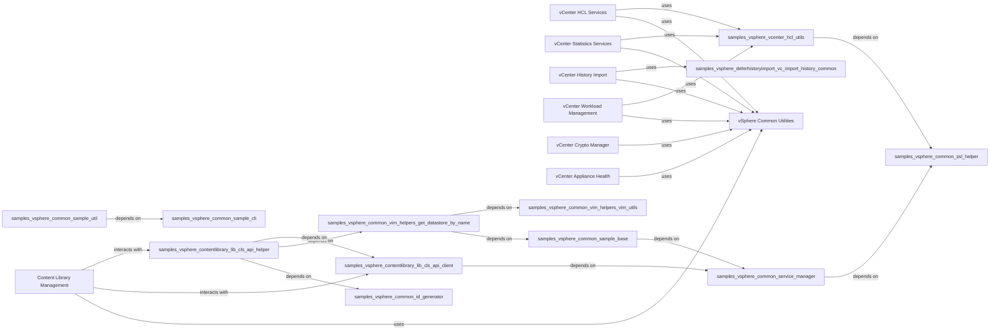

## Component Details

The vCenter Content & Advanced Services subsystem provides a comprehensive set of functionalities for managing vCenter environments. It encompasses content library operations for efficient template and OVA management, advanced services like Hardware Compatibility List (HCL) updates, vCenter statistics discovery, and the handling of deferred historical data imports. Additionally, it includes capabilities for Workload Management (WCP), cryptographic key management (KMS), and monitoring appliance health. The subsystem leverages a set of common utilities to ensure consistent interaction with vCenter APIs and streamline various sample implementations.

### Content Library Management
Manages content libraries, including CRUD operations, OVF/OVA deployment/capture, and publish/subscribe functionalities.

**Related Classes/Methods**:

- <a href="https://github.com/vmware/vsphere-automation-sdk-python/blob/master/samples/vsphere/contentlibrary/ovfdeploy/deploy_ovf_template.py#L15-L200" target="_blank" rel="noopener noreferrer">`samples.vsphere.contentlibrary.ovfdeploy.deploy_ovf_template` (15:200)</a>
- <a href="https://github.com/vmware/vsphere-automation-sdk-python/blob/master/samples/vsphere/contentlibrary/vmcapture/vm_template_capture.py#L15-L150" target="_blank" rel="noopener noreferrer">`samples.vsphere.contentlibrary.vmcapture.vm_template_capture` (15:150)</a>
- <a href="https://github.com/vmware/vsphere-automation-sdk-python/blob/master/samples/vsphere/contentlibrary/crud/library_crud.py#L15-L180" target="_blank" rel="noopener noreferrer">`samples.vsphere.contentlibrary.crud.library_crud` (15:180)</a>
- <a href="https://github.com/vmware/vsphere-automation-sdk-python/blob/master/samples/vsphere/contentlibrary/publishsubscribe/library_publish_subscribe.py#L15-L200" target="_blank" rel="noopener noreferrer">`samples.vsphere.contentlibrary.publishsubscribe.library_publish_subscribe` (15:200)</a>
- `samples.vsphere.contentlibrary.lib.cls_api_client` (full file reference)
- `samples.vsphere.contentlibrary.lib.cls_api_helper` (full file reference)

### vCenter HCL Services
Handles operations related to the Hardware Compatibility List (HCL), including data updates and compatibility checks.

**Related Classes/Methods**:

- <a href="https://github.com/vmware/vsphere-automation-sdk-python/blob/master/samples/vsphere/vcenter/hcl/compatibility_data_update_sample.py#L15-L100" target="_blank" rel="noopener noreferrer">`samples.vsphere.vcenter.hcl.compatibility_data_update_sample` (15:100)</a>
- `samples.vsphere.vcenter.hcl.utils` (full file reference)

### vCenter Statistics Services
Manages discovery and operations related to vCenter statistics.

**Related Classes/Methods**:

- <a href="https://github.com/vmware/vsphere-automation-sdk-python/blob/master/samples/vsphere/vcenter/vstats/discovery.py#L15-L80" target="_blank" rel="noopener noreferrer">`samples.vsphere.vcenter.vstats.discovery` (15:80)</a>

### vCenter History Import
Responsible for importing historical data into vCenter.

**Related Classes/Methods**:

- <a href="https://github.com/vmware/vsphere-automation-sdk-python/blob/master/samples/vsphere/deferhistoryimport/vc_import_history_sample.py#L15-L100" target="_blank" rel="noopener noreferrer">`samples.vsphere.deferhistoryimport.vc_import_history_sample` (15:100)</a>
- `samples.vsphere.deferhistoryimport.vc_import_history_common` (full file reference)

### vCenter Workload Management
Retrieves summary information for Supervisor Clusters.

**Related Classes/Methods**:

- <a href="https://github.com/vmware/vsphere-automation-sdk-python/blob/master/samples/vsphere/vcenter/wcp/get_supervisor_summary.py#L15-L80" target="_blank" rel="noopener noreferrer">`samples.vsphere.vcenter.wcp.get_supervisor_summary` (15:80)</a>

### vCenter Crypto Manager
Handles operations related to vCenter Native Key Provider functionality, including creation, backup, import, export, and setting default key providers.

**Related Classes/Methods**:

- <a href="https://github.com/vmware/vsphere-automation-sdk-python/blob/master/samples/vsphere/vcenter/crypto_manager/kms/native_key_provider.py#L15-L150" target="_blank" rel="noopener noreferrer">`samples.vsphere.vcenter.crypto_manager.kms.native_key_provider` (15:150)</a>

### vCenter Appliance Health
Monitors and retrieves health messages for vCenter appliance resources like memory, CPU, and storage.

**Related Classes/Methods**:

- <a href="https://github.com/vmware/vsphere-automation-sdk-python/blob/master/samples/vsphere/appliances/health_messages.py#L15-L80" target="_blank" rel="noopener noreferrer">`samples.vsphere.appliances.health_messages` (15:80)</a>

### vSphere Common Utilities
A foundational component providing shared utility functions and base classes for various vSphere samples, including argument parsing, service management, ID generation, and SSL helpers.

**Related Classes/Methods**:

- `samples.vsphere.common.sample_base` (full file reference)
- `samples.vsphere.common.id_generator` (full file reference)
- `samples.vsphere.common.sample_cli` (full file reference)
- `samples.vsphere.common.sample_util` (full file reference)
- `samples.vsphere.common.ssl_helper` (full file reference)
- `samples.vsphere.common.service_manager` (full file reference)
- `samples.vsphere.common.vim.helpers.vim_utils` (full file reference)
- `samples.vsphere.common.vim.helpers.get_datastore_by_name` (full file reference)
- `samples.vsphere.vcenter.helper.vm_helper` (full file reference)

### [FAQ](https://github.com/CodeBoarding/GeneratedOnBoardings/tree/main?tab=readme-ov-file#faq)