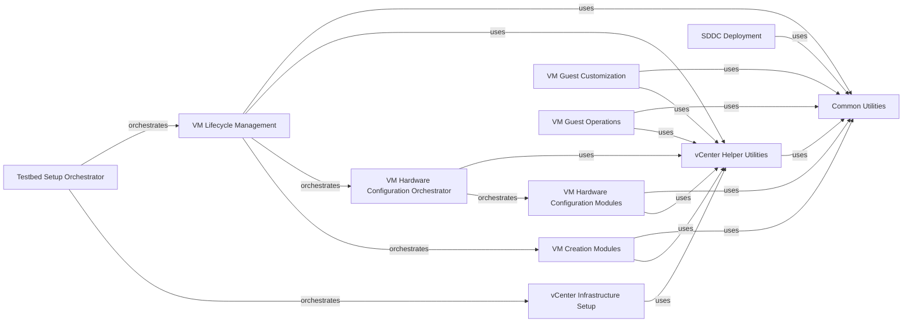

## Component Details

This component overview details the structure, flow, and purpose of the vCenter Infrastructure & VM Management subsystem. It encompasses functionalities for setting up and managing core vCenter infrastructure elements like datacenters, clusters, hosts, datastores, and networks, as well as comprehensive virtual machine lifecycle management, including creation, deletion, power operations, guest customization, and detailed hardware configuration. The system is designed to orchestrate complex vSphere testbed environments and provide utility functions for simplified interactions with vCenter APIs.

### Testbed Setup Orchestrator
This component orchestrates the complete setup, validation, and cleanup of a vSphere testbed environment by coordinating operations across various infrastructure components.

**Related Classes/Methods**:

- <a href="https://github.com/vmware/vsphere-automation-sdk-python/blob/master/samples/vsphere/vcenter/setup/testbed_setup.py#L65-L76" target="_blank" rel="noopener noreferrer">`vsphere-automation-sdk-python.samples.vsphere.vcenter.setup.testbed_setup:setup` (65:76)</a>
- <a href="https://github.com/vmware/vsphere-automation-sdk-python/blob/master/samples/vsphere/vcenter/setup/testbed_setup.py#L79-L91" target="_blank" rel="noopener noreferrer">`vsphere-automation-sdk-python.samples.vsphere.vcenter.setup.testbed_setup:cleanup` (79:91)</a>
- <a href="https://github.com/vmware/vsphere-automation-sdk-python/blob/master/samples/vsphere/vcenter/setup/testbed_setup.py#L94-L111" target="_blank" rel="noopener noreferrer">`vsphere-automation-sdk-python.samples.vsphere.vcenter.setup.testbed_setup:validate` (94:111)</a>

### vCenter Infrastructure Setup
This component provides functionalities for managing fundamental vCenter infrastructure elements, including detection, setup, and cleanup of datacenters, hosts, datastores, and clusters.

**Related Classes/Methods**:

- <a href="https://github.com/vmware/vsphere-automation-sdk-python/blob/master/samples/vsphere/vcenter/setup/datastore.py#L50-L56" target="_blank" rel="noopener noreferrer">`vsphere-automation-sdk-python.samples.vsphere.vcenter.setup.datastore:detect_nfs_datastore` (50:56)</a>
- <a href="https://github.com/vmware/vsphere-automation-sdk-python/blob/master/samples/vsphere/vcenter/setup/datastore.py#L89-L100" target="_blank" rel="noopener noreferrer">`vsphere-automation-sdk-python.samples.vsphere.vcenter.setup.datastore:setup_nfs_datastore` (89:100)</a>
- <a href="https://github.com/vmware/vsphere-automation-sdk-python/blob/master/samples/vsphere/vcenter/setup/datastore.py#L179-L191" target="_blank" rel="noopener noreferrer">`vsphere-automation-sdk-python.samples.vsphere.vcenter.setup.datastore:detect_vmfs_datastores` (179:191)</a>
- <a href="https://github.com/vmware/vsphere-automation-sdk-python/blob/master/samples/vsphere/vcenter/setup/datastore.py#L236-L246" target="_blank" rel="noopener noreferrer">`vsphere-automation-sdk-python.samples.vsphere.vcenter.setup.datastore:setup_vmfs_datastores` (236:246)</a>
- <a href="https://github.com/vmware/vsphere-automation-sdk-python/blob/master/samples/vsphere/vcenter/setup/datastore.py#L249-L251" target="_blank" rel="noopener noreferrer">`vsphere-automation-sdk-python.samples.vsphere.vcenter.setup.datastore:setup` (249:251)</a>
- <a href="https://github.com/vmware/vsphere-automation-sdk-python/blob/master/samples/vsphere/vcenter/setup/datastore.py#L254-L255" target="_blank" rel="noopener noreferrer">`vsphere-automation-sdk-python.samples.vsphere.vcenter.setup.datastore:cleanup` (254:255)</a>
- <a href="https://github.com/vmware/vsphere-automation-sdk-python/blob/master/samples/vsphere/vcenter/setup/datastore.py#L258-L261" target="_blank" rel="noopener noreferrer">`vsphere-automation-sdk-python.samples.vsphere.vcenter.setup.datastore:validate` (258:261)</a>
- <a href="https://github.com/vmware/vsphere-automation-sdk-python/blob/master/samples/vsphere/vcenter/setup/host.py#L38-L44" target="_blank" rel="noopener noreferrer">`vsphere-automation-sdk-python.samples.vsphere.vcenter.setup.host:detect_hosts` (38:44)</a>
- <a href="https://github.com/vmware/vsphere-automation-sdk-python/blob/master/samples/vsphere/vcenter/setup/host.py#L151-L170" target="_blank" rel="noopener noreferrer">`vsphere-automation-sdk-python.samples.vsphere.vcenter.setup.host:setup_hosts_vapi` (151:170)</a>
- <a href="https://github.com/vmware/vsphere-automation-sdk-python/blob/master/samples/vsphere/vcenter/setup/host.py#L173-L192" target="_blank" rel="noopener noreferrer">`vsphere-automation-sdk-python.samples.vsphere.vcenter.setup.host:setup_hosts_vim` (173:192)</a>
- <a href="https://github.com/vmware/vsphere-automation-sdk-python/blob/master/samples/vsphere/vcenter/setup/host.py#L195-L196" target="_blank" rel="noopener noreferrer">`vsphere-automation-sdk-python.samples.vsphere.vcenter.setup.host:setup_hosts` (195:196)</a>
- <a href="https://github.com/vmware/vsphere-automation-sdk-python/blob/master/samples/vsphere/vcenter/setup/host.py#L199-L200" target="_blank" rel="noopener noreferrer">`vsphere-automation-sdk-python.samples.vsphere.vcenter.setup.host:setup` (199:200)</a>
- <a href="https://github.com/vmware/vsphere-automation-sdk-python/blob/master/samples/vsphere/vcenter/setup/host.py#L203-L204" target="_blank" rel="noopener noreferrer">`vsphere-automation-sdk-python.samples.vsphere.vcenter.setup.host:cleanup` (203:204)</a>
- <a href="https://github.com/vmware/vsphere-automation-sdk-python/blob/master/samples/vsphere/vcenter/setup/host.py#L207-L208" target="_blank" rel="noopener noreferrer">`vsphere-automation-sdk-python.samples.vsphere.vcenter.setup.host:validate` (207:208)</a>
- <a href="https://github.com/vmware/vsphere-automation-sdk-python/blob/master/samples/vsphere/vcenter/setup/datacenter.py#L39-L48" target="_blank" rel="noopener noreferrer">`vsphere-automation-sdk-python.samples.vsphere.vcenter.setup.datacenter:detect_datacenters` (39:48)</a>
- <a href="https://github.com/vmware/vsphere-automation-sdk-python/blob/master/samples/vsphere/vcenter/setup/datacenter.py#L72-L98" target="_blank" rel="noopener noreferrer">`vsphere-automation-sdk-python.samples.vsphere.vcenter.setup.datacenter:setup_datacenters` (72:98)</a>
- <a href="https://github.com/vmware/vsphere-automation-sdk-python/blob/master/samples/vsphere/vcenter/setup/datacenter.py#L101-L102" target="_blank" rel="noopener noreferrer">`vsphere-automation-sdk-python.samples.vsphere.vcenter.setup.datacenter:cleanup` (101:102)</a>
- <a href="https://github.com/vmware/vsphere-automation-sdk-python/blob/master/samples/vsphere/vcenter/setup/datacenter.py#L105-L106" target="_blank" rel="noopener noreferrer">`vsphere-automation-sdk-python.samples.vsphere.vcenter.setup.datacenter:setup` (105:106)</a>
- <a href="https://github.com/vmware/vsphere-automation-sdk-python/blob/master/samples/vsphere/vcenter/setup/datacenter.py#L109-L110" target="_blank" rel="noopener noreferrer">`vsphere-automation-sdk-python.samples.vsphere.vcenter.setup.datacenter:validate` (109:110)</a>
- <a href="https://github.com/vmware/vsphere-automation-sdk-python/blob/master/samples/vsphere/vcenter/setup/cluster.py#L23-L36" target="_blank" rel="noopener noreferrer">`vsphere-automation-sdk-python.samples.vsphere.vcenter.setup.cluster:detect_cluster` (23:36)</a>
- <a href="https://github.com/vmware/vsphere-automation-sdk-python/blob/master/samples/vsphere/vcenter/setup/cluster.py#L132-L133" target="_blank" rel="noopener noreferrer">`vsphere-automation-sdk-python.samples.vsphere.vcenter.setup.cluster:setup_cluster` (132:133)</a>
- <a href="https://github.com/vmware/vsphere-automation-sdk-python/blob/master/samples/vsphere/vcenter/setup/cluster.py#L136-L137" target="_blank" rel="noopener noreferrer">`vsphere-automation-sdk-python.samples.vsphere.vcenter.setup.cluster:setup` (136:137)</a>
- <a href="https://github.com/vmware/vsphere-automation-sdk-python/blob/master/samples/vsphere/vcenter/setup/cluster.py#L140-L141" target="_blank" rel="noopener noreferrer">`vsphere-automation-sdk-python.samples.vsphere.vcenter.setup.cluster:cleanup` (140:141)</a>
- <a href="https://github.com/vmware/vsphere-automation-sdk-python/blob/master/samples/vsphere/vcenter/setup/cluster.py#L144-L145" target="_blank" rel="noopener noreferrer">`vsphere-automation-sdk-python.samples.vsphere.vcenter.setup.cluster:validate` (144:145)</a>

### VM Lifecycle Management
This component provides core functionalities for managing the lifecycle of Virtual Machines, including creation, deletion, and controlling their power state.

**Related Classes/Methods**:

- <a href="https://github.com/vmware/vsphere-automation-sdk-python/blob/master/samples/vsphere/vcenter/vm/delete_vm.py#L29-L69" target="_blank" rel="noopener noreferrer">`vsphere-automation-sdk-python.samples.vsphere.vcenter.vm.delete_vm.DeleteVM` (29:69)</a>
- <a href="https://github.com/vmware/vsphere-automation-sdk-python/blob/master/samples/vsphere/vcenter/vm/delete_vm.py#L72-L74" target="_blank" rel="noopener noreferrer">`vsphere-automation-sdk-python.samples.vsphere.vcenter.vm.delete_vm:main` (72:74)</a>
- <a href="https://github.com/vmware/vsphere-automation-sdk-python/blob/master/samples/vsphere/vcenter/vm/power.py#L43-L59" target="_blank" rel="noopener noreferrer">`vsphere-automation-sdk-python.samples.vsphere.vcenter.vm.power:setup` (43:59)</a>
- <a href="https://github.com/vmware/vsphere-automation-sdk-python/blob/master/samples/vsphere/vcenter/vm/power.py#L62-L99" target="_blank" rel="noopener noreferrer">`vsphere-automation-sdk-python.samples.vsphere.vcenter.vm.power:run` (62:99)</a>
- <a href="https://github.com/vmware/vsphere-automation-sdk-python/blob/master/samples/vsphere/vcenter/vm/power.py#L115-L119" target="_blank" rel="noopener noreferrer">`vsphere-automation-sdk-python.samples.vsphere.vcenter.vm.power:main` (115:119)</a>
- <a href="https://github.com/vmware/vsphere-automation-sdk-python/blob/master/samples/vsphere/vcenter/vm/main.py#L32-L141" target="_blank" rel="noopener noreferrer">`vsphere-automation-sdk-python.samples.vsphere.vcenter.vm.main.VMSetup` (32:141)</a>
- <a href="https://github.com/vmware/vsphere-automation-sdk-python/blob/master/samples/vsphere/vcenter/vm/main.py#L39-L85" target="_blank" rel="noopener noreferrer">`vsphere-automation-sdk-python.samples.vsphere.vcenter.vm.main.VMSetup:setup` (39:85)</a>
- <a href="https://github.com/vmware/vsphere-automation-sdk-python/blob/master/samples/vsphere/vcenter/vm/main.py#L87-L93" target="_blank" rel="noopener noreferrer">`vsphere-automation-sdk-python.samples.vsphere.vcenter.vm.main.VMSetup:cleanup` (87:93)</a>
- <a href="https://github.com/vmware/vsphere-automation-sdk-python/blob/master/samples/vsphere/vcenter/vm/main.py#L95-L103" target="_blank" rel="noopener noreferrer">`vsphere-automation-sdk-python.samples.vsphere.vcenter.vm.main.VMSetup:validate` (95:103)</a>
- <a href="https://github.com/vmware/vsphere-automation-sdk-python/blob/master/samples/vsphere/vcenter/vm/main.py#L105-L141" target="_blank" rel="noopener noreferrer">`vsphere-automation-sdk-python.samples.vsphere.vcenter.vm.main.VMSetup:run` (105:141)</a>

### VM Creation Modules
This component is dedicated to the creation of Virtual Machines, offering different methods for creating VMs with varying levels of configuration detail.

**Related Classes/Methods**:

- <a href="https://github.com/vmware/vsphere-automation-sdk-python/blob/master/samples/vsphere/vcenter/vm/create/create_default_vm.py#L32-L110" target="_blank" rel="noopener noreferrer">`vsphere-automation-sdk-python.samples.vsphere.vcenter.vm.create.create_default_vm.CreateDefaultVM` (32:110)</a>
- <a href="https://github.com/vmware/vsphere-automation-sdk-python/blob/master/samples/vsphere/vcenter/vm/create/create_default_vm.py#L113-L118" target="_blank" rel="noopener noreferrer">`vsphere-automation-sdk-python.samples.vsphere.vcenter.vm.create.create_default_vm:main` (113:118)</a>
- <a href="https://github.com/vmware/vsphere-automation-sdk-python/blob/master/samples/vsphere/vcenter/vm/create/create_basic_vm.py#L37-L152" target="_blank" rel="noopener noreferrer">`samples.vsphere.vcenter.vm.create.create_basic_vm.CreateBasicVM` (37:152)</a>
- <a href="https://github.com/vmware/vsphere-automation-sdk-python/blob/master/samples/vsphere/vcenter/vm/create/create_exhaustive_vm.py#L37-L248" target="_blank" rel="noopener noreferrer">`samples.vsphere.vcenter.vm.create.create_exhaustive_vm.CreateExhaustiveVM` (37:248)</a>

### VM Guest Customization
This component handles the customization of guest operating systems within Virtual Machines, supporting cloud-init data and general customization specifications.

**Related Classes/Methods**:

- <a href="https://github.com/vmware/vsphere-automation-sdk-python/blob/master/samples/vsphere/vcenter/guest/cloudinitDataCustomizationSpecs.py#L30-L179" target="_blank" rel="noopener noreferrer">`samples.vsphere.vcenter.guest.cloudinitDataCustomizationSpecs.CloudinitDataCustomizationSpecs` (30:179)</a>
- <a href="https://github.com/vmware/vsphere-automation-sdk-python/blob/master/samples/vsphere/vcenter/guest/cloudinitDataCustomizationSpecs.py#L182-L189" target="_blank" rel="noopener noreferrer">`samples.vsphere.vcenter.guest.cloudinitDataCustomizationSpecs:main` (182:189)</a>
- <a href="https://github.com/vmware/vsphere-automation-sdk-python/blob/master/samples/vsphere/vcenter/guest/customizationSpecs.py#L47-L374" target="_blank" rel="noopener noreferrer">`samples.vsphere.vcenter.guest.customizationSpecs.CustomizationSpecManager` (47:374)</a>
- <a href="https://github.com/vmware/vsphere-automation-sdk-python/blob/master/samples/vsphere/vcenter/guest/customizationSpecs.py#L377-L383" target="_blank" rel="noopener noreferrer">`samples.vsphere.vcenter.guest.customizationSpecs:main` (377:383)</a>
- <a href="https://github.com/vmware/vsphere-automation-sdk-python/blob/master/samples/vsphere/vcenter/guest/customizationSpecs_import_export.py#L29-L90" target="_blank" rel="noopener noreferrer">`samples.vsphere.vcenter.guest.customizationSpecs_import_export.CustomizationSpecManager` (29:90)</a>
- <a href="https://github.com/vmware/vsphere-automation-sdk-python/blob/master/samples/vsphere/vcenter/guest/customizationSpecs_import_export.py#L93-L98" target="_blank" rel="noopener noreferrer">`samples.vsphere.vcenter.guest.customizationSpecs_import_export:main` (93:98)</a>
- <a href="https://github.com/vmware/vsphere-automation-sdk-python/blob/master/samples/vsphere/vcenter/vm/guest/customize_vm_with_cloudinit_data.py#L37-L159" target="_blank" rel="noopener noreferrer">`samples.vsphere.vcenter.vm.guest.customize_vm_with_cloudinit_data.CustomizeVMWithCloudinitData` (37:159)</a>
- <a href="https://github.com/vmware/vsphere-automation-sdk-python/blob/master/samples/vsphere/vcenter/vm/guest/customize_vm_with_cloudinit_data.py#L162-L165" target="_blank" rel="noopener noreferrer">`samples.vsphere.vcenter.vm.guest.customize_vm_with_cloudinit_data:main` (162:165)</a>
- <a href="https://github.com/vmware/vsphere-automation-sdk-python/blob/master/samples/vsphere/vcenter/vm/guest/customize_vm.py#L55-L179" target="_blank" rel="noopener noreferrer">`samples.vsphere.vcenter.vm.guest.customize_vm.CustomizeVM` (55:179)</a>
- <a href="https://github.com/vmware/vsphere-automation-sdk-python/blob/master/samples/vsphere/vcenter/vm/guest/customize_vm.py#L182-L188" target="_blank" rel="noopener noreferrer">`samples.vsphere.vcenter.vm.guest.customize_vm:main` (182:188)</a>

### VM Guest Operations
This component focuses on operations performed within the guest operating system of a Virtual Machine, providing functionalities for retrieving guest information and managing guest power states.

**Related Classes/Methods**:

- <a href="https://github.com/vmware/vsphere-automation-sdk-python/blob/master/samples/vsphere/vcenter/vm/guest/info.py#L43-L99" target="_blank" rel="noopener noreferrer">`samples.vsphere.vcenter.vm.guest.info.GuestInfo` (43:99)</a>
- <a href="https://github.com/vmware/vsphere-automation-sdk-python/blob/master/samples/vsphere/vcenter/vm/guest/info.py#L102-L105" target="_blank" rel="noopener noreferrer">`samples.vsphere.vcenter.vm.guest.info:main` (102:105)</a>
- <a href="https://github.com/vmware/vsphere-automation-sdk-python/blob/master/samples/vsphere/vcenter/vm/guest/power.py#L44-L113" target="_blank" rel="noopener noreferrer">`samples.vsphere.vcenter.vm.guest.power.SoftPower` (44:113)</a>
- <a href="https://github.com/vmware/vsphere-automation-sdk-python/blob/master/samples/vsphere/vcenter/vm/guest/power.py#L116-L119" target="_blank" rel="noopener noreferrer">`samples.vsphere.vcenter.vm.guest.power:main` (116:119)</a>

### VM Hardware Configuration Orchestrator
This component serves as the central orchestrator for managing various hardware aspects of a Virtual Machine, coordinating calls to individual hardware configuration modules.

**Related Classes/Methods**:

- <a href="https://github.com/vmware/vsphere-automation-sdk-python/blob/master/samples/vsphere/vcenter/vm/hardware/main.py#L34-L48" target="_blank" rel="noopener noreferrer">`vsphere-automation-sdk-python.samples.vsphere.vcenter.vm.hardware.main:setup` (34:48)</a>
- <a href="https://github.com/vmware/vsphere-automation-sdk-python/blob/master/samples/vsphere/vcenter/vm/hardware/main.py#L51-L65" target="_blank" rel="noopener noreferrer">`vsphere-automation-sdk-python.samples.vsphere.vcenter.vm.hardware.main:cleanup` (51:65)</a>
- <a href="https://github.com/vmware/vsphere-automation-sdk-python/blob/master/samples/vsphere/vcenter/vm/hardware/main.py#L68-L80" target="_blank" rel="noopener noreferrer">`vsphere-automation-sdk-python.samples.vsphere.vcenter.vm.hardware.main:validate` (68:80)</a>
- <a href="https://github.com/vmware/vsphere-automation-sdk-python/blob/master/samples/vsphere/vcenter/vm/hardware/main.py#L83-L117" target="_blank" rel="noopener noreferrer">`vsphere-automation-sdk-python.samples.vsphere.vcenter.vm.hardware.main:run` (83:117)</a>

### VM Hardware Configuration Modules
This component comprises individual modules dedicated to configuring specific hardware components of a Virtual Machine, such as CPU, memory, disks, and network adapters.

**Related Classes/Methods**:

- `vsphere-automation-sdk-python.samples.vsphere.vcenter.vm.hardware.boot` (full file reference)
- `vsphere-automation-sdk-python.samples.vsphere.vcenter.vm.hardware.cpu` (full file reference)
- `vsphere-automation-sdk-python.samples.vsphere.vcenter.vm.hardware.memory` (full file reference)
- `vsphere-automation-sdk-python.samples.vsphere.vcenter.vm.hardware.serial` (full file reference)
- `vsphere-automation-sdk-python.samples.vsphere.vcenter.vm.hardware.floppy` (full file reference)
- `vsphere-automation-sdk-python.samples.vsphere.vcenter.vm.hardware.disk` (full file reference)
- `vsphere-automation-sdk-python.samples.vsphere.vcenter.vm.hardware.ethernet` (full file reference)
- `vsphere-automation-sdk-python.samples.vsphere.vcenter.vm.hardware.parallel` (full file reference)
- `vsphere-automation-sdk-python.samples.vsphere.vcenter.vm.hardware.cdrom` (full file reference)
- `vsphere-automation-sdk-python.samples.vsphere.vcenter.vm.hardware.boot_device` (full file reference)
- `vsphere-automation-sdk-python.samples.vsphere.vcenter.vm.hardware.adapter.scsi` (full file reference)
- `vsphere-automation-sdk-python.samples.vsphere.vcenter.vm.hardware.adapter.sata` (full file reference)

### vCenter Helper Utilities
This component provides a collection of utility functions designed to simplify interactions with various vCenter entities, abstracting complex API calls for common tasks.

**Related Classes/Methods**:

- `vsphere-automation-sdk-python.samples.vsphere.vcenter.helper.network_helper` (full file reference)
- `vsphere-automation-sdk-python.samples.vsphere.vcenter.helper.cluster_helper` (full file reference)
- `vsphere-automation-sdk-python.samples.vsphere.vcenter.helper.resource_pool_helper` (full file reference)
- `vsphere-automation-sdk-python.samples.vsphere.vcenter.helper.datastore_helper` (full file reference)
- `vsphere-automation-sdk-python.samples.vsphere.vcenter.helper.vm_placement_helper` (full file reference)
- `vsphere-automation-sdk-python.samples.vsphere.vcenter.helper.folder_helper` (full file reference)
- `samples.vsphere.vcenter.helper.vm_helper` (full file reference)
- `samples.vsphere.vcenter.helper.guest_helper` (full file reference)
- `samples.vsphere.vcenter.helper.datacenter_helper` (full file reference)

### Common Utilities
This component offers a set of general-purpose utility functions widely used across different parts of the SDK samples, including argument parsing, SSL handling, and inventory management.

**Related Classes/Methods**:

- `samples.vsphere.common.sample_util` (full file reference)
- `samples.vsphere.common.ssl_helper` (full file reference)
- `samples.vsphere.common.sample_cli` (full file reference)
- `samples.vsphere.common.vim.inventory` (full file reference)
- `samples.vsphere.common.vim.file` (full file reference)
- `samples.vsphere.common.vim.vmdk` (full file reference)
- `samples.vsphere.common.id_generator` (full file reference)

### SDDC Deployment
This component is specifically designed for deploying OVF templates within a Software-Defined Data Center (SDDC) environment, facilitating the automated provisioning of virtual appliances.

**Related Classes/Methods**:

- <a href="https://github.com/vmware/vsphere-automation-sdk-python/blob/master/samples/vmc/sddc/deploy_ovf_template.py#L31-L187" target="_blank" rel="noopener noreferrer">`vsphere-automation-sdk-python.samples.vmc.sddc.deploy_ovf_template.DeployOvfTemplate` (31:187)</a>

### [FAQ](https://github.com/CodeBoarding/GeneratedOnBoardings/tree/main?tab=readme-ov-file#faq)