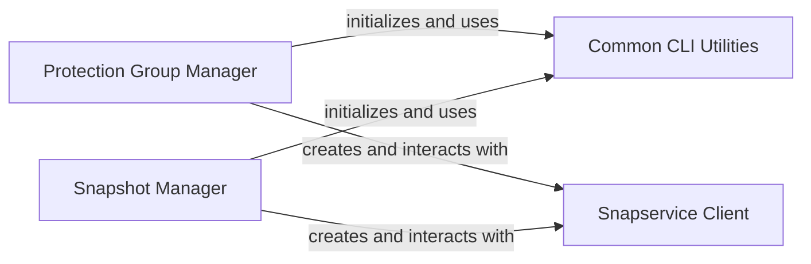

## Component Details

The vSAN Storage Management subsystem is responsible for managing snapshot services within a vSAN environment. Its primary purpose is to enable the creation, deletion, and listing of protection groups and their associated snapshots. The main flow involves client components interacting with a Snapservice Client to perform operations on protection groups and snapshots, leveraging common CLI utilities for argument parsing and SSL verification.

### Snapservice Client
The core client responsible for establishing and managing connections to the vSAN Snapservice API. It handles authentication using SAML bearer tokens and provides access to various Snapservice functionalities like clusters, info, and tasks.

**Related Classes/Methods**:

- <a href="https://github.com/vmware/vsphere-automation-sdk-python/blob/master/samples/vsan/snapservice/vsan_snapservice_client.py#L51-L98" target="_blank" rel="noopener noreferrer">`samples.vsan.snapservice.vsan_snapservice_client.SnapserviceClient` (51:98)</a>
- <a href="https://github.com/vmware/vsphere-automation-sdk-python/blob/master/samples/vsan/snapservice/vsan_snapservice_client.py#L38-L48" target="_blank" rel="noopener noreferrer">`samples.vsan.snapservice.vsan_snapservice_client.StubFactory` (38:48)</a>
- <a href="https://github.com/vmware/vsphere-automation-sdk-python/blob/master/samples/vsan/snapservice/vsan_snapservice_client.py#L101-L137" target="_blank" rel="noopener noreferrer">`samples.vsan.snapservice.vsan_snapservice_client.create_snapservice_client` (101:137)</a>

### Protection Group Manager
This component provides functionalities for managing vSAN protection groups, including creating new protection groups, deleting existing ones, and listing all available protection groups within a specified cluster.

**Related Classes/Methods**:

- <a href="https://github.com/vmware/vsphere-automation-sdk-python/blob/master/samples/vsan/snapservice/protection_group/create_protection_group.py#L34-L137" target="_blank" rel="noopener noreferrer">`samples.vsan.snapservice.protection_group.create_protection_group.CreateProtectionGroup` (34:137)</a>
- <a href="https://github.com/vmware/vsphere-automation-sdk-python/blob/master/samples/vsan/snapservice/protection_group/delete_protection_groups.py#L33-L132" target="_blank" rel="noopener noreferrer">`samples.vsan.snapservice.protection_group.delete_protection_groups.DeleteProtectionGroups` (33:132)</a>
- <a href="https://github.com/vmware/vsphere-automation-sdk-python/blob/master/samples/vsan/snapservice/protection_group/list_protection_groups.py#L30-L80" target="_blank" rel="noopener noreferrer">`samples.vsan.snapservice.protection_group.list_protection_groups.ListProtectionGroups` (30:80)</a>

### Snapshot Manager
This component focuses on managing snapshots associated with vSAN protection groups, specifically demonstrating the deletion of protection group snapshots based on retention policies.

**Related Classes/Methods**:

- <a href="https://github.com/vmware/vsphere-automation-sdk-python/blob/master/samples/vsan/snapservice/snapshot/delete_protection_group_snapshots.py#L30-L117" target="_blank" rel="noopener noreferrer">`samples.vsan.snapservice.snapshot.delete_protection_group_snapshots.DeleteProtectionGroupSnapshots` (30:117)</a>

### Common CLI Utilities
A set of utility functions and classes that provide common functionalities for command-line argument parsing, processing, and handling SSL certificate verification for vSphere samples.

**Related Classes/Methods**:

- <a href="https://github.com/vmware/vsphere-automation-sdk-python/blob/master/samples/vsphere/common/sample_cli.py#L20-L59" target="_blank" rel="noopener noreferrer">`samples.vsphere.common.sample_cli.build_arg_parser` (20:59)</a>
- <a href="https://github.com/vmware/vsphere-automation-sdk-python/blob/master/samples/vsphere/common/sample_util.py#L55-L81" target="_blank" rel="noopener noreferrer">`samples.vsphere.common.sample_util.process_cli_args` (55:81)</a>
- <a href="https://github.com/vmware/vsphere-automation-sdk-python/blob/master/samples/vsphere/common/ssl_helper.py#L32-L42" target="_blank" rel="noopener noreferrer">`samples.vsphere.common.ssl_helper.get_unverified_session` (32:42)</a>

### [FAQ](https://github.com/CodeBoarding/GeneratedOnBoardings/tree/main?tab=readme-ov-file#faq)