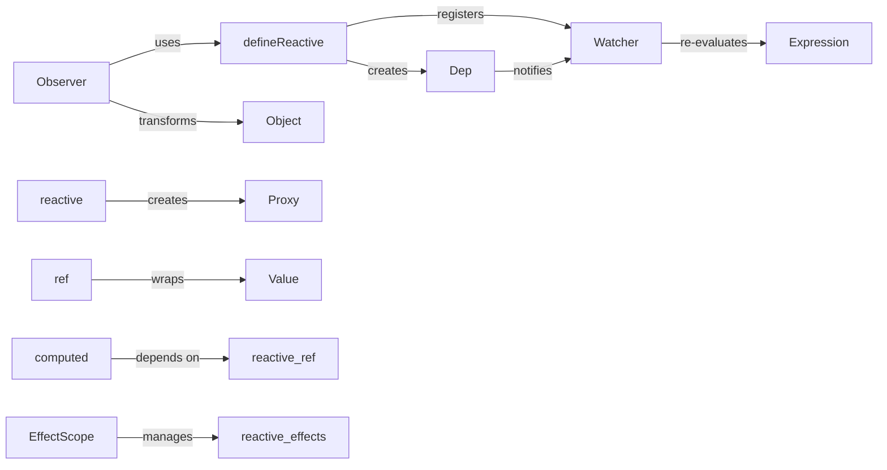

## Details

The Vue reactivity system is fundamentally divided into two distinct architectures: Vue 2's getter/setter-based system and Vue 3's Proxy-based system. In Vue 2, the Observer recursively transforms data objects by injecting defineReactive for each property, which in turn creates a Dep instance. Watcher instances subscribe to these Deps, and changes to reactive properties trigger Dep to notify its Watchers, leading to re-evaluation and updates. Vue 3, conversely, leverages ES6 Proxies through the reactive and ref APIs to achieve reactivity. reactive creates deeply reactive Proxy objects, while ref provides a reactive wrapper for any value type. computed properties build upon these primitives, offering cached derived values. Both reactive, ref, and computed operations are managed within an EffectScope, which provides a robust mechanism for grouping and disposing of reactive effects, crucial for lifecycle management in the Composition API. This clear separation ensures efficient and distinct reactivity patterns tailored to each Vue version.

### Observer
The cornerstone of Vue 2's reactivity, Observer transforms plain JavaScript objects into reactive objects. It recursively walks through an object's properties, converting them into getter/setters. When a property is accessed (get), its dependencies are collected; when it's modified (set), its dependents are notified.

**Related Classes/Methods**:

- <a href="https://github.com/vuejs/vue/blob/main/src/core/observer/index.ts" target="_blank" rel="noopener noreferrer">`vue.src.core.observer.Observer`</a>

### defineReactive
A utility function used by Observer to define a reactive getter/setter pair for a single property on an object. The getter registers the Watcher as a dependency, and the setter triggers updates by notifying all registered Watcher instances.

**Related Classes/Methods**:

- <a href="https://github.com/vuejs/vue/blob/main/src/core/observer/index.ts" target="_blank" rel="noopener noreferrer">`vue.src.core.observer.index.defineReactive`</a>

### Dep
Short for "Dependency," Dep is a central hub that manages a list of Watcher instances subscribed to a specific reactive property. It provides methods (depend() and notify()) for dependency collection and change notification. Each reactive property has its own Dep instance.

**Related Classes/Methods**:

- <a href="https://github.com/vuejs/vue/blob/main/src/core/observer/dep.ts" target="_blank" rel="noopener noreferrer">`vue.src.core.observer.Dep`</a>

### Watcher
A Watcher subscribes to reactive properties and re-evaluates its associated expression (e.g., a component's render function, a computed property's getter, or a watch callback) when its dependencies change. It acts as the bridge between reactive data and the system that needs to react to changes.

**Related Classes/Methods**:

- <a href="https://github.com/vuejs/vue/blob/main/src/core/observer/watcher.ts" target="_blank" rel="noopener noreferrer">`vue.src.core.observer.Watcher`</a>

### reactive
The primary API for creating deeply reactive objects in Vue 3. It takes a plain JavaScript object and returns a Proxy that intercepts all property access and modification operations, enabling efficient dependency tracking and change detection without direct getter/setter manipulation.

**Related Classes/Methods**:

### ref
Creates a reactive reference that can hold any value type, including primitives. It returns a special object with a .value property. Accessing or modifying .value triggers reactivity, making it suitable for making primitive values reactive in Vue 3's Composition API.

**Related Classes/Methods**:

### computed
Creates a reactive, cached derived property. It takes a getter function and returns a reactive ref. The computed value is re-evaluated only when its reactive dependencies change, and the result is cached until dependencies are updated, optimizing performance.

**Related Classes/Methods**:

### EffectScope
Provides a mechanism to group and manage a collection of reactive effects (e.g., watchers, computed properties, onMounted hooks). It allows these effects to be stopped or disposed of together, which is crucial for managing the lifecycle of reactive effects within components or other logical units.

**Related Classes/Methods**:

### [FAQ](https://github.com/CodeBoarding/GeneratedOnBoardings/tree/main?tab=readme-ov-file#faq)