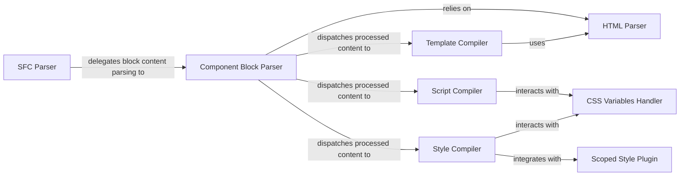

## Details

The `compiler-sfc` subsystem in Vue is responsible for transforming Single File Components (SFCs) into executable JavaScript. The process begins with the `SFC Parser`, which performs the initial breakdown of a `.vue` file into its core `<template>`, `<script>`, and `<style>` blocks. The `Component Block Parser` then takes these raw blocks and extracts their attributes and content, leveraging the `HTML Parser` for structural analysis. Subsequently, the processed content is dispatched to specialized compilers: the `Template Compiler` converts the template into render functions, also utilizing the `HTML Parser`; the `Script Compiler` processes the script block, handling Vue-specific macros and integrating with the `CSS Variables Handler` for dynamic styling; and the `Style Compiler` compiles the style block, applying scoped styling via the `Scoped Style Plugin` and also interacting with the `CSS Variables Handler` for CSS variable processing. This modular architecture ensures efficient and specialized handling of each part of an SFC.

### SFC Parser
The primary entry point for SFC compilation. It takes a raw `.vue` file string and performs the initial lexical and syntactic analysis, breaking it down into its fundamental `<template>`, `<script>`, and `<style>` blocks, along with custom blocks. It also manages source map generation for the overall file.

**Related Classes/Methods**:

- <a href="https://github.com/vuejs/vue/blob/main/packages/compiler-sfc/src/parse.ts" target="_blank" rel="noopener noreferrer">`SFC Parser`</a>

### Component Block Parser
Specializes in parsing the raw content of the individual `<template>`, `<script>`, and `<style>` tags extracted by the `SFC Parser`. It extracts attributes, language types (e.g., `lang="ts"`), and prepares the block content for their respective compilers.

**Related Classes/Methods**:

- <a href="https://github.com/vuejs/vue/blob/main/packages/compiler-sfc/src/parseComponent.ts" target="_blank" rel="noopener noreferrer">`Component Block Parser`</a>

### Template Compiler
Transforms the HTML-like syntax within the `<template>` block into optimized JavaScript render functions. This involves parsing the template into an Abstract Syntax Tree (AST), applying various optimizations (e.g., static tree hoisting), and generating render function code that Vue's runtime can efficiently execute.

**Related Classes/Methods**:

- <a href="https://github.com/vuejs/vue/blob/main/packages/compiler-sfc/src/compileTemplate.ts" target="_blank" rel="noopener noreferrer">`Template Compiler`</a>

### Script Compiler
Responsible for compiling the JavaScript/TypeScript code found within the `<script>` block. This includes processing Vue-specific macros (e.g., `defineProps`, `defineEmits`, `defineExpose`), performing binding analysis, and transforming the script into a format suitable for the browser or Node.js environment.

**Related Classes/Methods**:

- <a href="https://github.com/vuejs/vue/blob/main/packages/compiler-sfc/src/compileScript.ts" target="_blank" rel="noopener noreferrer">`Script Compiler`</a>

### Style Compiler
Handles the compilation of CSS code within the `<style>` block. It supports various CSS preprocessors (though the preprocessor integration itself is external) and is responsible for implementing Vue's scoped styling mechanism by integrating with the `Scoped Style Plugin`.

**Related Classes/Methods**:

- <a href="https://github.com/vuejs/vue/blob/main/packages/compiler-sfc/src/compileStyle.ts" target="_blank" rel="noopener noreferrer">`Style Compiler`</a>

### Scoped Style Plugin
Implements the core logic for Vue's scoped CSS feature. It rewrites CSS selectors by adding unique data attributes to ensure that styles are encapsulated and apply only to the elements within the current component, preventing style leakage into other components.

**Related Classes/Methods**:

- <a href="https://github.com/vuejs/vue/blob/main/packages/compiler-sfc/src/stylePlugins/scoped.ts" target="_blank" rel="noopener noreferrer">`Scoped Style Plugin`</a>

### CSS Variables Handler
Extracts and processes CSS variables defined within the SFC, ensuring their correct integration and reactivity within the compiled output. This is particularly important when CSS variables are used in conjunction with JavaScript for dynamic styling.

**Related Classes/Methods**:

- <a href="https://github.com/vuejs/vue/blob/main/packages/compiler-sfc/src/cssVars.ts" target="_blank" rel="noopener noreferrer">`CSS Variables Handler`</a>

### HTML Parser
A foundational HTML parser used for the structural analysis of component blocks, particularly the `<template>` and `<style>` blocks, to extract their content and attributes. It provides the basic parsing capabilities upon which higher-level compilers build.

**Related Classes/Methods**:

- <a href="https://github.com/vuejs/vue/blob/main/src/compiler/parser/html-parser.ts" target="_blank" rel="noopener noreferrer">`HTML Parser`</a>

### [FAQ](https://github.com/CodeBoarding/GeneratedOnBoardings/tree/main?tab=readme-ov-file#faq)