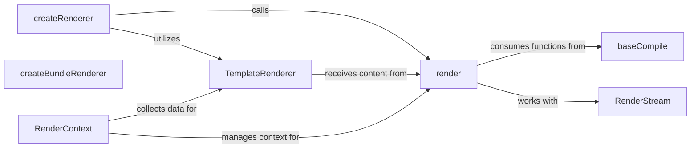

## Details

The server-renderer subsystem is central to Vue's server-side rendering capabilities. It orchestrates the transformation of Vue components into HTML, either as a complete string or a stream. The createRenderer component acts as the entry point, setting up the rendering environment. The render component performs the core rendering logic, leveraging baseCompile for template processing and interacting with RenderStream for efficient output delivery. The TemplateRenderer is responsible for structuring the final HTML document, while RenderContext maintains the state and collects data throughout the rendering process. For pre-built applications, createBundleRenderer provides a specialized rendering pathway. This interconnected set of components ensures efficient and flexible server-side rendering of Vue applications.

### createRenderer
The primary factory for initializing and configuring the server-side rendering environment. It orchestrates the setup of core rendering functions and the TemplateRenderer.

**Related Classes/Methods**:

- <a href="https://github.com/vuejs/vue/blob/main/packages/server-renderer/src/index.ts#L15-L28" target="_blank" rel="noopener noreferrer">`createRenderer`:15-28</a>

### render
The core engine for converting Vue components and VNodes into HTML strings on the server. It handles recursive traversal, component resolution, and directive application.

**Related Classes/Methods**:

- <a href="https://github.com/vuejs/vue/blob/main/packages/compiler-sfc/src/compileTemplate.ts" target="_blank" rel="noopener noreferrer">`render`</a>

### TemplateRenderer
Manages the overall HTML document structure for the server-rendered output. This includes injecting the rendered application content, handling resource hints, and embedding styles and scripts.

**Related Classes/Methods**:

- <a href="https://github.com/vuejs/vue/blob/main/packages/server-renderer/src/create-renderer.ts#L56-L65" target="_blank" rel="noopener noreferrer">`TemplateRenderer`:56-65</a>

### baseCompile
The server-side specific compiler that processes Vue templates. It applies SSR-specific optimizations and generates highly efficient render functions. This component encapsulates the functionalities of optimizer and codegen.

**Related Classes/Methods**:

- <a href="https://github.com/vuejs/vue/blob/main/packages/server-renderer/src/optimizing-compiler/index.ts#L7-L19" target="_blank" rel="noopener noreferrer">`baseCompile`:7-19</a>

### createBundleRenderer
Provides an API for rendering Vue applications from a pre-built server bundle. It sets up the necessary environment for executing the bundle, internally utilizing a bundle runner.

**Related Classes/Methods**:

- <a href="https://github.com/vuejs/vue/blob/main/packages/server-renderer/src/index.ts" target="_blank" rel="noopener noreferrer">`createBundleRenderer`</a>

### RenderStream
Manages the streaming of the server-rendered HTML output. This is crucial for improving Time To First Byte (TTFB) by sending HTML chunks incrementally to the client.

**Related Classes/Methods**:

- <a href="https://github.com/vuejs/vue/blob/main/packages/server-renderer/src/render-stream.ts#L15-L100" target="_blank" rel="noopener noreferrer">`RenderStream`:15-100</a>

### RenderContext
Manages the rendering context during the SSR process. This includes handling asynchronous operations, tracking the state of the rendering, and collecting data like CSS or component assets.

**Related Classes/Methods**:

- <a href="https://github.com/vuejs/vue/blob/main/types/umd.d.ts" target="_blank" rel="noopener noreferrer">`RenderContext`</a>

### [FAQ](https://github.com/CodeBoarding/GeneratedOnBoardings/tree/main?tab=readme-ov-file#faq)