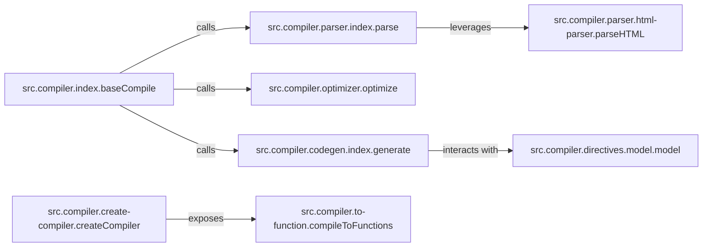

## Details

The Vue.js compiler subsystem orchestrates the transformation of template strings into optimized render functions. The `baseCompile` component serves as the central orchestrator, initiating the parsing of raw templates by `src.compiler.parser.index.parse`, which in turn leverages `src.compiler.parser.html-parser.parseHTML` for low-level HTML parsing. The resulting Abstract Syntax Tree (AST) is then optimized by `src.compiler.optimizer.optimize` to identify static content. Subsequently, `src.compiler.codegen.index.generate` converts the optimized AST into executable JavaScript code. During this code generation, specific directive logic, such as that for `v-model` encapsulated in `src.compiler.directives.model.model`, is applied. Finally, `src.compiler.create-compiler.createCompiler` provides the public interface to the compiler, exposing `src.compiler.to-function.compileToFunctions` to convert the generated code into callable functions for the runtime. This structured flow ensures efficient and optimized template compilation.

### src.compiler.index.baseCompile
The orchestrator and primary entry point for the template compilation process. It coordinates the parsing, optimization, and code generation stages.

**Related Classes/Methods**:

- <a href="https://github.com/vuejs/vue/blob/main/src/compiler/index.ts#L10-L24" target="_blank" rel="noopener noreferrer">`src.compiler.index.baseCompile`:10-24</a>

### src.compiler.parser.index.parse
Responsible for parsing the raw template string into an Abstract Syntax Tree (AST), representing the template's structure and content.

**Related Classes/Methods**:

- <a href="https://github.com/vuejs/vue/blob/main/src/compiler/parser/index.ts#L86-L422" target="_blank" rel="noopener noreferrer">`src.compiler.parser.index.parse`:86-422</a>

### src.compiler.optimizer.optimize
Analyzes the generated AST to identify static parts of the template that do not need re-rendering on data changes, marking them for optimization to improve runtime performance.

**Related Classes/Methods**:

- <a href="https://github.com/vuejs/vue/blob/main/src/compiler/optimizer.ts#L20-L31" target="_blank" rel="noopener noreferrer">`src.compiler.optimizer.optimize`:20-31</a>

### src.compiler.codegen.index.generate
Takes the optimized AST and traverses it to generate a JavaScript code string, which will become the render function.

**Related Classes/Methods**:

- <a href="https://github.com/vuejs/vue/blob/main/src/compiler/codegen/index.ts#L57-L72" target="_blank" rel="noopener noreferrer">`src.compiler.codegen.index.generate`:57-72</a>

### src.compiler.create-compiler.createCompiler
Provides the public API for the compiler, allowing external modules or build tools to initiate the compilation process and access its functionalities.

**Related Classes/Methods**:

- <a href="https://github.com/vuejs/vue/blob/main/src/compiler/create-compiler.ts#L7-L82" target="_blank" rel="noopener noreferrer">`src.compiler.create-compiler.createCompiler`:7-82</a>

### src.compiler.to-function.compileToFunctions
A utility component that finalizes the compilation by converting the generated JavaScript code string into actual executable functions, ready for the runtime.

**Related Classes/Methods**:

- <a href="https://github.com/vuejs/vue/blob/main/src/compiler/to-function.ts#L24-L118" target="_blank" rel="noopener noreferrer">`src.compiler.to-function.compileToFunctions`:24-118</a>

### src.compiler.parser.html-parser.parseHTML
A low-level parser specifically designed to parse raw HTML, forming the foundational step for the higher-level template parser.

**Related Classes/Methods**:

- <a href="https://github.com/vuejs/vue/blob/main/src/compiler/parser/html-parser.ts#L71-L341" target="_blank" rel="noopener noreferrer">`src.compiler.parser.html-parser.parseHTML`:71-341</a>

### src.compiler.directives.model.model
Encapsulates the specific logic for handling the `v-model` built-in directive during the compilation process, influencing both parsing and code generation.

**Related Classes/Methods**: _None_

### [FAQ](https://github.com/CodeBoarding/GeneratedOnBoardings/tree/main?tab=readme-ov-file#faq)