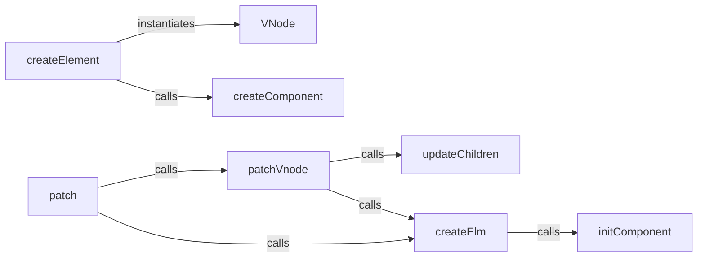

## Details

The Virtual DOM (VDOM) Manager subsystem is responsible for the efficient creation, manipulation, and updating of the Virtual DOM, thereby minimizing direct interactions with the real DOM for performance optimization. Its core functionality revolves around representing the UI as a lightweight VDOM tree, comparing changes between VDOM trees, and applying only necessary updates to the actual browser DOM.

### VNode
The fundamental data structure representing a virtual DOM node. It encapsulates properties like tag, data, children, and component options, serving as the blueprint for the virtual representation of the UI.

**Related Classes/Methods**:

- <a href="https://github.com/vuejs/vue/blob/main/types/umd.d.ts" target="_blank" rel="noopener noreferrer">`VNode`</a>

### createElement
Orchestrates the creation of Virtual DOM nodes (VNodes). It serves as the primary API for constructing the VDOM tree, handling various node types (elements, components, text, empty nodes). This is the entry point for building the virtual representation.

**Related Classes/Methods**:

- <a href="https://github.com/vuejs/vue/blob/main/types/umd.d.ts" target="_blank" rel="noopener noreferrer">`createElement`</a>

### createComponent
Specifically handles the creation of VNodes that represent Vue components. This includes resolving component options and preparing the VNode for component instantiation, integrating Vue's component model with the VDOM.

**Related Classes/Methods**:

- <a href="https://github.com/vuejs/vue/blob/main/src/core/vdom/create-component.ts#L101-L210" target="_blank" rel="noopener noreferrer">`createComponent`:101-210</a>

### patch
The core diffing and patching algorithm. It compares an old VDOM tree with a new one and efficiently applies only the necessary changes to the real DOM, minimizing direct DOM manipulations. This is the central update mechanism.

**Related Classes/Methods**:

- <a href="https://github.com/vuejs/vue/blob/main/src/platforms/web/runtime/patch.ts" target="_blank" rel="noopener noreferrer">`patch`</a>

### patchVnode
Compares two individual VNodes (old and new) and applies the necessary updates to their corresponding real DOM element. It's a recursive function central to the patching process, handling node-level differences.

**Related Classes/Methods**:

- <a href="https://github.com/vuejs/vue/blob/main/src/core/vdom/patch.ts#L584-L659" target="_blank" rel="noopener noreferrer">`patchVnode`:584-659</a>

### updateChildren
Implements the sophisticated diffing algorithm for child node lists. It optimizes DOM updates by efficiently reusing, moving, or removing existing elements based on keys and node types, crucial for list rendering performance.

**Related Classes/Methods**:

- <a href="https://github.com/vuejs/vue/blob/main/src/core/vdom/patch.ts#L413-L557" target="_blank" rel="noopener noreferrer">`updateChildren`:413-557</a>

### createElm
Responsible for the actual creation of real DOM elements based on a given VNode. It's the bridge between the virtual representation and the physical DOM, performing the actual browser API calls.

**Related Classes/Methods**:

- <a href="https://github.com/vuejs/vue/blob/main/src/core/vdom/patch.ts#L121-L185" target="_blank" rel="noopener noreferrer">`createElm`:121-185</a>

### initComponent
Initializes a component instance during the patching process, attaching the component instance to its VNode. This is crucial for component lifecycle management and data reactivity within the VDOM update cycle.

**Related Classes/Methods**:

- <a href="https://github.com/vuejs/vue/blob/main/src/core/vdom/patch.ts#L209-L228" target="_blank" rel="noopener noreferrer">`initComponent`:209-228</a>

### [FAQ](https://github.com/CodeBoarding/GeneratedOnBoardings/tree/main?tab=readme-ov-file#faq)