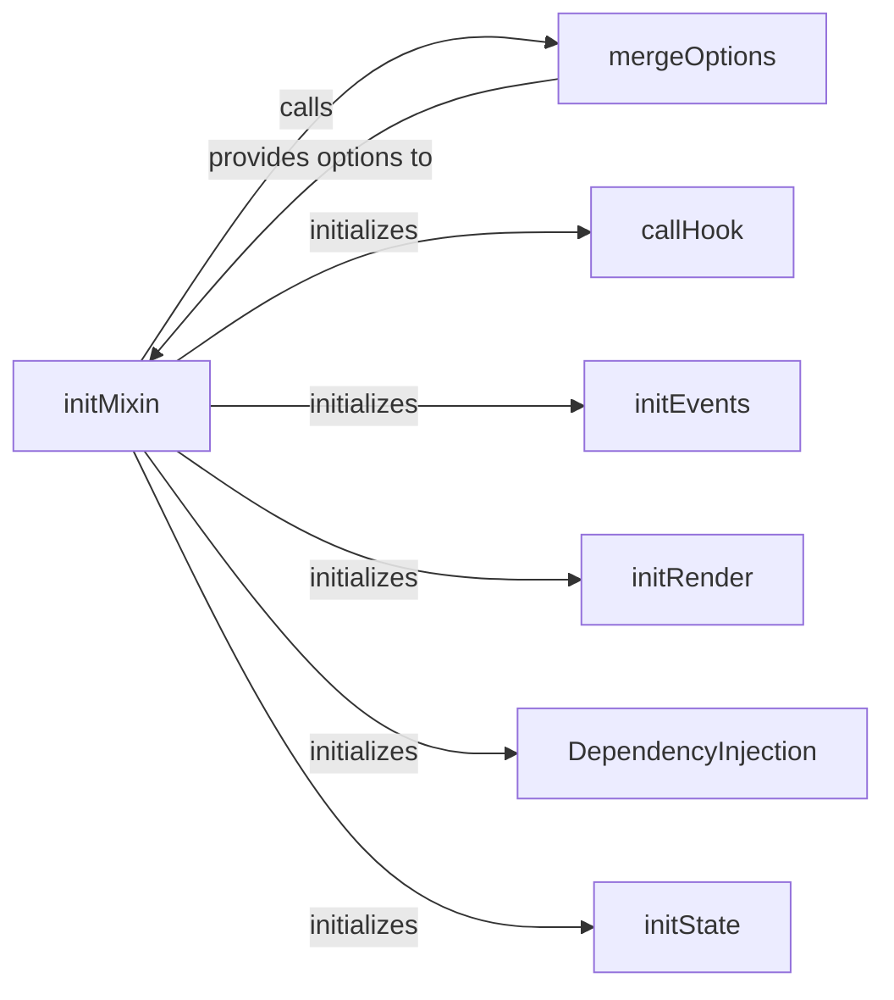

## Details

The `Vue Instance Core` subsystem is the heart of every Vue component, orchestrating its creation, data management, rendering, and lifecycle. It embodies the MVVM pattern by managing the view's state and behavior.

### initMixin
The primary orchestrator for initializing a Vue instance. It coordinates the setup of all core functionalities, including options merging, lifecycle, events, rendering, state, and dependency injection. This component is fundamental as it kicks off the entire instance creation process, aligning with the "Core Runtime" expected component.

**Related Classes/Methods**:

- <a href="https://github.com/vuejs/vue/blob/main/src/core/global-api/mixin.ts#L4-L9" target="_blank" rel="noopener noreferrer">`initMixin`:4-9</a>

### initState
Manages the setup and reactivity of the instance's data, props, methods, computed properties, and watchers. It's responsible for making these properties reactive, which is crucial for the MVVM pattern and unidirectional data flow.

**Related Classes/Methods**:

- <a href="https://github.com/vuejs/vue/blob/main/src/core/instance/state.ts#L52-L70" target="_blank" rel="noopener noreferrer">`initState`:52-70</a>

### initRender
Prepares the instance's rendering capabilities, including the creation of virtual DOM nodes and the setup of the render function. This component is vital for the "Rendering Process" aspect of the Vue Instance Core.

**Related Classes/Methods**:

- <a href="https://github.com/vuejs/vue/blob/main/src/core/instance/render.ts#L21-L86" target="_blank" rel="noopener noreferrer">`initRender`:21-86</a>

### callHook
Responsible for dispatching and invoking the various lifecycle hooks (e.g., `beforeCreate`, `created`, `mounted`) during the instance's existence. This is a core part of the "Lifecycle" management.

**Related Classes/Methods**:

- <a href="https://github.com/vuejs/vue/blob/main/src/core/instance/lifecycle.ts#L394-L421" target="_blank" rel="noopener noreferrer">`callHook`:394-421</a>

### initEvents
Initializes the instance's custom event system, allowing components to emit and listen for events using `$on`, `$emit`, `$off`, and `$once`. This is crucial for inter-component communication, especially in a component-based architecture.

**Related Classes/Methods**:

- <a href="https://github.com/vuejs/vue/blob/main/src/core/instance/events.ts#L12-L20" target="_blank" rel="noopener noreferrer">`initEvents`:12-20</a>

### DependencyInjection
Handles the `provide` and `inject` mechanism, facilitating dependency injection for data passing down the component tree without prop drilling. This supports cleaner data flow in complex component hierarchies.

**Related Classes/Methods**:

- <a href="https://github.com/vuejs/vue/blob/main/src/core/instance/inject.ts" target="_blank" rel="noopener noreferrer">`DependencyInjection`</a>

### mergeOptions
A utility for consolidating and merging component options from various sources (e.g., global mixins, parent components, local options). This ensures a consistent and complete set of options for each instance.

**Related Classes/Methods**:

- <a href="https://github.com/vuejs/vue/blob/main/src/core/global-api/index.ts" target="_blank" rel="noopener noreferrer">`mergeOptions`</a>

### [FAQ](https://github.com/CodeBoarding/GeneratedOnBoardings/tree/main?tab=readme-ov-file#faq)