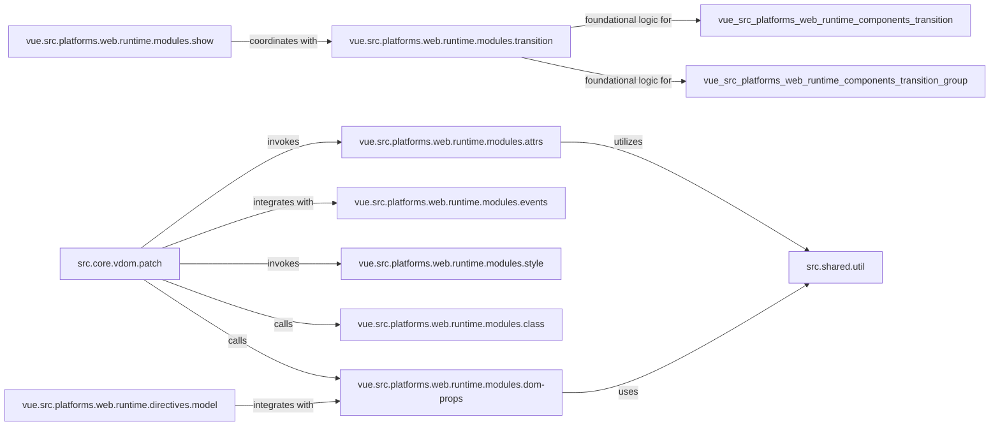

## Details

The Vue.js rendering subsystem orchestrates the efficient update of the actual DOM based on changes in the Virtual DOM. At its core, `src.core.vdom.patch` acts as the central reconciliation engine, comparing old and new Virtual Nodes (VNodes) and applying necessary changes. This process involves specialized modules like `vue.src.platforms.web.runtime.modules.attrs`, `vue.src.platforms.web.runtime.modules.dom-props`, `vue.src.platforms.web.runtime.modules.events`, `vue.src.platforms.web.runtime.modules.style`, and `vue.src.platforms.web.runtime.modules.class`, each responsible for specific aspects of DOM manipulation. Directives such as `vue.src.platforms.web.runtime.directives.model` and `vue.src.platforms.web.runtime.modules.show` extend this functionality, providing two-way data binding and conditional rendering, often integrating with the `vue.src.platforms.web.runtime.modules.transition` module for animated effects. Utility functions from `src.shared.util` support various operations across these components.

### vue.src.platforms.web.runtime.modules.attrs
Manages the setting and updating of HTML attributes on actual DOM elements. It ensures that attributes in the Virtual DOM are correctly reflected in the browser's DOM.

**Related Classes/Methods**:

- <a href="https://github.com/vuejs/vue/blob/main/src/platforms/web/runtime/modules/attrs.ts" target="_blank" rel="noopener noreferrer">`vue.src.platforms.web.runtime.modules.attrs`</a>

### vue.src.platforms.web.runtime.modules.dom-props
Handles the updating of DOM properties (e.g., `value`, `checked`, `selected`) on elements. These properties often behave differently from HTML attributes and require specific handling.

**Related Classes/Methods**:

- <a href="https://github.com/vuejs/vue/blob/main/src/platforms/web/runtime/modules/dom-props.ts" target="_blank" rel="noopener noreferrer">`vue.src.platforms.web.runtime.modules.dom-props`</a>

### vue.src.platforms.web.runtime.modules.events
Responsible for attaching, detaching, and updating native DOM event listeners on elements, enabling user interaction and reactivity.

**Related Classes/Methods**:

- <a href="https://github.com/vuejs/vue/blob/main/src/platforms/web/runtime/modules/events.ts#L16-L31" target="_blank" rel="noopener noreferrer">`vue.src.platforms.web.runtime.modules.events`:16-31</a>

### vue.src.platforms.web.runtime.modules.style
Applies and updates inline CSS styles on DOM elements based on the style data provided by the Virtual DOM.

**Related Classes/Methods**:

- <a href="https://github.com/vuejs/vue/blob/main/src/platforms/web/runtime/modules/style.ts" target="_blank" rel="noopener noreferrer">`vue.src.platforms.web.runtime.modules.style`</a>

### vue.src.platforms.web.runtime.modules.class
Manages the addition and removal of CSS classes on DOM elements, supporting dynamic styling based on component state.

**Related Classes/Methods**:

- <a href="https://github.com/vuejs/vue/blob/main/src/platforms/web/runtime/modules/class.ts" target="_blank" rel="noopener noreferrer">`vue.src.platforms.web.runtime.modules.class`</a>

### vue.src.platforms.web.runtime.modules.show
Implements the `v-show` directive, which controls element visibility by toggling the `display` CSS property. It can coordinate with transitions for smooth visual effects.

**Related Classes/Methods**:

### vue.src.platforms.web.runtime.directives.model
Provides the core client-side logic for the `v-model` two-way data binding directive, primarily for form inputs (`<input>`, `<textarea>`, `<select>`), synchronizing input values with component data.

**Related Classes/Methods**:

- <a href="https://github.com/vuejs/vue/blob/main/src/platforms/web/runtime/directives/model.ts" target="_blank" rel="noopener noreferrer">`vue.src.platforms.web.runtime.directives.model`</a>

### vue.src.platforms.web.runtime.modules.transition
Contains the fundamental logic for handling CSS transitions (e.g., `enter`, `leave` hooks) by applying and removing CSS classes at appropriate times during element insertion or removal.

**Related Classes/Methods**:

- <a href="https://github.com/vuejs/vue/blob/main/src/platforms/web/runtime/modules/transition.ts" target="_blank" rel="noopener noreferrer">`vue.src.platforms.web.runtime.modules.transition`</a>

### src.core.vdom.patch
Vue's Virtual DOM Manager, orchestrates the Virtual DOM reconciliation process by comparing VNodes and applying changes to the real DOM.

**Related Classes/Methods**:

- <a href="https://github.com/vuejs/vue/blob/main/src/core/vdom/patch.ts" target="_blank" rel="noopener noreferrer">`src.core.vdom.patch`</a>

### src.shared.util
Utility functions used across various modules, providing common helpers for type checking, object manipulation, and string transformations.

**Related Classes/Methods**:

- <a href="https://github.com/vuejs/vue/blob/main/src/shared/util.ts" target="_blank" rel="noopener noreferrer">`src.shared.util`</a>

### [FAQ](https://github.com/CodeBoarding/GeneratedOnBoardings/tree/main?tab=readme-ov-file#faq)