```mermaid
graph LR
    SFC_Compiler["SFC Compiler"]
    Template_Compiler_Core["Template Compiler Core"]
    Vue_Instance_Core["Vue Instance Core"]
    Reactivity_System["Reactivity System"]
    Virtual_DOM_VDOM_Manager["Virtual DOM (VDOM) Manager"]
    Web_Platform_Runtime["Web Platform Runtime"]
    Server_Side_Renderer_SSR_["Server-Side Renderer (SSR)"]
    SFC_Compiler -- "extracts template content and passes to" --> Template_Compiler_Core
    Template_Compiler_Core -- "outputs render functions utilized by" --> Vue_Instance_Core
    Vue_Instance_Core -- "initializes state and registers watchers with" --> Reactivity_System
    Reactivity_System -- "notifies when data changes, triggering re-renders in" --> Vue_Instance_Core
    Vue_Instance_Core -- "requests creation and patching of VDOM trees from" --> Virtual_DOM_VDOM_Manager
    Virtual_DOM_VDOM_Manager -- "sends DOM update instructions to" --> Web_Platform_Runtime
    Web_Platform_Runtime -- "dispatches DOM events back to" --> Vue_Instance_Core
    Server_Side_Renderer_SSR_ -- "utilizes for server-side compilation" --> Template_Compiler_Core
    Server_Side_Renderer_SSR_ -- "uses to render VDOM nodes into static HTML" --> Virtual_DOM_VDOM_Manager
    click SFC_Compiler href "https://github.com/CodeBoarding/GeneratedOnBoardings/blob/main/vue/SFC_Compiler.md" "Details"
    click Template_Compiler_Core href "https://github.com/CodeBoarding/GeneratedOnBoardings/blob/main/vue/Template_Compiler_Core.md" "Details"
    click Vue_Instance_Core href "https://github.com/CodeBoarding/GeneratedOnBoardings/blob/main/vue/Vue_Instance_Core.md" "Details"
    click Reactivity_System href "https://github.com/CodeBoarding/GeneratedOnBoardings/blob/main/vue/Reactivity_System.md" "Details"
    click Virtual_DOM_VDOM_Manager href "https://github.com/CodeBoarding/GeneratedOnBoardings/blob/main/vue/Virtual_DOM_VDOM_Manager.md" "Details"
    click Web_Platform_Runtime href "https://github.com/CodeBoarding/GeneratedOnBoardings/blob/main/vue/Web_Platform_Runtime.md" "Details"
    click Server_Side_Renderer_SSR_ href "https://github.com/CodeBoarding/GeneratedOnBoardings/blob/main/vue/Server_Side_Renderer_SSR_.md" "Details"
```

## Details

The Vue.js framework operates on a robust component-based architecture, primarily driven by a reactive data flow. At its core, the system transforms declarative templates into efficient render functions, manages component lifecycles, and intelligently updates the DOM. This process begins with compilation, moves through a reactive runtime, and culminates in precise DOM manipulation, with an optional server-side rendering path for enhanced performance and SEO.

### SFC Compiler [[Expand]](./SFC_Compiler.md)
Parses and compiles Vue Single File Components (.vue files) into executable JavaScript, CSS, and render functions.

**Related Classes/Methods**:

- <a href="https://github.com/vuejs/vue/blob/main/packages/compiler-sfc/src/parse.ts" target="_blank" rel="noopener noreferrer">`packages/compiler-sfc/src/parse.ts`</a>

### Template Compiler Core [[Expand]](./Template_Compiler_Core.md)
The foundational compiler that takes HTML-like template strings, parses them into an Abstract Syntax Tree (AST), optimizes them, and generates JavaScript render functions.

**Related Classes/Methods**:

- <a href="https://github.com/vuejs/vue/blob/main/src/compiler/index.ts" target="_blank" rel="noopener noreferrer">`src/compiler/index.ts`</a>

### Vue Instance Core [[Expand]](./Vue_Instance_Core.md)
Manages the lifecycle, state, events, and rendering process for individual Vue component instances, acting as the central orchestrator for a component's runtime behavior.

**Related Classes/Methods**:

- <a href="https://github.com/vuejs/vue/blob/main/src/core/instance/init.ts" target="_blank" rel="noopener noreferrer">`src/core/instance/init.ts`</a>

### Reactivity System [[Expand]](./Reactivity_System.md)
The fundamental mechanism that makes Vue reactive, automatically tracking dependencies and triggering updates when observed data changes.

**Related Classes/Methods**:

- <a href="https://github.com/vuejs/vue/blob/main/src/core/observer/index.ts" target="_blank" rel="noopener noreferrer">`src/core/observer/index.ts`</a>
- <a href="https://github.com/vuejs/vue/blob/main/src/v3/reactivity/reactive.ts" target="_blank" rel="noopener noreferrer">`src/v3/reactivity/reactive.ts`</a>

### Virtual DOM (VDOM) Manager [[Expand]](./Virtual_DOM_VDOM_Manager.md)
Responsible for creating, manipulating, and efficiently updating the Virtual DOM, minimizing direct DOM manipulations for performance.

**Related Classes/Methods**:

- <a href="https://github.com/vuejs/vue/blob/main/src/core/vdom/create-element.ts" target="_blank" rel="noopener noreferrer">`src/core/vdom/create-element.ts`</a>
- <a href="https://github.com/vuejs/vue/blob/main/src/core/vdom/patch.ts" target="_blank" rel="noopener noreferrer">`src/core/vdom/patch.ts`</a>

### Web Platform Runtime [[Expand]](./Web_Platform_Runtime.md)
Provides web-specific runtime functionalities, acting as the bridge between the Virtual DOM Manager and the actual browser DOM, handling attributes, properties, events, and built-in directives.

**Related Classes/Methods**:

- <a href="https://github.com/vuejs/vue/blob/main/src/platforms/web/runtime/modules/attrs.ts" target="_blank" rel="noopener noreferrer">`src/platforms/web/runtime/modules/attrs.ts`</a>

### Server-Side Renderer (SSR) [[Expand]](./Server_Side_Renderer_SSR_.md)
Enables rendering Vue components into static HTML strings on the server, improving initial page load performance and SEO.

**Related Classes/Methods**:

- <a href="https://github.com/vuejs/vue/blob/main/packages/server-renderer/src/create-renderer.ts" target="_blank" rel="noopener noreferrer">`packages/server-renderer/src/create-renderer.ts`</a>

### [FAQ](https://github.com/CodeBoarding/GeneratedOnBoardings/tree/main?tab=readme-ov-file#faq)