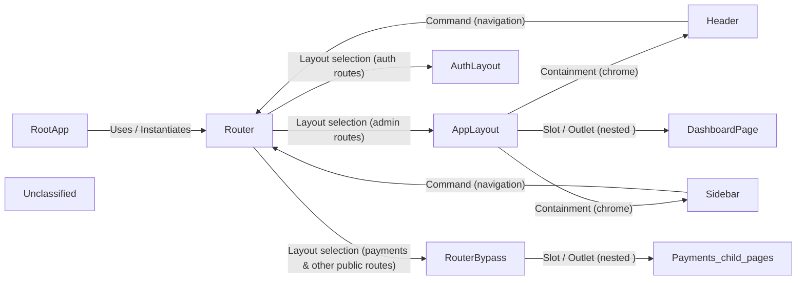

## Details

The graph models the navigation and layout architecture of a Vue 3 application. The RootApp bootstraps the Vue instance, registers the Router, Pinia stores, i18n, and UI libraries, and mounts the app. The Router acts as the central navigation engine, mapping URLs to three top‑level layout shells—AppLayout for authenticated admin pages, AuthLayout for authentication pages, and RouterBypass for public or embedded sections. Each layout contains its own UI chrome: AppLayout embeds a Header and Sidebar that issue navigation commands back to the Router, while the layout’s inner <router‑view/> renders feature pages such as DashboardPage. AuthLayout and RouterBypass provide minimal containers that simply render their child pages. This hierarchy creates a clear top‑down flow: RootApp → Router → Layout → Chrome (Header/Sidebar) → Feature Page, with navigation commands flowing back from Header and Sidebar to the Router.

### RootApp
Root Vue application bootstrap; creates the Vue app, registers router, Pinia stores, i18n, Vuestic UI, and mounts the app. Also includes the root App.vue component that renders the top‑level <router‑view/>.

**Related Classes/Methods**:

- <a href="https://github.com/epicmaxco/vuestic-admin/blob/master/src/main.ts" target="_blank" rel="noopener noreferrer">`src/main.ts`</a>
- <a href="https://github.com/epicmaxco/vuestic-admin/blob/master/src/App.vue" target="_blank" rel="noopener noreferrer">`src/App.vue`</a>

### Router
Vue‑Router instance that declares routes, selects one of three layout shells (AppLayout, AuthLayout, RouterBypass), and lazy‑loads page components.

**Related Classes/Methods**:

- <a href="https://github.com/epicmaxco/vuestic-admin/blob/master/src/router/index.ts" target="_blank" rel="noopener noreferrer">`src/router/index.ts`</a>

### AppLayout
Authenticated admin layout shell; composes Header and Sidebar, provides persistent chrome, and contains a nested <router‑view/> where feature pages are rendered.

**Related Classes/Methods**:

- <a href="https://github.com/epicmaxco/vuestic-admin/blob/master/src/layouts/AppLayout.vue" target="_blank" rel="noopener noreferrer">`src/layouts/AppLayout.vue`</a>

### AuthLayout
Minimal layout used for authentication pages; renders a centered <router‑view/> without the admin chrome.

**Related Classes/Methods**:

- <a href="https://github.com/epicmaxco/vuestic-admin/blob/master/src/layouts/AuthLayout.vue" target="_blank" rel="noopener noreferrer">`src/layouts/AuthLayout.vue`</a>

### RouterBypass
Lightweight layout for public or embedded pages (e.g., payments); renders a plain <router‑view/> and serves as a parent for child routes.

**Related Classes/Methods**:

- <a href="https://github.com/epicmaxco/vuestic-admin/blob/master/src/layouts/RouterBypass.vue" target="_blank" rel="noopener noreferrer">`src/layouts/RouterBypass.vue`</a>

### Header
Top navigation bar component; reads global store to react to sidebar state and emits navigation actions via <RouterLink> and click handlers.

**Related Classes/Methods**:

- <a href="https://github.com/epicmaxco/vuestic-admin/blob/master/src/components/navbar/AppNavbar.vue" target="_blank" rel="noopener noreferrer">`src/components/navbar/AppNavbar.vue`</a>

### Sidebar
Collapsible side‑menu component; renders navigation routes and triggers router.push on menu item clicks.

**Related Classes/Methods**:

- <a href="https://github.com/epicmaxco/vuestic-admin/blob/master/src/components/sidebar/AppSidebar.vue" target="_blank" rel="noopener noreferrer">`src/components/sidebar/AppSidebar.vue`</a>

### DashboardPage
Example authenticated page; lazy‑loaded by the router, consumes Pinia stores/composables, and is displayed inside the <router‑view/> of AppLayout.

**Related Classes/Methods**:

- <a href="https://github.com/epicmaxco/vuestic-admin/blob/master/src/pages/admin/dashboard/Dashboard.vue" target="_blank" rel="noopener noreferrer">`src/pages/admin/dashboard/Dashboard.vue`</a>

### Unclassified
Component for all unclassified files and utility functions (Utility functions/External Libraries/Dependencies)

**Related Classes/Methods**: _None_

### [FAQ](https://github.com/CodeBoarding/GeneratedOnBoardings/tree/main?tab=readme-ov-file#faq)