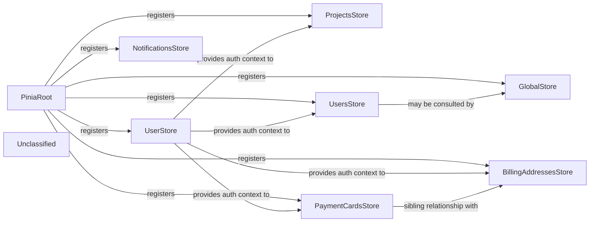

## Details

The Pinia‑based State Management subsystem provides a centralized, single source of truth for UI‑wide flags, authenticated user data, and domain collections within the Vuestic‑Admin front‑end. A single PiniaRoot (src/stores/index.ts) creates the Pinia instance and registers eight feature stores, each responsible for a specific slice of state: GlobalStore for UI flags, UserStore for the current user profile, ProjectsStore, PaymentCardsStore, BillingAddressesStore, UsersStore for domain entity collections, and NotificationsStore for static configuration. Stores expose state, getters, and actions consumed directly by Vue components, while UserStore supplies auth context to other stores and the GlobalStore drives layout components. The subsystem ensures low coupling and high cohesion, enabling clear data flow and straightforward diagramming of relationships.

### PiniaRoot
Creates the global Pinia instance and registers every feature store with the Vue app, exposing the Pinia instance to the whole application.

**Related Classes/Methods**:

- <a href="https://github.com/epicmaxco/vuestic-admin/blob/master/src/stores/index.ts" target="_blank" rel="noopener noreferrer">`src.stores.index`</a>

### GlobalStore
Holds UI‑wide mutable flags (e.g., isSidebarMinimized) and actions to toggle them, consumed by layout components.

**Related Classes/Methods**:

- <a href="https://github.com/epicmaxco/vuestic-admin/blob/master/src/stores/global-store.ts" target="_blank" rel="noopener noreferrer">`src.stores.global_store`</a>

### UserStore
Stores the currently‑authenticated user profile and actions to mutate it, providing auth context to other stores and UI components.

**Related Classes/Methods**:

- <a href="https://github.com/epicmaxco/vuestic-admin/blob/master/src/stores/user-store.ts" target="_blank" rel="noopener noreferrer">`src.stores.user_store`</a>

### ProjectsStore
Manages the paginated collection of Project objects, exposing CRUD actions that call the mock backend.

**Related Classes/Methods**:

- <a href="https://github.com/epicmaxco/vuestic-admin/blob/master/src/stores/projects.ts" target="_blank" rel="noopener noreferrer">`src.stores.projects`</a>

### PaymentCardsStore
Holds the list of PaymentCard entities, a loading flag, and CRUD helpers; loads data via a simulated async fetch.

**Related Classes/Methods**:

- <a href="https://github.com/epicmaxco/vuestic-admin/blob/master/src/stores/payment-cards.ts" target="_blank" rel="noopener noreferrer">`src.stores.payment_cards`</a>

### BillingAddressesStore
Holds the list of BillingAddress entities, a loading flag, and CRUD helpers; loads data via a simulated async fetch.

**Related Classes/Methods**:

- <a href="https://github.com/epicmaxco/vuestic-admin/blob/master/src/stores/billing-addresses.ts" target="_blank" rel="noopener noreferrer">`src.stores.billing_addresses`</a>

### NotificationsStore
Provides a static map of notification‑type toggles used by the Settings page.

**Related Classes/Methods**:

- <a href="https://github.com/epicmaxco/vuestic-admin/blob/master/src/stores/notifications.ts" target="_blank" rel="noopener noreferrer">`src.stores.notifications`</a>

### UsersStore
Manages the admin‑level collection of platform User objects, exposing pagination, filtering, and full CRUD actions.

**Related Classes/Methods**:

- <a href="https://github.com/epicmaxco/vuestic-admin/blob/master/src/stores/users.ts" target="_blank" rel="noopener noreferrer">`src.stores.users`</a>

### Unclassified
Component for all unclassified files and utility functions (Utility functions/External Libraries/Dependencies)

**Related Classes/Methods**: _None_

### [FAQ](https://github.com/CodeBoarding/GeneratedOnBoardings/tree/main?tab=readme-ov-file#faq)