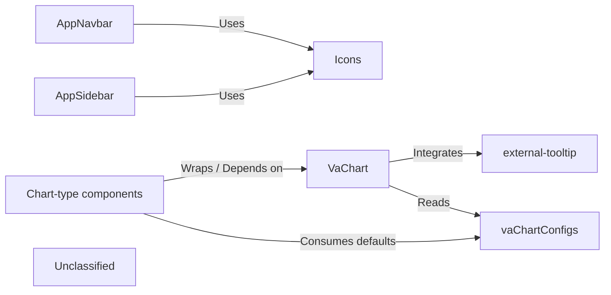

## Details

The Vuestic‑Admin UI architecture is split into a layout subsystem (AppNavbar and AppSidebar) that provides navigation and global actions, and a charting subsystem centred on VaChart. Layout components import the shared Icons library for visual symbols. VaChart is a thin wrapper around Chart.js that incorporates default configuration from vaChartConfigs and delegates tooltip rendering to the external‑tooltip helper. Individual chart‑type components (Line, Bar, Pie, etc.) act as lightweight facades that import VaChart, specify a concrete chart type, and merge their own options with the shared defaults, ensuring consistent visual styling. All dependencies flow from consumers to providers, establishing a clear, unidirectional data flow suitable for documentation and diagramming.

### AppNavbar
Top‑level navigation bar (logo, global actions, sidebar‑toggle).

**Related Classes/Methods**:

- <a href="https://github.com/epicmaxco/vuestic-admin/blob/master/src/components/navbar/AppNavbar.vue" target="_blank" rel="noopener noreferrer">`AppNavbar`</a>

### AppSidebar
Collapsible navigation drawer that renders the route tree.

**Related Classes/Methods**:

- <a href="https://github.com/epicmaxco/vuestic-admin/blob/master/src/components/sidebar/AppSidebar.vue" target="_blank" rel="noopener noreferrer">`AppSidebar`</a>

### Icons
Central catalogue of reusable SVG‑based Vue components.

**Related Classes/Methods**:

- <a href="https://github.com/epicmaxco/vuestic-admin/blob/master/src/components/icons" target="_blank" rel="noopener noreferrer">`Icons`</a>

### VaChart
Thin wrapper around Chart.js (va‑chart) that creates/destroys the chart instance and forwards external‑tooltip callbacks.

**Related Classes/Methods**:

- <a href="https://github.com/epicmaxco/vuestic-admin/blob/master/src/components/va-charts/VaChart.vue" target="_blank" rel="noopener noreferrer">`VaChart`</a>

### Chart‑type components
Small, purpose‑specific wrappers that expose only the data & options required for a given chart type.

**Related Classes/Methods**:

- <a href="https://github.com/epicmaxco/vuestic-admin/blob/master/src/components/va-charts/chart-types/LineChart.vue" target="_blank" rel="noopener noreferrer">`LineChart`</a>
- <a href="https://github.com/epicmaxco/vuestic-admin/blob/master/src/components/va-charts/chart-types/BarChart.vue" target="_blank" rel="noopener noreferrer">`BarChart`</a>
- <a href="https://github.com/epicmaxco/vuestic-admin/blob/master/src/components/va-charts/chart-types/PieChart.vue" target="_blank" rel="noopener noreferrer">`PieChart`</a>

### vaChartConfigs
Centralised default Chart.js configuration and helper utilities (e.g., mergeOptions, getDefaultColors).

**Related Classes/Methods**:

- <a href="https://github.com/epicmaxco/vuestic-admin/blob/master/src/components/va-charts/vaChartConfigs.js" target="_blank" rel="noopener noreferrer">`vaChartConfigs`</a>

### external‑tooltip
Custom HTML tooltip implementation used by VaChart.

**Related Classes/Methods**:

- <a href="https://github.com/epicmaxco/vuestic-admin/blob/master/src/components/va-charts/external-tooltip.ts" target="_blank" rel="noopener noreferrer">`externalTooltip`</a>

### Unclassified
Component for all unclassified files and utility functions (Utility functions/External Libraries/Dependencies)

**Related Classes/Methods**: _None_

### [FAQ](https://github.com/CodeBoarding/GeneratedOnBoardings/tree/main?tab=readme-ov-file#faq)