```mermaid
graph LR
    App_Bootstrap["App Bootstrap"]
    Routing_Layout_System["Routing & Layout System"]
    State_Management["State Management"]
    UI_Charting_Library["UI & Charting Library"]
    Internationalisation_Data_Layer["Internationalisation & Data Layer"]
    Unclassified["Unclassified"]
    App_Bootstrap -- "registers router" --> Routing_Layout_System
    App_Bootstrap -- "registers Pinia stores" --> State_Management
    App_Bootstrap -- "registers i18n" --> Internationalisation_Data_Layer
    Routing_Layout_System -- "embeds UI components and router‑view" --> UI_Charting_Library
    UI_Charting_Library -- "reads store values and dispatches actions" --> State_Management
    State_Management -- "triggers UI re‑render via store mutations" --> UI_Charting_Library
    State_Management -- "seeds stores with locale‑specific mock data" --> Internationalisation_Data_Layer
    Internationalisation_Data_Layer -- "provides localized strings to UI components" --> UI_Charting_Library
    click Routing_Layout_System href "https://github.com/CodeBoarding/GeneratedOnBoardings/blob/main/vuestic-admin/Routing_Layout_System.md" "Details"
    click State_Management href "https://github.com/CodeBoarding/GeneratedOnBoardings/blob/main/vuestic-admin/State_Management.md" "Details"
    click UI_Charting_Library href "https://github.com/CodeBoarding/GeneratedOnBoardings/blob/main/vuestic-admin/UI_Charting_Library.md" "Details"
```

## Details

vuestic-admin follows a classic Vue 3 + Pinia architecture. The App Bootstrap (src/main.ts) creates the Vue instance and globally registers three foundational services: router, Pinia stores, and i18n (plus Vuestic‑UI and optional GTM). The Routing & Layout System (src/router/index.ts together with the three layout shells) determines which layout wraps a page and injects the shared UI widgets (navbar, sidebar, icon set). All visual components, including the VaChart subsystem, consume reactive data from the State Management layer (Pinia stores defined under src/stores/*). Stores are initially seeded with static mock data from the Data directory and expose actions that drive UI state (theme, sidebar visibility, notifications). Localized strings are provided by Internationalisation (src/i18n/*) and are used throughout the UI and chart labels. The resulting data‑flow is a top‑down cascade (Bootstrap → Router → Layout → UI/Chart) with upward event feedback (UI → Store → Router), forming a clean, diagram‑friendly flow graph.

### App Bootstrap
Creates the Vue application, registers Pinia, router, i18n, Vuestic‑UI, optional GTM, and mounts the root component.

**Related Classes/Methods**:

- <a href="https://github.com/epicmaxco/vuestic-admin/blob/master/src/main.ts" target="_blank" rel="noopener noreferrer">`src/main.ts`</a>
- <a href="https://github.com/epicmaxco/vuestic-admin/blob/master/src/App.vue" target="_blank" rel="noopener noreferrer">`src/App.vue`</a>

### Routing & Layout System [[Expand]](./Routing_Layout_System.md)
Declares all route records, lazy‑loads page components, and selects one of three layout shells (App, Auth, RouterBypass).

**Related Classes/Methods**:

- <a href="https://github.com/epicmaxco/vuestic-admin/blob/master/src/router/index.ts" target="_blank" rel="noopener noreferrer">`src/router/index.ts`</a>
- <a href="https://github.com/epicmaxco/vuestic-admin/blob/master/src/layouts/AppLayout.vue" target="_blank" rel="noopener noreferrer">`src/layouts/AppLayout.vue`</a>
- <a href="https://github.com/epicmaxco/vuestic-admin/blob/master/src/layouts/AuthLayout.vue" target="_blank" rel="noopener noreferrer">`src/layouts/AuthLayout.vue`</a>
- <a href="https://github.com/epicmaxco/vuestic-admin/blob/master/src/layouts/RouterBypass.vue" target="_blank" rel="noopener noreferrer">`src/layouts/RouterBypass.vue`</a>

### State Management [[Expand]](./State_Management.md)
Pinia‑based stores that hold UI flags, authentication state, domain data (projects, payments, billing, notifications) and expose actions used throughout the UI.

**Related Classes/Methods**:

- <a href="https://github.com/epicmaxco/vuestic-admin/blob/master/src/stores/index.ts" target="_blank" rel="noopener noreferrer">`src/stores/index.ts`</a>
- <a href="https://github.com/epicmaxco/vuestic-admin/blob/master/src/stores/global-store.ts" target="_blank" rel="noopener noreferrer">`src/stores/global-store.ts`</a>
- <a href="https://github.com/epicmaxco/vuestic-admin/blob/master/src/stores/user-store.ts" target="_blank" rel="noopener noreferrer">`src/stores/user-store.ts`</a>
- <a href="https://github.com/epicmaxco/vuestic-admin/blob/master/src/stores/projects.ts" target="_blank" rel="noopener noreferrer">`src/stores/projects.ts`</a>
- <a href="https://github.com/epicmaxco/vuestic-admin/blob/master/src/stores/payment-cards.ts" target="_blank" rel="noopener noreferrer">`src/stores/payment-cards.ts`</a>
- <a href="https://github.com/epicmaxco/vuestic-admin/blob/master/src/stores/billing-addresses.ts" target="_blank" rel="noopener noreferrer">`src/stores/billing-addresses.ts`</a>
- <a href="https://github.com/epicmaxco/vuestic-admin/blob/master/src/stores/notifications.ts" target="_blank" rel="noopener noreferrer">`src/stores/notifications.ts`</a>

### UI & Charting Library [[Expand]](./UI_Charting_Library.md)
Reusable visual widgets (navbar, sidebar, icon set) and the charting subsystem (VaChart wrapper, chart‑type components, config helpers, external tooltip integration).

**Related Classes/Methods**:

- <a href="https://github.com/epicmaxco/vuestic-admin/blob/master/src/components/navbar/AppNavbar.vue" target="_blank" rel="noopener noreferrer">`src/components/navbar/AppNavbar.vue`</a>
- <a href="https://github.com/epicmaxco/vuestic-admin/blob/master/src/components/sidebar/AppSidebar.vue" target="_blank" rel="noopener noreferrer">`src/components/sidebar/AppSidebar.vue`</a>
- <a href="https://github.com/epicmaxco/vuestic-admin/blob/master/src/components/icons" target="_blank" rel="noopener noreferrer">`src/components/icons`</a>
- <a href="https://github.com/epicmaxco/vuestic-admin/blob/master/src/components/va-charts/VaChart.vue" target="_blank" rel="noopener noreferrer">`src/components/va-charts/VaChart.vue`</a>
- <a href="https://github.com/epicmaxco/vuestic-admin/blob/master/src/components/va-charts/chart-types" target="_blank" rel="noopener noreferrer">`src/components/va-charts/chart-types`</a>
- <a href="https://github.com/epicmaxco/vuestic-admin/blob/master/src/components/va-charts/vaChartConfigs.js" target="_blank" rel="noopener noreferrer">`src/components/va-charts/vaChartConfigs.js`</a>
- <a href="https://github.com/epicmaxco/vuestic-admin/blob/master/src/components/va-charts/external-tooltip.ts" target="_blank" rel="noopener noreferrer">`src/components/va-charts/external-tooltip.ts`</a>

### Internationalisation & Data Layer
Sets up Vue‑i18n, loads locale JSON files, and provides static/mock datasets consumed by stores and chart components.

**Related Classes/Methods**:

- <a href="https://github.com/epicmaxco/vuestic-admin/blob/master/src/i18n/index.ts" target="_blank" rel="noopener noreferrer">`src/i18n/index.ts`</a>
- <a href="https://github.com/epicmaxco/vuestic-admin/blob/master/src/i18n/locales" target="_blank" rel="noopener noreferrer">`src/i18n/locales`</a>
- <a href="https://github.com/epicmaxco/vuestic-admin/blob/master/src/data" target="_blank" rel="noopener noreferrer">`src/data`</a>

### Unclassified
Component for all unclassified files and utility functions (Utility functions/External Libraries/Dependencies)

**Related Classes/Methods**: _None_

### [FAQ](https://github.com/CodeBoarding/GeneratedOnBoardings/tree/main?tab=readme-ov-file#faq)