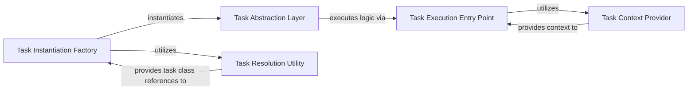

## Details

The `Asynchronous Task Processing` subsystem is central to offloading and executing background tasks, ensuring the responsiveness of the main web application. Its core functionality revolves around defining, instantiating, and executing tasks asynchronously.

### Task Abstraction Layer
Serves as the foundational abstraction for all background tasks. It defines the common interface and contract that all tasks must adhere to, ensuring consistency and extensibility across the asynchronous processing system.

**Related Classes/Methods**:

- <a href="https://github.com/pypi/warehouse/blob/main/warehouse/tasks.py#L45-L183" target="_blank" rel="noopener noreferrer">`warehouse.tasks.WarehouseTask` (45:183)</a>

### Task Execution Entry Point
This method encapsulates the specific business logic that a `WarehouseTask` performs when it is executed by an asynchronous worker. It is the primary mechanism for offloading resource-intensive operations from the main web request path.

**Related Classes/Methods**:

- <a href="https://github.com/pypi/warehouse/blob/main/warehouse/tasks.py#L93-L100" target="_blank" rel="noopener noreferrer">`warehouse.tasks.WarehouseTask.__call__` (93:100)</a>

### Task Context Provider
Responsible for supplying necessary contextual information (e.g., data from the original web request or environment details) to the task's execution logic. This enables tasks to operate with relevant data without direct coupling to the web application's request cycle.

**Related Classes/Methods**:

- <a href="https://github.com/pypi/warehouse/blob/main/warehouse/tasks.py#L102-L125" target="_blank" rel="noopener noreferrer">`warehouse.tasks.WarehouseTask.get_request` (102:125)</a>

### Task Instantiation Factory
Dynamically creates instances of `WarehouseTask` based on configuration or payload data received from the task queue. This factory is crucial for enabling flexible and decoupled task dispatching in a distributed system where tasks are queued and processed by workers.

**Related Classes/Methods**:

- <a href="https://github.com/pypi/warehouse/blob/main/warehouse/tasks.py#L235-L237" target="_blank" rel="noopener noreferrer">`warehouse.tasks._get_task_from_config` (235:237)</a>

### Task Resolution Utility
A utility responsible for resolving task identifiers (e.g., task names or unique IDs) to their corresponding `WarehouseTask` classes. It supports the `Task Instantiation Factory` in dynamically loading and preparing tasks for execution.

**Related Classes/Methods**:

- <a href="https://github.com/pypi/warehouse/blob/main/warehouse/tasks.py#L225-L227" target="_blank" rel="noopener noreferrer">`warehouse.tasks._get_task` (225:227)</a>

### [FAQ](https://github.com/CodeBoarding/GeneratedOnBoardings/tree/main?tab=readme-ov-file#faq)