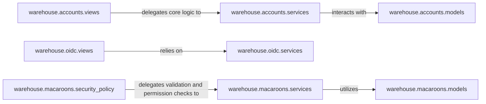

## Details

The "Authentication & Authorization Service" subsystem is primarily defined by the `warehouse/accounts`, `warehouse/macaroons`, and `warehouse/oidc` packages. These packages collectively manage user authentication (passwords, 2FA, OIDC) and authorization (permissions, macaroons), ensuring secure access to resources across all interfaces within the `warehouse` project.

### warehouse.accounts.services
Manages core user account operations, including user retrieval, password validation, and multi-factor authentication (TOTP, WebAuthn). This is crucial for user registration and login.

**Related Classes/Methods**:

- <a href="https://github.com/pypi/warehouse/blob/main/warehouse/accounts/services.py" target="_blank" rel="noopener noreferrer">`warehouse.accounts.services`</a>

### warehouse.accounts.views
Handles web-based user authentication flows (login, 2FA, registration, password reset) and OIDC publisher management. It acts as the interface for user interaction with the authentication system.

**Related Classes/Methods**:

- <a href="https://github.com/pypi/warehouse/blob/main/warehouse/accounts/views.py" target="_blank" rel="noopener noreferrer">`warehouse.accounts.views`</a>

### warehouse.oidc.services
Verifies JWT signatures for OpenID Connect (OIDC) tokens and manages the retrieval and caching of OIDC keysets. This ensures the authenticity and integrity of OIDC tokens.

**Related Classes/Methods**:

- <a href="https://github.com/pypi/warehouse/blob/main/warehouse/oidc/services.py" target="_blank" rel="noopener noreferrer">`warehouse.oidc.services`</a>

### warehouse.oidc.views
Handles the minting of API tokens based on OpenID Connect (OIDC) claims. This enables third-party identity providers for authentication.

**Related Classes/Methods**:

- <a href="https://github.com/pypi/warehouse/blob/main/warehouse/oidc/views.py" target="_blank" rel="noopener noreferrer">`warehouse.oidc.views`</a>

### warehouse.macaroons.services
Manages the lifecycle of macaroons, including deserialization, lookup, verification, and deletion. Macaroons provide a decentralized and fine-grained authorization mechanism.

**Related Classes/Methods**:

- <a href="https://github.com/pypi/warehouse/blob/main/warehouse/macaroons/services.py" target="_blank" rel="noopener noreferrer">`warehouse.macaroons.services`</a>

### warehouse.macaroons.security_policy
Enforces security policies by extracting macaroons from requests and checking permissions against them. This is the enforcement point for macaroon-based authorization.

**Related Classes/Methods**:

- <a href="https://github.com/pypi/warehouse/blob/main/warehouse/macaroons/security_policy.py" target="_blank" rel="noopener noreferrer">`warehouse.macaroons.security_policy`</a>

### warehouse.accounts.models
Manages data persistence and structure for user accounts.

**Related Classes/Methods**:

- <a href="https://github.com/pypi/warehouse/blob/main/warehouse/accounts/models.py" target="_blank" rel="noopener noreferrer">`warehouse.accounts.models`</a>

### warehouse.macaroons.models
Manages data persistence and structure for macaroons.

**Related Classes/Methods**:

- <a href="https://github.com/pypi/warehouse/blob/main/warehouse/macaroons/models.py" target="_blank" rel="noopener noreferrer">`warehouse.macaroons.models`</a>

### [FAQ](https://github.com/CodeBoarding/GeneratedOnBoardings/tree/main?tab=readme-ov-file#faq)