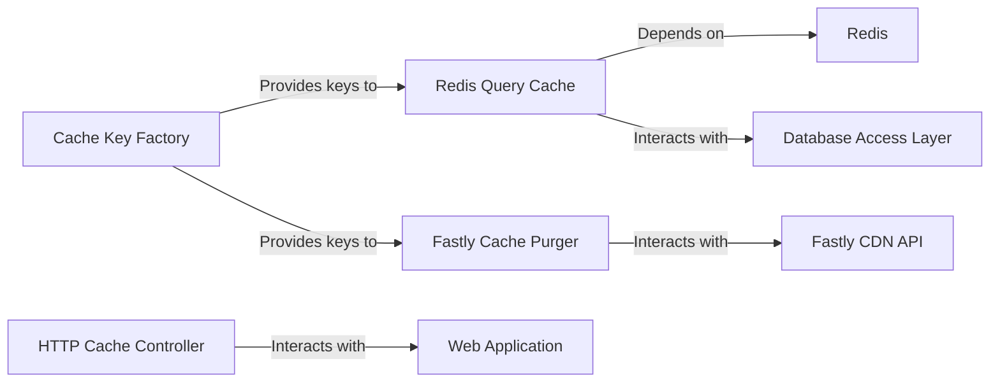

## Details

One paragraph explaining the functionality which is represented by this graph. What the main flow is and what is its purpose.

### HTTP Cache Controller
Manages HTTP Vary headers to ensure that cached responses are correctly served based on varying request attributes (e.g., Accept-Encoding). This is crucial for efficient browser and proxy caching, directly supporting the web application's performance and adhering to web standards for cache control.

**Related Classes/Methods**:

- `warehouse.cache.http`

### Redis Query Cache
Provides a mechanism to cache the results of database queries in Redis. This significantly reduces database load and improves response times for frequently accessed data, which is critical for a package repository handling numerous metadata lookups and ensuring high availability.

**Related Classes/Methods**:

- <a href="https://github.com/pypi/warehouse/blob/main/warehouse/cache/services.py#L18-L47" target="_blank" rel="noopener noreferrer">`warehouse.cache.services.RedisQueryResults` (18:47)</a>

### Fastly Cache Purger
Manages the invalidation and purging of cached content on the Fastly CDN. It provides methods for single and double purges to ensure content freshness and robustness against propagation delays, essential for a global content distribution system like a package repository.

**Related Classes/Methods**:

- <a href="https://github.com/pypi/warehouse/blob/main/warehouse/cache/origin/fastly.py#L37-L141" target="_blank" rel="noopener noreferrer">`warehouse.cache.origin.fastly.FastlyCache` (37:141)</a>

### Cache Key Factory
Centralizes the creation and registration of standardized cache keys. This ensures consistency in how content is identified and invalidated across different caching layers (e.g., Fastly, Redis), which is vital for maintaining cache coherence in a complex distributed system. This component underpins the reliability of the entire caching strategy.

**Related Classes/Methods**:

- `warehouse.cache.origin.__init__`

### Web Application
The primary web-facing application that serves content and interacts with the caching subsystem to optimize performance and manage HTTP caching headers.

**Related Classes/Methods**: _None_

### Redis
An in-memory data structure store used as a database, cache, and message broker. The Redis Query Cache component depends on Redis for storing cached query results.

**Related Classes/Methods**: _None_

### Database Access Layer
The part of the system responsible for interacting with the underlying database. The Redis Query Cache interacts with this layer to fetch data when a cache miss occurs.

**Related Classes/Methods**: _None_

### Fastly CDN API
The Application Programming Interface provided by Fastly CDN, used by the Fastly Cache Purger to programmatically invalidate and purge cached content on the CDN.

**Related Classes/Methods**: _None_

### [FAQ](https://github.com/CodeBoarding/GeneratedOnBoardings/tree/main?tab=readme-ov-file#faq)