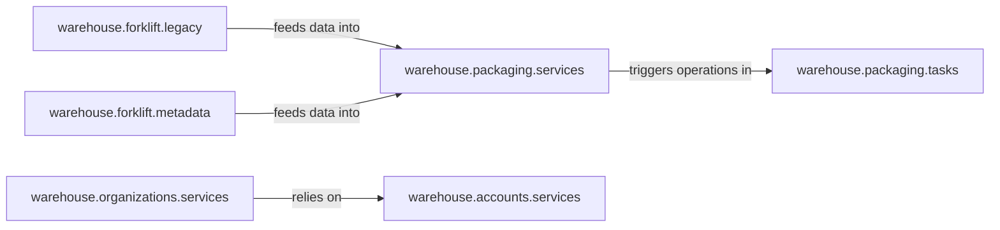

## Details

Core Package & User Management subsystem

### warehouse.packaging.services
Acts as the central business logic for managing the lifecycle of projects and releases. This includes creation, retrieval, and management of package files, metadata, and checksums. It enforces business rules like rate limits and ensures data integrity for the package catalog.

**Related Classes/Methods**:

- <a href="https://github.com/pypi/warehouse/blob/main/warehouse/packaging/services.py" target="_blank" rel="noopener noreferrer">`warehouse.packaging.services`</a>

### warehouse.forklift.legacy
Handles the initial ingestion and validation of package uploads. This includes validating filenames, checking for platform compatibility, detecting duplicate files, and managing dependencies. It serves as the entry point for new package data.

**Related Classes/Methods**:

- <a href="https://github.com/pypi/warehouse/blob/main/warehouse/forklift/legacy.py" target="_blank" rel="noopener noreferrer">`warehouse.forklift.legacy`</a>

### warehouse.forklift.metadata
Parses and validates package metadata during the upload process, ensuring that the submitted metadata adheres to required standards and is complete. This is crucial for accurate cataloging and searchability.

**Related Classes/Methods**:

- <a href="https://github.com/pypi/warehouse/blob/main/warehouse/forklift/metadata.py" target="_blank" rel="noopener noreferrer">`warehouse.forklift.metadata`</a>

### warehouse.packaging.tasks
Manages asynchronous background tasks related to package file storage and processing. This includes operations like copying files to cache and reconciling file storage, ensuring data consistency and availability without blocking user requests.

**Related Classes/Methods**:

- <a href="https://github.com/pypi/warehouse/blob/main/warehouse/packaging/tasks.py" target="_blank" rel="noopener noreferrer">`warehouse.packaging.tasks`</a>

### warehouse.organizations.services
Encapsulates the business logic for managing organizations, teams, roles, and permissions. It enables collaborative package management by defining access control and ownership structures for projects.

**Related Classes/Methods**:

- <a href="https://github.com/pypi/warehouse/blob/main/warehouse/organizations/services.py" target="_blank" rel="noopener noreferrer">`warehouse.organizations.services`</a>

### warehouse.accounts.services
Manages core user account functionalities, including user retrieval, password validation, email management, and two-factor authentication. It provides the foundational identity and authentication services required for any user-facing system, including organization management.

**Related Classes/Methods**:

- <a href="https://github.com/pypi/warehouse/blob/main/warehouse/accounts/services.py" target="_blank" rel="noopener noreferrer">`warehouse.accounts.services`</a>

### [FAQ](https://github.com/CodeBoarding/GeneratedOnBoardings/tree/main?tab=readme-ov-file#faq)