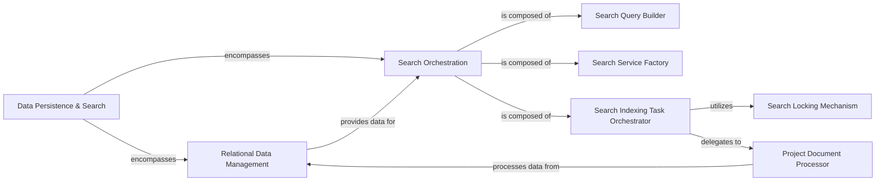

## Details

One paragraph explaining the functionality which is represented by this graph. What the main flow is and what is its purpose.

### Data Persistence & Search [[Expand]](./Data_Persistence_Search.md)
The overarching central data layer, providing robust storage and retrieval mechanisms for all persistent application data. This includes relational data (PostgreSQL), full-text search indexes (OpenSearch), and high-speed caching/queuing (Redis).

**Related Classes/Methods**:

- `warehouse.models` (1:1)
- `warehouse.search` (1:1)

### Relational Data Management
Manages the schema and interactions with PostgreSQL, serving as the ORM layer for all structured relational data. Responsible for defining data models, handling CRUD operations, and ensuring data integrity within the PostgreSQL database.

**Related Classes/Methods**:

- `warehouse.models` (1:1)

### Search Orchestration
Orchestrates all search-related functionalities, including query building, service instantiation, indexing, and task management for OpenSearch. This module acts as a facade for the more granular search components.

**Related Classes/Methods**:

- `warehouse.search` (1:1)

### Search Query Builder
Responsible for constructing and formatting OpenSearch queries based on application logic and user input.

**Related Classes/Methods**:

- <a href="https://github.com/pypi/warehouse/blob/main/warehouse/search/queries.py#L1-L1" target="_blank" rel="noopener noreferrer">`warehouse.search.queries` (1:1)</a>

### Search Service Factory
Instantiates and configures the concrete `SearchService` instances that interact directly with the OpenSearch cluster.

**Related Classes/Methods**:

- `warehouse.search.services`

### Search Indexing Task Orchestrator
Manages asynchronous indexing operations for OpenSearch, coordinating the locking mechanism and delegating the actual document processing.

**Related Classes/Methods**:

- `warehouse.search.tasks`

### Search Locking Mechanism
Provides mechanisms to ensure data consistency and prevent race conditions during concurrent index modifications in OpenSearch.

**Related Classes/Methods**:

- <a href="https://github.com/pypi/warehouse/blob/main/warehouse/search/tasks.py#L95-L102" target="_blank" rel="noopener noreferrer">`warehouse.search.tasks.SearchLock` (95:102)</a>

### Project Document Processor
Prepares and transforms data retrieved from `Relational Data Management` into a suitable document format for OpenSearch indexing.

**Related Classes/Methods**:

- <a href="https://github.com/pypi/warehouse/blob/main/warehouse/search/tasks.py#L30-L92" target="_blank" rel="noopener noreferrer">`warehouse.search.tasks._project_docs` (30:92)</a>

### [FAQ](https://github.com/CodeBoarding/GeneratedOnBoardings/tree/main?tab=readme-ov-file#faq)