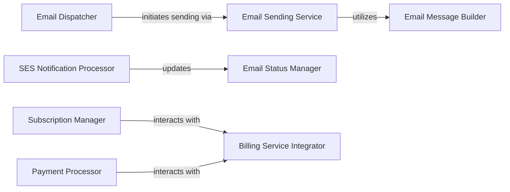

## Details

One paragraph explaining the functionality which is represented by this graph. What the main flow is and what is its purpose.

### Email Dispatcher
Provides a high-level, event-driven API for the rest of the Warehouse application to trigger specific email notifications. It encapsulates the logic for determining the recipient and redacting sensitive information.

**Related Classes/Methods**:

- `warehouse.email.services`

### Email Sending Service
Manages the actual process of sending emails, abstracting the underlying email transport mechanism (e.g., SMTP, AWS SES).

**Related Classes/Methods**:

- `warehouse.email.services`

### Email Message Builder
Constructs email messages, often from templates, ensuring they are properly formatted and ready for dispatch.

**Related Classes/Methods**:

- `warehouse.email.services`

### Email Status Manager
Tracks and persists the delivery status of emails sent via AWS SES, specifically handling events like bounces and complaints.

**Related Classes/Methods**:

- `warehouse.email.ses.models`
- `warehouse.email.ses.tasks`

### SES Notification Processor
Acts as an endpoint for receiving and processing notifications from AWS SES (e.g., via SNS). It verifies the authenticity of these notifications.

**Related Classes/Methods**:

- `warehouse.email.ses.views`

### Billing Service Integrator
Handles communication and integration with external billing services (e.g., Stripe) for processing payments and managing subscriptions.

**Related Classes/Methods**:

- `warehouse.api.billing`

### Subscription Manager
Manages the lifecycle of user subscriptions, including creation, renewal, cancellation, and status tracking.

**Related Classes/Methods**:

- `warehouse.api.billing`

### Payment Processor
Handles the core payment processing logic, including initiating charges, managing payment methods and recording payment transactions.

**Related Classes/Methods**:

- `warehouse.api.billing`

### [FAQ](https://github.com/CodeBoarding/GeneratedOnBoardings/tree/main?tab=readme-ov-file#faq)