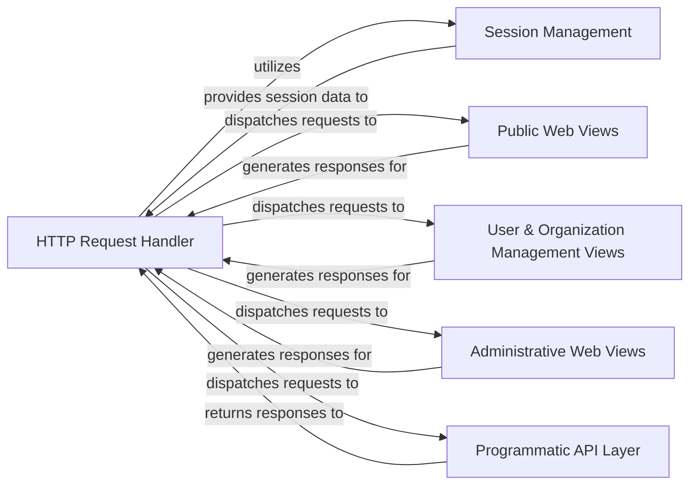

## Details

The Presentation Layer (Web & API) serves as the unified entry point for all user interactions within the warehouse project. It encompasses both the web-based user interface (including public, authenticated user, and administrative functions) and various programmatic APIs (PyPI, JSON, XML-RPC, simple, integrity, billing webhooks). Its core responsibilities include handling request routing, managing user sessions, and generating appropriate responses for both human users and automated clients.

### HTTP Request Handler
The foundational component responsible for managing the HTTP request and response lifecycle. It acts as the central dispatcher, handling incoming web traffic and integrating with session management. This component is critical as the primary entry point for all web and API interactions.

**Related Classes/Methods**:

- <a href="https://github.com/pypi/warehouse/blob/main/warehouse/http.py" target="_blank" rel="noopener noreferrer">`warehouse.http`</a>

### Session Management
Provides comprehensive user session management, including session creation, retrieval, storage (likely Redis-backed), and handling of flash messages and CSRF tokens. Essential for maintaining user state across requests for both web and API interactions requiring authentication.

**Related Classes/Methods**:

- <a href="https://github.com/pypi/warehouse/blob/main/warehouse/sessions.py" target="_blank" rel="noopener noreferrer">`warehouse.sessions`</a>

### Public Web Views
Renders standard public web pages, processes user input from forms, and displays general user-facing content such as search results. This component represents the anonymous user experience of the package repository.

**Related Classes/Methods**:

- <a href="https://github.com/pypi/warehouse/blob/main/warehouse/views.py#L356-L480" target="_blank" rel="noopener noreferrer">`warehouse.views.search`:356-480</a>

### User & Organization Management Views
Provides web interfaces for authenticated users to manage their accounts (e.g., emails, two-factor authentication, API tokens) and for organization owners/managers to manage organizations, teams, projects, and subscriptions. This is crucial for user and organizational self-service within the repository.

**Related Classes/Methods**:

- <a href="https://github.com/pypi/warehouse/blob/main/warehouse/manage/views/__init__.py" target="_blank" rel="noopener noreferrer">`warehouse.manage.views`</a>
- <a href="https://github.com/pypi/warehouse/blob/main/warehouse/manage/views/organizations.py" target="_blank" rel="noopener noreferrer">`warehouse.manage.views.organizations`</a>

### Administrative Web Views
Offers web interfaces for administrative tasks, including managing users, sponsors, banners, and organization applications. This component is vital for the operational control and moderation of the package repository.

**Related Classes/Methods**:

- <a href="https://github.com/pypi/warehouse/blob/main/warehouse/admin/views/users.py" target="_blank" rel="noopener noreferrer">`warehouse.admin.views.users`</a>
- <a href="https://github.com/pypi/warehouse/blob/main/warehouse/admin/views/sponsors.py" target="_blank" rel="noopener noreferrer">`warehouse.admin.views.sponsors`</a>
- <a href="https://github.com/pypi/warehouse/blob/main/warehouse/admin/views/organizations.py" target="_blank" rel="noopener noreferrer">`warehouse.admin.views.organizations`</a>
- <a href="https://github.com/pypi/warehouse/blob/main/warehouse/admin/flags.py" target="_blank" rel="noopener noreferrer">`warehouse.admin.flags`</a>

### Programmatic API Layer
Provides various programmatic interfaces for automated clients, including older XML-RPC and JSON APIs, the standard PyPI simple API for package discovery, an API for integrity checks, and endpoints for billing webhooks. This consolidated component is fundamental for machine-to-machine interaction, enabling package uploads, downloads, and integration with external services.

**Related Classes/Methods**:

- <a href="https://github.com/pypi/warehouse/blob/main/warehouse/legacy/api/xmlrpc/views.py" target="_blank" rel="noopener noreferrer">`warehouse.legacy.api.xmlrpc.views`</a>
- <a href="https://github.com/pypi/warehouse/blob/main/warehouse/legacy/api/json.py" target="_blank" rel="noopener noreferrer">`warehouse.legacy.api.json`</a>
- <a href="https://github.com/pypi/warehouse/blob/main/warehouse/api/simple.py" target="_blank" rel="noopener noreferrer">`warehouse.api.simple`</a>
- <a href="https://github.com/pypi/warehouse/blob/main/warehouse/api/integrity.py" target="_blank" rel="noopener noreferrer">`warehouse.api.integrity`</a>
- <a href="https://github.com/pypi/warehouse/blob/main/warehouse/api/billing.py" target="_blank" rel="noopener noreferrer">`warehouse.api.billing`</a>

### [FAQ](https://github.com/CodeBoarding/GeneratedOnBoardings/tree/main?tab=readme-ov-file#faq)