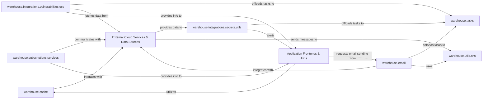

## Details

Architecture Overview:
The warehouse subsystem serves as a critical backend for managing various core functionalities, including background task processing, caching, email communications, subscription management, and security integrations. It interacts extensively with both internal application components, represented by Application Frontends & APIs, and a range of External Cloud Services & Data Sources to deliver its services. This architecture ensures efficient operation, scalability, and robust handling of external dependencies, centralizing key business logic and integrations within the warehouse domain.

Synthesized Insights:
The warehouse subsystem is designed to handle a variety of asynchronous and synchronous operations, offloading heavy tasks to warehouse.tasks for efficient processing. Its warehouse.cache component is crucial for performance, interacting directly with external CDNs. Email functionalities, managed by warehouse.email, integrate with external services for sending and status updates. Subscription services, provided by warehouse.subscriptions.services, orchestrate interactions with payment gateways. Security is a key focus, with warehouse.integrations.vulnerabilities.osv processing data from external vulnerability databases and warehouse.integrations.secrets.utils handling sensitive information disclosures from external scanning tools. The warehouse.utils.sns module provides general utilities for interacting with AWS SNS, primarily for message verification. The subsystem's services are consumed by various Application Frontends & APIs, which include the main web application, user interfaces, authentication systems, and administrative tools.

### warehouse.tasks
Manages the queuing and execution of background tasks, offloading long-running operations from the main application flow to ensure responsiveness and efficient resource utilization.

**Related Classes/Methods**:

- <a href="https://github.com/pypi/warehouse/blob/main/warehouse/tasks.py" target="_blank" rel="noopener noreferrer">`warehouse.tasks`</a>

### warehouse.cache
Implements both HTTP-level response caching and CDN-specific cache invalidation to significantly improve application performance, reduce server load, and ensure content freshness across the distribution network.

**Related Classes/Methods**:

- <a href="https://github.com/pypi/warehouse/blob/main/warehouse/cache/http.py" target="_blank" rel="noopener noreferrer">`warehouse.cache.http`</a>
- <a href="https://github.com/pypi/warehouse/blob/main/warehouse/cache/origin/fastly.py" target="_blank" rel="noopener noreferrer">`warehouse.cache.origin.fastly`</a>

### warehouse.email
Provides a comprehensive interface for sending various types of emails (e.g., notifications, alerts, password resets) and processes delivery statuses (e.g., bounces, complaints) received from external email services.

**Related Classes/Methods**:

- <a href="https://github.com/pypi/warehouse/blob/main/warehouse/email/services.py" target="_blank" rel="noopener noreferrer">`warehouse.email.services`</a>
- <a href="https://github.com/pypi/warehouse/blob/main/warehouse/email/ses/models.py" target="_blank" rel="noopener noreferrer">`warehouse.email.ses.models`</a>

### warehouse.subscriptions.services
Orchestrates interactions with external billing systems to manage user subscriptions, process payments, handle billing-related events, and enforce access based on subscription status.

**Related Classes/Methods**:

- <a href="https://github.com/pypi/warehouse/blob/main/warehouse/subscriptions/services.py" target="_blank" rel="noopener noreferrer">`warehouse.subscriptions.services`</a>

### warehouse.integrations.vulnerabilities.osv
Specializes in processing and integrating vulnerability reports from external databases like OSV (Open Source Vulnerability), crucial for maintaining the security posture and trustworthiness of hosted packages.

**Related Classes/Methods**:

- <a href="https://github.com/pypi/warehouse/blob/main/warehouse/integrations/vulnerabilities/osv" target="_blank" rel="noopener noreferrer">`warehouse.integrations.vulnerabilities.osv`</a>

### warehouse.integrations.secrets.utils
Focuses on analyzing and processing disclosures related to token leaks and other sensitive information, acting as a critical security function to protect the integrity and confidentiality of the package repository.

**Related Classes/Methods**:

- <a href="https://github.com/pypi/warehouse/blob/main/warehouse/integrations/secrets/utils.py" target="_blank" rel="noopener noreferrer">`warehouse.integrations.secrets.utils`</a>

### warehouse.utils.sns
Provides general utilities for interacting with AWS Simple Notification Service (SNS), primarily for verifying the authenticity and integrity of messages received from various AWS services and external systems.

**Related Classes/Methods**:

- <a href="https://github.com/pypi/warehouse/blob/main/warehouse/utils/sns.py" target="_blank" rel="noopener noreferrer">`warehouse.utils.sns`</a>

### Application Frontends & APIs
Represents the various client-facing applications and internal API layers that interact with the warehouse subsystem. This includes the main web application, user interfaces, authentication systems, and administrative interfaces, acting as primary consumers and initiators of operations within warehouse.

**Related Classes/Methods**: _None_

### External Cloud Services & Data Sources
Encompasses all third-party cloud services, external APIs, and data sources that the warehouse subsystem integrates with to perform its functions. This includes CDNs, email services, payment gateways, vulnerability databases, secret scanning tools, and messaging services.

**Related Classes/Methods**: _None_

### [FAQ](https://github.com/CodeBoarding/GeneratedOnBoardings/tree/main?tab=readme-ov-file#faq)