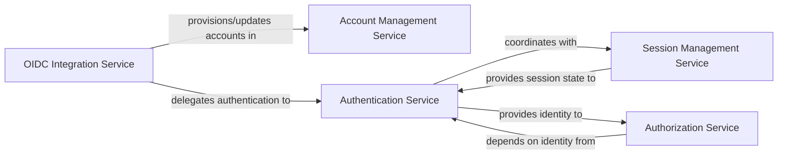

## Details

One paragraph explaining the functionality which is represented by this graph. What the main flow is and what is its purpose.

### Account Management Service
Manages the full lifecycle of user accounts, including user registration, profile updates, and secure password management (hashing, resetting, and recovery). This component is foundational for any system requiring user persistence.

**Related Classes/Methods**:

- `warehouse.accounts` (1:1)

### Authentication Service
Handles user login processes, validates various credential types (e.g., traditional password-based, Macaroons), and establishes the user's verified identity within the system. It is the gateway for user access.

**Related Classes/Methods**:

- `warehouse.accounts` (1:1)

### Session Management Service
Oversees the creation, validation, and invalidation of user sessions, ensuring secure and persistent user state across multiple requests. This is vital for maintaining user experience and security in a web application.

**Related Classes/Methods**:

- `warehouse.accounts` (1:1)

### OIDC Integration Service
Facilitates user authentication through external OpenID Connect (OIDC) providers. It manages the necessary protocol flows (redirects, token exchange) and maps external identities to internal user accounts.

**Related Classes/Methods**:

- `warehouse.oidc` (1:1)

### Authorization Service
Determines and enforces user permissions and access rights to various resources and functionalities based on established roles, policies, or granular permissions. This component ensures that authenticated users can only perform authorized actions.

**Related Classes/Methods**:

- `warehouse.accounts` (1:1)

### [FAQ](https://github.com/CodeBoarding/GeneratedOnBoardings/tree/main?tab=readme-ov-file#faq)