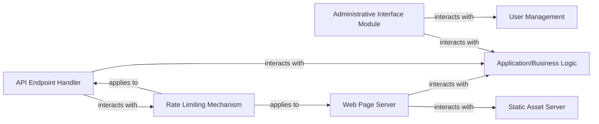

## Details

One paragraph explaining the functionality which is represented by this graph. What the main flow is and what is its purpose.

### Web Page Server
This component is responsible for receiving and processing HTTP requests for the user-facing web application. It orchestrates the retrieval of data from the application's business logic and data layers, renders dynamic HTML content, and serves it to the client. It forms the core of the interactive user experience.

**Related Classes/Methods**:

- `warehouse.views`

### API Endpoint Handler
This component manages all programmatic interactions with the system. It exposes various API endpoints, including modern RESTful interfaces and legacy XML-RPC services, allowing external applications and services to interact with the package repository. It handles request parsing, authentication, and response formatting.

**Related Classes/Methods**:

- `warehouse.views`
- `warehouse.legacy.xmlrpc`

### Static Asset Server
Dedicated to efficiently serving static content such as CSS stylesheets, JavaScript files, images, and other media assets. This component is optimized for high-speed delivery, often leveraging caching mechanisms. Within the project, static assets for the administrative interface are located in `warehouse/admin/static`.

**Related Classes/Methods**:

- `warehouse.admin.static`

### Administrative Interface Module
Provides a secure, web-based interface specifically for system administrators. This module enables privileged users to perform critical management tasks such as user account management, package moderation, system configuration adjustments, and monitoring of application health and performance.

**Related Classes/Methods**:

- `warehouse.admin.views`

### Rate Limiting Mechanism
This component implements and enforces policies to control the frequency of requests originating from individual clients or IP addresses. Its primary role is to protect the application from denial-of-service (DoS) attacks, prevent abuse, and ensure fair resource allocation across all users and API consumers.

**Related Classes/Methods**:

- `warehouse.views`
- `warehouse.legacy.xmlrpc`

### Application/Business Logic
This central component encapsulates the core business rules, processes, and data manipulation logic of the `warehouse` application. It orchestrates interactions between various data sources and provides the underlying functionality for both the web page server and API endpoint handler.

**Related Classes/Methods**:

- `warehouse`

### User Management
This component is responsible for handling all aspects of user accounts, including registration, authentication, authorization, profile management, and security policies. It ensures secure and efficient management of user identities within the system.

**Related Classes/Methods**:

- `warehouse.accounts`

### [FAQ](https://github.com/CodeBoarding/GeneratedOnBoardings/tree/main?tab=readme-ov-file#faq)