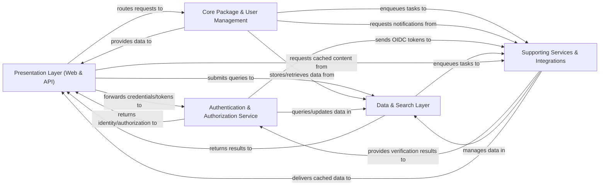

## Details

The Warehouse project is structured around five key architectural components, designed to manage and serve Python packages efficiently and securely. The **Presentation Layer (Web & API)** acts as the primary interface, handling all incoming user and programmatic requests, routing them to the appropriate backend services, and managing sessions. This layer interacts heavily with the **Authentication & Authorization Service** to secure access, forwarding credentials and receiving identity and authorization tokens.

The core business logic resides within the **Core Package & User Management** component, which oversees the entire lifecycle of projects and releases, including package uploads, metadata processing, and comprehensive user, organization, and team management. This component relies on the **Data & Search Layer** for all data persistence and retrieval, utilizing its ORM capabilities and dedicated search functionalities for indexing and querying package information.

Finally, the **Supporting Services & Integrations** component provides essential cross-cutting functionalities such as asynchronous task processing, caching for performance optimization, and seamless integration with external systems for email, billing, vulnerability detection, and notifications. This component supports various operations across the other layers, including managing data in the Data & Search Layer, providing verification results to the Authentication & Authorization Service, and delivering cached content to the Presentation Layer. This modular design ensures clear separation of concerns, scalability, and maintainability for the Warehouse project.

### Presentation Layer (Web & API) [[Expand]](./Presentation_Layer_Web_API_.md)
The unified entry point for all user interactions, encompassing both the web-based user interface (including admin functions) and various programmatic APIs (PyPI, JSON, XML-RPC, simple, integrity, billing webhooks). It handles request routing, session management, and response generation for both human users and automated clients.

**Related Classes/Methods**:

- <a href="https://github.com/pypi/warehouse/blob/main/warehouse/config.py" target="_blank" rel="noopener noreferrer">`warehouse/config.py`</a>
- <a href="https://github.com/pypi/warehouse/blob/main/warehouse/http.py" target="_blank" rel="noopener noreferrer">`warehouse/http.py`</a>
- <a href="https://github.com/pypi/warehouse/blob/main/warehouse/sessions.py" target="_blank" rel="noopener noreferrer">`warehouse/sessions.py`</a>
- <a href="https://github.com/pypi/warehouse/blob/main/warehouse/views/search.py" target="_blank" rel="noopener noreferrer">`warehouse/views/search.py`</a>
- <a href="https://github.com/pypi/warehouse/blob/main/warehouse/manage/views/__init__.py" target="_blank" rel="noopener noreferrer">`warehouse/manage/views/__init__.py`</a>
- <a href="https://github.com/pypi/warehouse/blob/main/warehouse/manage/views/organizations.py" target="_blank" rel="noopener noreferrer">`warehouse/manage/views/organizations.py`</a>
- <a href="https://github.com/pypi/warehouse/blob/main/warehouse/admin/views/users.py" target="_blank" rel="noopener noreferrer">`warehouse/admin/views/users.py`</a>
- <a href="https://github.com/pypi/warehouse/blob/main/warehouse/admin/views/sponsors.py" target="_blank" rel="noopener noreferrer">`warehouse/admin/views/sponsors.py`</a>
- <a href="https://github.com/pypi/warehouse/blob/main/warehouse/admin/views/organizations.py" target="_blank" rel="noopener noreferrer">`warehouse/admin/views/organizations.py`</a>
- <a href="https://github.com/pypi/warehouse/blob/main/warehouse/admin/flags.py" target="_blank" rel="noopener noreferrer">`warehouse/admin/flags.py`</a>
- <a href="https://github.com/pypi/warehouse/blob/main/warehouse/legacy/api/xmlrpc/views.py" target="_blank" rel="noopener noreferrer">`warehouse/legacy/api/xmlrpc/views.py`</a>
- <a href="https://github.com/pypi/warehouse/blob/main/warehouse/legacy/api/json.py" target="_blank" rel="noopener noreferrer">`warehouse/legacy/api/json.py`</a>
- <a href="https://github.com/pypi/warehouse/blob/main/warehouse/api/simple.py" target="_blank" rel="noopener noreferrer">`warehouse/api/simple.py`</a>
- <a href="https://github.com/pypi/warehouse/blob/main/warehouse/api/integrity.py" target="_blank" rel="noopener noreferrer">`warehouse/api/integrity.py`</a>
- <a href="https://github.com/pypi/warehouse/blob/main/warehouse/api/billing.py" target="_blank" rel="noopener noreferrer">`warehouse/api/billing.py`</a>

### Authentication & Authorization Service [[Expand]](./Authentication_Authorization_Service.md)
Centralized service responsible for user authentication (passwords, 2FA, OIDC) and authorization (permissions, macaroons), ensuring secure access to resources across all interfaces.

**Related Classes/Methods**:

- <a href="https://github.com/pypi/warehouse/blob/main/warehouse/accounts/services.py" target="_blank" rel="noopener noreferrer">`warehouse/accounts/services.py`</a>
- <a href="https://github.com/pypi/warehouse/blob/main/warehouse/accounts/views.py" target="_blank" rel="noopener noreferrer">`warehouse/accounts/views.py`</a>
- <a href="https://github.com/pypi/warehouse/blob/main/warehouse/macaroons/security_policy.py" target="_blank" rel="noopener noreferrer">`warehouse/macaroons/security_policy.py`</a>
- <a href="https://github.com/pypi/warehouse/blob/main/warehouse/macaroons/services.py" target="_blank" rel="noopener noreferrer">`warehouse/macaroons/services.py`</a>
- <a href="https://github.com/pypi/warehouse/blob/main/warehouse/oidc/views.py" target="_blank" rel="noopener noreferrer">`warehouse/oidc/views.py`</a>

### Core Package & User Management [[Expand]](./Core_Package_User_Management.md)
The core domain logic for managing the lifecycle of projects and releases, including package uploads, metadata processing, and the business logic for user accounts, organizations, teams, and their permissions.

**Related Classes/Methods**:

- <a href="https://github.com/pypi/warehouse/blob/main/warehouse/forklift/legacy.py" target="_blank" rel="noopener noreferrer">`warehouse/forklift/legacy.py`</a>
- <a href="https://github.com/pypi/warehouse/blob/main/warehouse/forklift/metadata.py" target="_blank" rel="noopener noreferrer">`warehouse/forklift/metadata.py`</a>
- <a href="https://github.com/pypi/warehouse/blob/main/warehouse/packaging/services.py" target="_blank" rel="noopener noreferrer">`warehouse/packaging/services.py`</a>
- <a href="https://github.com/pypi/warehouse/blob/main/warehouse/packaging/tasks.py" target="_blank" rel="noopener noreferrer">`warehouse/packaging/tasks.py`</a>
- <a href="https://github.com/pypi/warehouse/blob/main/warehouse/organizations/services.py" target="_blank" rel="noopener noreferrer">`warehouse/organizations/services.py`</a>

### Data & Search Layer
Provides an abstraction for all interactions with the underlying database, defining data models and offering ORM capabilities. It also includes the dedicated component for indexing package information and processing search queries.

**Related Classes/Methods**:

- <a href="https://github.com/pypi/warehouse/blob/main/warehouse/db.py" target="_blank" rel="noopener noreferrer">`warehouse/db.py`</a>
- <a href="https://github.com/pypi/warehouse/blob/main/warehouse/organizations/models.py" target="_blank" rel="noopener noreferrer">`warehouse/organizations/models.py`</a>
- <a href="https://github.com/pypi/warehouse/blob/main/warehouse/accounts/models.py" target="_blank" rel="noopener noreferrer">`warehouse/accounts/models.py`</a>
- <a href="https://github.com/pypi/warehouse/blob/main/warehouse/packaging/models.py" target="_blank" rel="noopener noreferrer">`warehouse.packaging.models.py`</a>
- <a href="https://github.com/pypi/warehouse/blob/main/warehouse/search/queries.py" target="_blank" rel="noopener noreferrer">`warehouse/search/queries.py`</a>
- <a href="https://github.com/pypi/warehouse/blob/main/warehouse/search/tasks.py" target="_blank" rel="noopener noreferrer">`warehouse/search/tasks.py`</a>

### Supporting Services & Integrations [[Expand]](./Supporting_Services_Integrations.md)
Encompasses asynchronous task processing, caching mechanisms for performance optimization, and all interactions with external systems (email, billing, vulnerability databases, token leak detection, SNS).

**Related Classes/Methods**:

- <a href="https://github.com/pypi/warehouse/blob/main/warehouse/tasks.py" target="_blank" rel="noopener noreferrer">`warehouse.tasks.py`</a>
- <a href="https://github.com/pypi/warehouse/blob/main/warehouse/cache/http.py" target="_blank" rel="noopener noreferrer">`warehouse/cache/http.py`</a>
- <a href="https://github.com/pypi/warehouse/blob/main/warehouse/cache/origin/fastly.py" target="_blank" rel="noopener noreferrer">`warehouse/cache/origin/fastly.py`</a>
- <a href="https://github.com/pypi/warehouse/blob/main/warehouse/email/services.py" target="_blank" rel="noopener noreferrer">`warehouse/email/services.py`</a>
- <a href="https://github.com/pypi/warehouse/blob/main/warehouse/email/ses/models.py" target="_blank" rel="noopener noreferrer">`warehouse/email/ses/models.py`</a>
- <a href="https://github.com/pypi/warehouse/blob/main/warehouse/subscriptions/services.py" target="_blank" rel="noopener noreferrer">`warehouse/subscriptions/services.py`</a>
- <a href="https://github.com/pypi/warehouse/blob/main/warehouse/integrations/__init__.py" target="_blank" rel="noopener noreferrer">`warehouse/integrations/__init__.py`</a>
- <a href="https://github.com/pypi/warehouse/blob/main/warehouse/integrations/vulnerabilities/osv/__init__.py" target="_blank" rel="noopener noreferrer">`warehouse/integrations/vulnerabilities/osv/__init__.py`</a>
- <a href="https://github.com/pypi/warehouse/blob/main/warehouse/integrations/secrets/utils.py" target="_blank" rel="noopener noreferrer">`warehouse/integrations/secrets/utils.py`</a>
- <a href="https://github.com/pypi/warehouse/blob/main/warehouse/utils/sns.py" target="_blank" rel="noopener noreferrer">`warehouse/utils/sns.py`</a>

### [FAQ](https://github.com/CodeBoarding/GeneratedOnBoardings/tree/main?tab=readme-ov-file#faq)