```mermaid
graph LR
    Web_Application_API_Gateway["Web Application & API Gateway"]
    User_Identity_Management["User & Identity Management"]
    Package_Management_Storage["Package Management & Storage"]
    Asynchronous_Task_Processing["Asynchronous Task Processing"]
    Data_Persistence_Search["Data Persistence & Search"]
    Caching_Content_Delivery["Caching & Content Delivery"]
    External_Communications_Billing["External Communications & Billing"]
    Web_Application_API_Gateway -- "interacts with" --> User_Identity_Management
    Web_Application_API_Gateway -- "accesses" --> Package_Management_Storage
    Web_Application_API_Gateway -- "utilizes" --> Caching_Content_Delivery
    Web_Application_API_Gateway -- "triggers" --> Asynchronous_Task_Processing
    Web_Application_API_Gateway -- "accesses" --> Data_Persistence_Search
    Web_Application_API_Gateway -- "interacts with" --> External_Communications_Billing
    User_Identity_Management -- "interacts with" --> Data_Persistence_Search
    User_Identity_Management -- "invokes" --> External_Communications_Billing
    Package_Management_Storage -- "interacts with" --> Data_Persistence_Search
    Package_Management_Storage -- "triggers" --> Asynchronous_Task_Processing
    Asynchronous_Task_Processing -- "accesses" --> Data_Persistence_Search
    Asynchronous_Task_Processing -- "invokes" --> External_Communications_Billing
    External_Communications_Billing -- "interacts with" --> Data_Persistence_Search
    click Web_Application_API_Gateway href "https://github.com/CodeBoarding/GeneratedOnBoardings/blob/main/warehouse/Web_Application_API_Gateway.md" "Details"
    click User_Identity_Management href "https://github.com/CodeBoarding/GeneratedOnBoardings/blob/main/warehouse/User_Identity_Management.md" "Details"
    click Asynchronous_Task_Processing href "https://github.com/CodeBoarding/GeneratedOnBoardings/blob/main/warehouse/Asynchronous_Task_Processing.md" "Details"
    click Data_Persistence_Search href "https://github.com/CodeBoarding/GeneratedOnBoardings/blob/main/warehouse/Data_Persistence_Search.md" "Details"
    click Caching_Content_Delivery href "https://github.com/CodeBoarding/GeneratedOnBoardings/blob/main/warehouse/Caching_Content_Delivery.md" "Details"
    click External_Communications_Billing href "https://github.com/CodeBoarding/GeneratedOnBoardings/blob/main/warehouse/External_Communications_Billing.md" "Details"
```

## Details

One paragraph explaining the functionality which is represented by this graph. What the main flow is and what is its purpose.

### Web Application & API Gateway [[Expand]](./Web_Application_API_Gateway.md)
The primary user-facing component, handling all HTTP requests, serving web pages, exposing APIs (including legacy XML-RPC), and managing static assets. It also incorporates administrative interfaces and rate limiting.

**Related Classes/Methods**:

- `warehouse.views`
- `warehouse.legacy.xmlrpc` (1:1)

### User & Identity Management [[Expand]](./User_Identity_Management.md)
Manages user accounts, registration, login, session management, and various authentication mechanisms including traditional password-based, Macaroons, and OpenID Connect (OIDC).

**Related Classes/Methods**:

- `warehouse.accounts` (1:1)
- `warehouse.oidc` (1:1)

### Package Management & Storage
Handles the core functionality of storing, retrieving, and managing Python package metadata and binary distributions. This includes abstracting interactions with various cloud object storage providers (Backblaze B2, AWS S3, Google Cloud Storage) for efficient and scalable binary blob storage.

**Related Classes/Methods**:

- `warehouse.packaging` (1:1)
- `warehouse.storage` (1:1)

### Asynchronous Task Processing [[Expand]](./Asynchronous_Task_Processing.md)
A dedicated system for offloading and executing long-running, resource-intensive, or background tasks from the main web request path, ensuring the responsiveness of the application.

**Related Classes/Methods**:

- `warehouse.tasks`

### Data Persistence & Search [[Expand]](./Data_Persistence_Search.md)
The central data layer, providing robust storage and retrieval mechanisms for all persistent application data. This includes relational data (PostgreSQL), full-text search indexes (OpenSearch), and high-speed caching/queuing (Redis).

**Related Classes/Methods**:

- `warehouse.models` (1:1)
- `warehouse.search` (1:1)

### Caching & Content Delivery [[Expand]](./Caching_Content_Delivery.md)
Optimizes application performance and reduces load on origin servers by caching frequently accessed content and integrating with external Content Delivery Networks (CDNs) for efficient global content distribution and invalidation.

**Related Classes/Methods**:

- `warehouse.cache` (1:1)

### External Communications & Billing [[Expand]](./External_Communications_Billing.md)
Manages outbound communications, primarily email notifications (e.g., account verification, security alerts), and integrates with third-party billing services (e.g., Stripe) for subscription management and payment processing.

**Related Classes/Methods**:

- `warehouse.email` (1:1)
- `warehouse.billing` (1:1)

### [FAQ](https://github.com/CodeBoarding/GeneratedOnBoardings/tree/main?tab=readme-ov-file#faq)