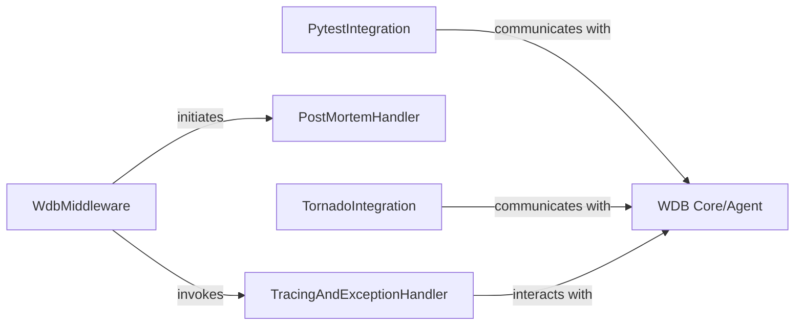

## Details

The WDB debugging system integrates with various Python application environments through specialized components. The `WdbMiddleware` acts as a primary entry point for synchronous web applications, intelligently routing control to either the `TracingAndExceptionHandler` for active debugging or the `PostMortemHandler` for graceful error handling. Separately, `PytestIntegration` and `TornadoIntegration` provide specific hooks for their respective frameworks, both communicating directly with the `WDB Core/Agent`. This `WDB Core/Agent` serves as the central debugging engine, orchestrating all debugging sessions and functionalities across these diverse integration points. This modular design allows WDB to adapt its powerful debugging capabilities to different application architectures while maintaining a consistent core.

### WdbMiddleware
A WSGI middleware designed to intercept web requests and responses in synchronous Python web applications (e.g., Flask, Django, CherryPy). It serves as the primary entry point for WDB to inject its debugging capabilities into the application's request-response cycle.

**Related Classes/Methods**:

- <a href="https://github.com/Kozea/wdb/blob/master/client/wdb/ext.py#L141-L234" target="_blank" rel="noopener noreferrer">`client.wdb.ext.WdbMiddleware`:141-234</a>

### TracingAndExceptionHandler
This component is responsible for enabling WDB's tracing capabilities during a request and handling exceptions that occur within the application's request-response cycle when WDB is enabled. It leverages the `trace` context manager to wrap the application's execution and provides mechanisms for post-mortem debugging or error reporting when an exception is caught.

**Related Classes/Methods**:

- <a href="https://github.com/Kozea/wdb/blob/master/client/wdb/ext.py" target="_blank" rel="noopener noreferrer">`client.wdb.ext.WdbMiddleware.trace_wsgi`</a>
- <a href="https://github.com/Kozea/wdb/blob/master/client/wdb/ext.py#L323-L325" target="_blank" rel="noopener noreferrer">`client.wdb.ext.trace`:323-325</a>

### PostMortemHandler
This component manages the application's response when WDB is not actively tracing or when an exception occurs and WDB needs to gracefully handle the error without full debugging capabilities. It ensures a fallback mechanism for error reporting, such as displaying a simplified error message or logging the exception details.

**Related Classes/Methods**:

- <a href="https://github.com/Kozea/wdb/blob/master/client/wdb/ext.py#L85-L138" target="_blank" rel="noopener noreferrer">`client.wdb.ext._handle_off`:85-138</a>

### PytestIntegration
This conceptual component encapsulates the Pytest plugin functionalities that enable WDB to integrate with and debug Pytest test runs. It provides hooks into Pytest's lifecycle, allowing WDB to manage debugging sessions during test execution.

**Related Classes/Methods**:

### TornadoIntegration
A specific integration point tailored for the Tornado web framework. This component adapts WDB's debugging capabilities to Tornado's asynchronous I/O model, ensuring proper tracing and interaction within an event-driven environment.

**Related Classes/Methods**:

- <a href="https://github.com/Kozea/wdb/blob/master/client/wdb/ext.py#L237-L304" target="_blank" rel="noopener noreferrer">`client.wdb.ext.wdb_tornado`:237-304</a>

### WDB Core/Agent
This is the central debugging engine of WDB. It manages debugging sessions, handles breakpoints, and provides the core functionalities that the various integrations (WSGI, Pytest, Tornado) interact with. It represents the main `Wdb` class instance that orchestrates the debugging process.

**Related Classes/Methods**:

### [FAQ](https://github.com/CodeBoarding/GeneratedOnBoardings/tree/main?tab=readme-ov-file#faq)