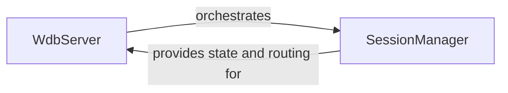

## Details

The WDB Server Core subsystem is the heart of the WDB debugging tool, responsible for orchestrating debugging sessions and real-time communication.

### WdbServer
The primary entry point and web interface for the WDB debugging tool. It is responsible for handling all incoming HTTP requests (GET, POST) for serving the web client and establishing the initial WebSocket connections with both WDB Debugging Agents and WDB Web Clients. It acts as the orchestrator for client-server interactions within the core.

**Related Classes/Methods**:

- <a href="https://github.com/Kozea/wdb/blob/master/server/wdb.server.py#L1-L1000" target="_blank" rel="noopener noreferrer">`WdbServer`:1-1000</a>

### SessionManager
Manages the lifecycle and current state of all active debugging sessions. This includes adding new sessions, removing disconnected ones, and facilitating real-time communication by sending messages to specific sessions or broadcasting messages to all connected clients. It is crucial for maintaining the integrity and responsiveness of the debugging environment, embodying the "Centralized Session Management" and "Real-time Interaction" architectural biases.

**Related Classes/Methods**:

- <a href="https://github.com/Kozea/wdb/blob/master/server/wdb.server.py#L1-L1000" target="_blank" rel="noopener noreferrer">`SessionManager`:1-1000</a>

### [FAQ](https://github.com/CodeBoarding/GeneratedOnBoardings/tree/main?tab=readme-ov-file#faq)